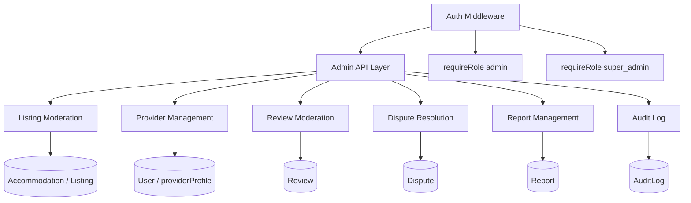

# Epic: Moderation & Admin Systems for Temporary Stay Listings

---

# Moderation & Administration System

## Overview

This spec defines the full moderation and administration system for the Creapy temporary-stay platform. It extends the existing admin infrastructure (inactive listings, provider verification, booking settlement) with listing approval workflows, provider suspension, review moderation queues, dispute resolution, report management, and a comprehensive audit log.

## System Architecture



## Role-Based Access

The existing `requireRole('admin')` middleware is used for all admin routes. A `super_admin` role is introduced for destructive or irreversible actions (permanent deletion, overriding settled bookings).

| Action | `admin` | `super_admin` |
| --- | --- | --- |
| Approve / reject listing | ✅ | ✅ |
| Suspend / reinstate provider | ✅ | ✅ |
| Moderate reviews | ✅ | ✅ |
| Resolve disputes | ✅ | ✅ |
| Manage reports | ✅ | ✅ |
| View audit logs | ✅ | ✅ |
| Permanently delete content | ❌ | ✅ |

`requireRole` in file:real-app-backend-main/controllers/authController.js is extended to accept an array of roles: `requireRole(['admin', 'super_admin'])`.

## Database Schema Changes

### New Models

#### `AuditLog`

Records every admin action with full context for accountability.

| Field | Type | Description |
| --- | --- | --- |
| `id` | `String` (cuid) | Primary key |
| `adminId` | `String` | FK → `User.id` |
| `action` | `String` | e.g. `listing.approved`, `provider.suspended` |
| `targetType` | `String` | e.g. `Listing`, `User`, `Review`, `Dispute` |
| `targetId` | `String` | ID of the affected record |
| `metadata` | `Json?` | Snapshot of before/after state, notes |
| `ipAddress` | `String?` | Request IP for security tracing |
| `createdAt` | `DateTime` | Timestamp |

#### `Report`

Allows guests or providers to flag listings or reviews for admin review.

| Field | Type | Description |
| --- | --- | --- |
| `id` | `String` (cuid) | Primary key |
| `reporterId` | `String` | FK → `User.id` |
| `targetType` | `String` | `Listing`, `Accommodation`, `Review` |
| `targetId` | `String` | ID of the reported entity |
| `reason` | `String` | Category: `spam`, `inappropriate`, `fraud`, `other` |
| `description` | `String?` | Free-text detail |
| `status` | `ReportStatus` enum | `OPEN`, `UNDER_REVIEW`, `RESOLVED`, `DISMISSED` |
| `resolvedBy` | `String?` | FK → `User.id` (admin) |
| `resolution` | `String?` | Admin's resolution note |
| `resolvedAt` | `DateTime?` |  |
| `createdAt` | `DateTime` |  |
| `updatedAt` | `DateTime` |  |

#### `Dispute`

Tracks booking disputes raised by guests or providers.

| Field | Type | Description |
| --- | --- | --- |
| `id` | `String` (cuid) | Primary key |
| `bookingId` | `String` | FK → `Booking.id` |
| `raisedBy` | `String` | FK → `User.id` |
| `raisedByRole` | `String` | `guest` or `provider` |
| `reason` | `String` | Category: `refund`, `no_show`, `property_mismatch`, `other` |
| `description` | `String` | Free-text |
| `status` | `DisputeStatus` enum | `OPEN`, `UNDER_REVIEW`, `RESOLVED`, `CLOSED` |
| `resolution` | `String?` | Admin decision |
| `resolvedBy` | `String?` | FK → `User.id` (admin) |
| `resolvedAt` | `DateTime?` |  |
| `createdAt` | `DateTime` |  |
| `updatedAt` | `DateTime` |  |

### Enum Additions to `schema.prisma`

```
enum ReportStatus { OPEN UNDER_REVIEW RESOLVED DISMISSED }
enum DisputeStatus { OPEN UNDER_REVIEW RESOLVED CLOSED }
```

### Existing Model Changes

**`Accommodation`** — add `moderationStatus` field:

- `PENDING_REVIEW` (newly submitted, awaiting admin approval)
- `APPROVED` (live)
- `REJECTED` (not approved, with reason)
- `SUSPENDED` (temporarily taken down)

**`User`** — `providerProfile` JSON gains a `suspendedAt` and `suspensionReason` field (no schema migration needed, JSON field).

## Backend API Design

### Listing Approval (`/api/admin/accommodations`)

| Method | Path | Description |
| --- | --- | --- |
| `GET` | `/admin/accommodations` | List all accommodations with filters: `moderationStatus`, `type`, `province`, `city`, `page`, `limit` |
| `PUT` | `/admin/accommodations/:id/approve` | Approve a listing — sets `moderationStatus=APPROVED`, `isPublished=true` |
| `PUT` | `/admin/accommodations/:id/reject` | Reject with `reason` — sets `moderationStatus=REJECTED`, `isPublished=false` |
| `PUT` | `/admin/accommodations/:id/suspend` | Suspend — sets `moderationStatus=SUSPENDED`, `isPublished=false` |
| `PUT` | `/admin/accommodations/:id/reinstate` | Reinstate — sets `moderationStatus=APPROVED`, `isPublished=true` |

All actions write an `AuditLog` entry.

### Provider Suspension (`/api/providers`)

Extends existing `verifyProvider` in file:real-app-backend-main/controllers/adminController.js:

| Method | Path | Description |
| --- | --- | --- |
| `PUT` | `/providers/:id/suspend` | Suspend provider — sets `providerProfile.suspendedAt`, `providerProfile.suspensionReason` |
| `PUT` | `/providers/:id/reinstate` | Reinstate provider — clears suspension fields |

Suspended providers cannot accept new bookings (enforced in booking creation middleware).

### Review Moderation (`/api/admin/reviews`)

`moderateReview` already exists in file:real-app-backend-main/controllers/reviewController.js. The admin route needs to be wired and extended:

| Method | Path | Description |
| --- | --- | --- |
| `GET` | `/admin/reviews` | List all reviews with filters: `isPublished`, `accommodationId`, `from`, `to`, `page`, `limit` |
| `GET` | `/admin/reviews/analytics` | Review analytics (already implemented) |
| `PUT` | `/admin/reviews/:id/moderate` | Publish / unpublish / delete / restore (already implemented) |

### Dispute Management (`/api/admin/disputes`)

| Method | Path | Description |
| --- | --- | --- |
| `GET` | `/admin/disputes` | List disputes with filters: `status`, `bookingId`, `raisedByRole`, `page`, `limit` |
| `GET` | `/admin/disputes/:id` | Get single dispute with booking context |
| `POST` | `/admin/disputes/:id/resolve` | Resolve dispute with `resolution` text, sets `status=RESOLVED` |
| `POST` | `/admin/disputes/:id/close` | Close without resolution (e.g. duplicate) |
| `POST` | `/disputes` | Guest/provider raises a dispute (authenticated, non-admin) |

### Report Management (`/api/admin/reports`)

| Method | Path | Description |
| --- | --- | --- |
| `GET` | `/admin/reports` | List reports with filters: `status`, `targetType`, `reason`, `page`, `limit` |
| `GET` | `/admin/reports/:id` | Get single report with target context |
| `PUT` | `/admin/reports/:id/review` | Mark as `UNDER_REVIEW` |
| `PUT` | `/admin/reports/:id/resolve` | Resolve with `resolution` note |
| `PUT` | `/admin/reports/:id/dismiss` | Dismiss with `resolution` note |
| `POST` | `/reports` | Any authenticated user submits a report |

### Audit Log (`/api/admin/audit-logs`)

| Method | Path | Description |
| --- | --- | --- |
| `GET` | `/admin/audit-logs` | List audit logs with filters: `adminId`, `action`, `targetType`, `targetId`, `from`, `to`, `page`, `limit` |
| `GET` | `/admin/audit-logs/:id` | Get single audit log entry |

Audit logs are **read-only** — no create/update/delete via API.

### Moderation Queue (`/api/admin/queue`)

A single aggregated endpoint for the admin dashboard:

| Method | Path | Description |
| --- | --- | --- |
| `GET` | `/admin/queue` | Returns counts: `pendingAccommodations`, `openReports`, `openDisputes`, `pendingReviews` (unpublished, non-deleted) |

## Audit Log Service

A shared utility file:real-app-backend-main/utils/auditLog.js is created:

```js
// auditLog.createEntry({ adminId, action, targetType, targetId, metadata, ipAddress })
```

Every admin controller action calls this after a successful DB write. It is fire-and-forget (non-blocking) — a failure to write the audit log must not fail the admin action.

## Notification Integration

Admin actions trigger notifications via the existing `notificationService.enqueue` pattern in file:real-app-backend-main/utils/notificationService.js:

| Event | Recipients |
| --- | --- |
| `accommodation.approved` | Provider (owner) |
| `accommodation.rejected` | Provider (owner) |
| `accommodation.suspended` | Provider (owner) |
| `provider.suspended` | Provider |
| `provider.reinstated` | Provider |
| `dispute.resolved` | Guest + Provider |
| `report.resolved` | Reporter |

## Frontend Admin Dashboard

The existing file:real-app-frontend-main/src/views/Dashboard/Admin.tsx is extended with new tabs. The existing tabs (Expired Listings, Providers, Bookings) are preserved.

### New Tabs

| Tab | Content |
| --- | --- |
| **Moderation Queue** | Summary cards: pending accommodations, open reports, open disputes, pending reviews |
| **Accommodations** | Table of all accommodations with approval/reject/suspend/reinstate actions |
| **Review Moderation** | Table of all reviews with publish/unpublish/delete actions |
| **Reports** | Table of reports with status filters and resolve/dismiss actions |
| **Disputes** | Table of disputes with resolve/close actions |
| **Audit Log** | Read-only paginated log of all admin actions |

### Wireframe — Admin Dashboard (Extended)

```wireframe

<html>
<head>
<style>
* { box-sizing: border-box; margin: 0; padding: 0; font-family: sans-serif; font-size: 13px; }
body { background: #f5f5f5; }
.header { background: #1a1a2e; color: white; padding: 12px 24px; display: flex; align-items: center; gap: 16px; }
.header h1 { font-size: 16px; font-weight: 600; }
.badge { background: #e53935; color: white; border-radius: 10px; padding: 2px 7px; font-size: 11px; }
.layout { display: flex; min-height: calc(100vh - 44px); }
.sidebar { width: 200px; background: white; border-right: 1px solid #e0e0e0; padding: 16px 0; }
.sidebar-item { padding: 10px 20px; cursor: pointer; color: #555; display: flex; justify-content: space-between; align-items: center; }
.sidebar-item.active { background: #e8f0fe; color: #1a73e8; font-weight: 600; border-left: 3px solid #1a73e8; }
.sidebar-item:hover { background: #f5f5f5; }
.count-chip { background: #e53935; color: white; border-radius: 10px; padding: 1px 6px; font-size: 10px; }
.main { flex: 1; padding: 20px; }
.page-title { font-size: 18px; font-weight: 600; margin-bottom: 16px; color: #1a1a2e; }
.queue-cards { display: grid; grid-template-columns: repeat(4, 1fr); gap: 12px; margin-bottom: 24px; }
.queue-card { background: white; border-radius: 8px; padding: 16px; border: 1px solid #e0e0e0; }
.queue-card .label { color: #777; font-size: 11px; text-transform: uppercase; letter-spacing: 0.5px; }
.queue-card .value { font-size: 28px; font-weight: 700; margin: 6px 0 4px; }
.queue-card .value.warn { color: #e53935; }
.queue-card .value.ok { color: #43a047; }
.queue-card .sub { font-size: 11px; color: #999; }
.filters { display: flex; gap: 8px; margin-bottom: 12px; flex-wrap: wrap; }
.filter-select { border: 1px solid #ddd; border-radius: 4px; padding: 6px 10px; background: white; }
.filter-input { border: 1px solid #ddd; border-radius: 4px; padding: 6px 10px; background: white; width: 180px; }
.btn { padding: 6px 14px; border-radius: 4px; border: none; cursor: pointer; font-size: 12px; }
.btn-primary { background: #1a73e8; color: white; }
.btn-success { background: #43a047; color: white; }
.btn-warn { background: #fb8c00; color: white; }
.btn-danger { background: #e53935; color: white; }
.btn-ghost { background: transparent; border: 1px solid #ddd; color: #555; }
table { width: 100%; border-collapse: collapse; background: white; border-radius: 8px; overflow: hidden; border: 1px solid #e0e0e0; }
th { background: #f8f9fa; padding: 10px 12px; text-align: left; font-weight: 600; color: #555; border-bottom: 1px solid #e0e0e0; font-size: 11px; text-transform: uppercase; }
td { padding: 10px 12px; border-bottom: 1px solid #f0f0f0; color: #333; vertical-align: middle; }
tr:last-child td { border-bottom: none; }
.status-chip { display: inline-block; padding: 2px 8px; border-radius: 10px; font-size: 11px; font-weight: 500; }
.chip-pending { background: #fff3e0; color: #e65100; }
.chip-approved { background: #e8f5e9; color: #2e7d32; }
.chip-rejected { background: #ffebee; color: #c62828; }
.chip-suspended { background: #fce4ec; color: #880e4f; }
.chip-open { background: #e3f2fd; color: #1565c0; }
.chip-resolved { background: #e8f5e9; color: #2e7d32; }
.actions { display: flex; gap: 4px; }
.pagination { display: flex; justify-content: flex-end; align-items: center; gap: 8px; margin-top: 12px; color: #555; }
</style>
</head>
<body>
<div class="header">
  <h1>Creapy Admin</h1>
  <span style="flex:1"></span>
  <span>super_admin@creapy.com</span>
</div>
<div class="layout">
  <div class="sidebar">
    <div class="sidebar-item active" data-element-id="tab-queue">Moderation Queue <span class="count-chip">14</span></div>
    <div class="sidebar-item" data-element-id="tab-accommodations">Accommodations <span class="count-chip">5</span></div>
    <div class="sidebar-item" data-element-id="tab-reviews">Review Moderation</div>
    <div class="sidebar-item" data-element-id="tab-reports">Reports <span class="count-chip">6</span></div>
    <div class="sidebar-item" data-element-id="tab-disputes">Disputes <span class="count-chip">3</span></div>
    <div class="sidebar-item" data-element-id="tab-providers">Providers</div>
    <div class="sidebar-item" data-element-id="tab-bookings">Bookings</div>
    <div class="sidebar-item" data-element-id="tab-listings">Expired Listings</div>
    <div class="sidebar-item" data-element-id="tab-audit">Audit Log</div>
  </div>
  <div class="main">
    <div class="page-title">Moderation Queue</div>
    <div class="queue-cards">
      <div class="queue-card">
        <div class="label">Pending Accommodations</div>
        <div class="value warn">5</div>
        <div class="sub">Awaiting approval</div>
      </div>
      <div class="queue-card">
        <div class="label">Open Reports</div>
        <div class="value warn">6</div>
        <div class="sub">Flagged content</div>
      </div>
      <div class="queue-card">
        <div class="label">Open Disputes</div>
        <div class="value warn">3</div>
        <div class="sub">Booking disputes</div>
      </div>
      <div class="queue-card">
        <div class="label">Pending Reviews</div>
        <div class="value ok">0</div>
        <div class="sub">Hidden / unpublished</div>
      </div>
    </div>

    <div class="page-title" style="margin-top:8px">Pending Accommodations</div>
    <div class="filters">
      <select class="filter-select" data-element-id="filter-type"><option>All Types</option><option>HOTEL</option><option>BNB</option><option>APARTMENT</option></select>
      <select class="filter-select" data-element-id="filter-province"><option>All Provinces</option><option>Harare</option><option>Bulawayo</option></select>
      <input class="filter-input" placeholder="Search by name or owner..." data-element-id="filter-search" />
      <button class="btn btn-primary" data-element-id="btn-filter">Filter</button>
    </div>
    <table>
      <thead>
        <tr><th>Name</th><th>Type</th><th>Owner</th><th>Province</th><th>Submitted</th><th>Status</th><th>Actions</th></tr>
      </thead>
      <tbody>
        <tr>
          <td>Sunset Lodge</td><td>LODGE</td><td>john.doe</td><td>Harare</td><td>2026-05-18</td>
          <td><span class="status-chip chip-pending">PENDING_REVIEW</span></td>
          <td class="actions">
            <button class="btn btn-success" data-element-id="btn-approve-1">Approve</button>
            <button class="btn btn-danger" data-element-id="btn-reject-1">Reject</button>
          </td>
        </tr>
        <tr>
          <td>City Apartments</td><td>APARTMENT</td><td>jane.smith</td><td>Bulawayo</td><td>2026-05-17</td>
          <td><span class="status-chip chip-pending">PENDING_REVIEW</span></td>
          <td class="actions">
            <button class="btn btn-success" data-element-id="btn-approve-2">Approve</button>
            <button class="btn btn-danger" data-element-id="btn-reject-2">Reject</button>
          </td>
        </tr>
        <tr>
          <td>Harare Hostel</td><td>HOSTEL</td><td>mike.t</td><td>Harare</td><td>2026-05-16</td>
          <td><span class="status-chip chip-suspended">SUSPENDED</span></td>
          <td class="actions">
            <button class="btn btn-warn" data-element-id="btn-reinstate-3">Reinstate</button>
          </td>
        </tr>
      </tbody>
    </table>
    <div class="pagination">
      <span>Showing 1–3 of 5</span>
      <button class="btn btn-ghost" data-element-id="btn-prev">‹ Prev</button>
      <button class="btn btn-ghost" data-element-id="btn-next">Next ›</button>
    </div>
  </div>
</div>
</body>
</html>
```

### Wireframe — Disputes & Reports Tab

```wireframe

<html>
<head>
<style>
* { box-sizing: border-box; margin: 0; padding: 0; font-family: sans-serif; font-size: 13px; }
body { background: #f5f5f5; padding: 20px; }
.page-title { font-size: 18px; font-weight: 600; margin-bottom: 16px; color: #1a1a2e; }
.tabs { display: flex; gap: 0; margin-bottom: 16px; border-bottom: 2px solid #e0e0e0; }
.tab { padding: 8px 20px; cursor: pointer; color: #777; border-bottom: 2px solid transparent; margin-bottom: -2px; }
.tab.active { color: #1a73e8; border-bottom-color: #1a73e8; font-weight: 600; }
.filters { display: flex; gap: 8px; margin-bottom: 12px; }
.filter-select { border: 1px solid #ddd; border-radius: 4px; padding: 6px 10px; background: white; }
.btn { padding: 6px 14px; border-radius: 4px; border: none; cursor: pointer; font-size: 12px; }
.btn-primary { background: #1a73e8; color: white; }
.btn-success { background: #43a047; color: white; }
.btn-warn { background: #fb8c00; color: white; }
.btn-danger { background: #e53935; color: white; }
.btn-ghost { background: transparent; border: 1px solid #ddd; color: #555; }
table { width: 100%; border-collapse: collapse; background: white; border-radius: 8px; overflow: hidden; border: 1px solid #e0e0e0; }
th { background: #f8f9fa; padding: 10px 12px; text-align: left; font-weight: 600; color: #555; border-bottom: 1px solid #e0e0e0; font-size: 11px; text-transform: uppercase; }
td { padding: 10px 12px; border-bottom: 1px solid #f0f0f0; color: #333; vertical-align: middle; }
tr:last-child td { border-bottom: none; }
.status-chip { display: inline-block; padding: 2px 8px; border-radius: 10px; font-size: 11px; font-weight: 500; }
.chip-open { background: #e3f2fd; color: #1565c0; }
.chip-under-review { background: #fff3e0; color: #e65100; }
.chip-resolved { background: #e8f5e9; color: #2e7d32; }
.actions { display: flex; gap: 4px; }
.detail-panel { background: white; border: 1px solid #e0e0e0; border-radius: 8px; padding: 16px; margin-top: 16px; }
.detail-panel h3 { font-size: 14px; font-weight: 600; margin-bottom: 12px; }
.detail-row { display: flex; gap: 8px; margin-bottom: 8px; }
.detail-label { color: #777; width: 120px; flex-shrink: 0; }
.detail-value { color: #333; }
textarea { width: 100%; border: 1px solid #ddd; border-radius: 4px; padding: 8px; margin-top: 8px; height: 80px; resize: vertical; }
.action-row { display: flex; gap: 8px; margin-top: 12px; justify-content: flex-end; }
</style>
</head>
<body>
<div class="page-title">Disputes</div>
<div class="tabs">
  <div class="tab active" data-element-id="tab-disputes">Disputes (3)</div>
  <div class="tab" data-element-id="tab-reports">Reports (6)</div>
</div>
<div class="filters">
  <select class="filter-select" data-element-id="filter-status"><option>All Statuses</option><option>OPEN</option><option>UNDER_REVIEW</option><option>RESOLVED</option></select>
  <select class="filter-select" data-element-id="filter-role"><option>All Roles</option><option>guest</option><option>provider</option></select>
  <button class="btn btn-primary" data-element-id="btn-filter">Filter</button>
</div>
<table>
  <thead>
    <tr><th>ID</th><th>Booking</th><th>Raised By</th><th>Role</th><th>Reason</th><th>Status</th><th>Created</th><th>Actions</th></tr>
  </thead>
  <tbody>
    <tr>
      <td>#DIS-001</td><td>BK-4421</td><td>alice@example.com</td><td>guest</td><td>refund</td>
      <td><span class="status-chip chip-open">OPEN</span></td>
      <td>2026-05-18</td>
      <td class="actions">
        <button class="btn btn-warn" data-element-id="btn-review-1">Review</button>
        <button class="btn btn-success" data-element-id="btn-resolve-1">Resolve</button>
      </td>
    </tr>
    <tr>
      <td>#DIS-002</td><td>BK-3310</td><td>bob@example.com</td><td>provider</td><td>no_show</td>
      <td><span class="status-chip chip-under-review">UNDER_REVIEW</span></td>
      <td>2026-05-15</td>
      <td class="actions">
        <button class="btn btn-success" data-element-id="btn-resolve-2">Resolve</button>
        <button class="btn btn-ghost" data-element-id="btn-close-2">Close</button>
      </td>
    </tr>
    <tr>
      <td>#DIS-003</td><td>BK-2201</td><td>carol@example.com</td><td>guest</td><td>property_mismatch</td>
      <td><span class="status-chip chip-open">OPEN</span></td>
      <td>2026-05-14</td>
      <td class="actions">
        <button class="btn btn-warn" data-element-id="btn-review-3">Review</button>
        <button class="btn btn-success" data-element-id="btn-resolve-3">Resolve</button>
      </td>
    </tr>
  </tbody>
</table>

<div class="detail-panel">
  <h3>Resolve Dispute #DIS-001</h3>
  <div class="detail-row"><span class="detail-label">Booking:</span><span class="detail-value">BK-4421 — Sunset Lodge, 2026-05-10 to 2026-05-13</span></div>
  <div class="detail-row"><span class="detail-label">Guest:</span><span class="detail-value">alice@example.com</span></div>
  <div class="detail-row"><span class="detail-label">Reason:</span><span class="detail-value">Refund requested — property not as described</span></div>
  <div class="detail-row"><span class="detail-label">Description:</span><span class="detail-value">The room had no hot water and the photos were misleading.</span></div>
  <label style="color:#555; font-weight:600">Resolution Note</label>
  <textarea data-element-id="resolution-input" placeholder="Enter your resolution decision..."></textarea>
  <div class="action-row">
    <button class="btn btn-ghost" data-element-id="btn-cancel">Cancel</button>
    <button class="btn btn-success" data-element-id="btn-confirm-resolve">Confirm Resolution</button>
  </div>
</div>
</body>
</html>
```

### Wireframe — Audit Log Tab

```wireframe

<html>
<head>
<style>
* { box-sizing: border-box; margin: 0; padding: 0; font-family: sans-serif; font-size: 13px; }
body { background: #f5f5f5; padding: 20px; }
.page-title { font-size: 18px; font-weight: 600; margin-bottom: 16px; color: #1a1a2e; }
.filters { display: flex; gap: 8px; margin-bottom: 12px; flex-wrap: wrap; }
.filter-select { border: 1px solid #ddd; border-radius: 4px; padding: 6px 10px; background: white; }
.filter-input { border: 1px solid #ddd; border-radius: 4px; padding: 6px 10px; background: white; width: 160px; }
.btn { padding: 6px 14px; border-radius: 4px; border: none; cursor: pointer; font-size: 12px; }
.btn-primary { background: #1a73e8; color: white; }
.btn-ghost { background: transparent; border: 1px solid #ddd; color: #555; }
table { width: 100%; border-collapse: collapse; background: white; border-radius: 8px; overflow: hidden; border: 1px solid #e0e0e0; }
th { background: #f8f9fa; padding: 10px 12px; text-align: left; font-weight: 600; color: #555; border-bottom: 1px solid #e0e0e0; font-size: 11px; text-transform: uppercase; }
td { padding: 10px 12px; border-bottom: 1px solid #f0f0f0; color: #333; vertical-align: middle; font-size: 12px; }
tr:last-child td { border-bottom: none; }
.action-tag { display: inline-block; padding: 2px 8px; border-radius: 4px; font-size: 11px; background: #e8eaf6; color: #3949ab; font-family: monospace; }
.meta { color: #999; font-size: 11px; max-width: 200px; overflow: hidden; text-overflow: ellipsis; white-space: nowrap; }
.pagination { display: flex; justify-content: flex-end; align-items: center; gap: 8px; margin-top: 12px; color: #555; }
</style>
</head>
<body>
<div class="page-title">Audit Log</div>
<div class="filters">
  <select class="filter-select" data-element-id="filter-action"><option>All Actions</option><option>listing.approved</option><option>listing.rejected</option><option>provider.suspended</option><option>review.deleted</option><option>dispute.resolved</option></select>
  <select class="filter-select" data-element-id="filter-target"><option>All Target Types</option><option>Accommodation</option><option>User</option><option>Review</option><option>Dispute</option><option>Report</option></select>
  <input class="filter-input" type="date" data-element-id="filter-from" />
  <input class="filter-input" type="date" data-element-id="filter-to" />
  <input class="filter-input" placeholder="Admin ID or email..." data-element-id="filter-admin" />
  <button class="btn btn-primary" data-element-id="btn-filter">Filter</button>
</div>
<table>
  <thead>
    <tr><th>Timestamp</th><th>Admin</th><th>Action</th><th>Target Type</th><th>Target ID</th><th>Notes</th></tr>
  </thead>
  <tbody>
    <tr>
      <td>2026-05-19 09:14:22</td>
      <td>admin@creapy.com</td>
      <td><span class="action-tag">accommodation.approved</span></td>
      <td>Accommodation</td>
      <td style="font-family:monospace; font-size:11px">clx1abc...</td>
      <td class="meta">Approved after document review</td>
    </tr>
    <tr>
      <td>2026-05-19 08:55:10</td>
      <td>admin@creapy.com</td>
      <td><span class="action-tag">provider.suspended</span></td>
      <td>User</td>
      <td style="font-family:monospace; font-size:11px">clx2def...</td>
      <td class="meta">Fraudulent listings reported</td>
    </tr>
    <tr>
      <td>2026-05-18 17:30:05</td>
      <td>admin@creapy.com</td>
      <td><span class="action-tag">dispute.resolved</span></td>
      <td>Dispute</td>
      <td style="font-family:monospace; font-size:11px">clx3ghi...</td>
      <td class="meta">Refund approved for guest</td>
    </tr>
    <tr>
      <td>2026-05-18 14:12:44</td>
      <td>admin@creapy.com</td>
      <td><span class="action-tag">review.deleted</span></td>
      <td>Review</td>
      <td style="font-family:monospace; font-size:11px">clx4jkl...</td>
      <td class="meta">Spam content removed</td>
    </tr>
    <tr>
      <td>2026-05-17 11:05:33</td>
      <td>admin@creapy.com</td>
      <td><span class="action-tag">report.resolved</span></td>
      <td>Report</td>
      <td style="font-family:monospace; font-size:11px">clx5mno...</td>
      <td class="meta">Listing removed after fraud confirmed</td>
    </tr>
  </tbody>
</table>
<div class="pagination">
  <span>Showing 1–5 of 142</span>
  <button class="btn btn-ghost" data-element-id="btn-prev">‹ Prev</button>
  <button class="btn btn-ghost" data-element-id="btn-next">Next ›</button>
</div>
</body>
</html>
```

## Frontend API Slice Extensions

file:real-app-frontend-main/src/redux/api/adminApiSlice.ts is extended with new endpoints:

- `getAccommodations` — list with moderation status filter
- `approveAccommodation`, `rejectAccommodation`, `suspendAccommodation`, `reinstateAccommodation`
- `suspendProvider`, `reinstateProvider`
- `getAllReviews`, `moderateReview`
- `getDisputes`, `getDisputeById`, `resolveDispute`, `closeDispute`
- `getReports`, `getReportById`, `reviewReport`, `resolveReport`, `dismissReport`
- `getAuditLogs`, `getAuditLogById`
- `getModerationQueue`

RTK Query cache tags added: `AdminAccommodation`, `AdminReview`, `Dispute`, `Report`, `AuditLog`.

## Migration Strategy

1. Add `AuditLog`, `Report`, `Dispute` models to `schema.prisma`
2. Add `moderationStatus` field to `Accommodation` model (default `APPROVED` for existing records to avoid breaking live listings)
3. Add `ReportStatus`, `DisputeStatus` enums
4. Generate and apply Prisma migration
5. Wire new admin routes in file:real-app-backend-main/routes/adminRoutes.js
6. Extend file:real-app-backend-main/controllers/adminController.js with new handlers
7. Create file:real-app-backend-main/utils/auditLog.js
8. Extend frontend API slice and Admin dashboard

## Non-Functional Requirements

- **Scalability**: All list endpoints are paginated (default 20, max 100). Audit log table is indexed on `(adminId, action, createdAt)`.
- **Security**: All admin routes require `protect` + `requireRole(['admin', 'super_admin'])`. IP address is captured from `req.ip` for audit logs.
- **Idempotency**: Approve/reject/suspend actions are idempotent — re-applying the same status returns 200 without error.
- **Soft deletes**: Reports and disputes are never hard-deleted. Reviews use existing `deletedAt` soft-delete pattern.