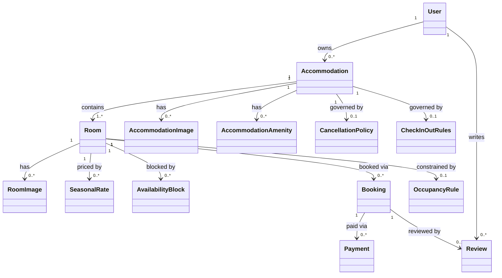
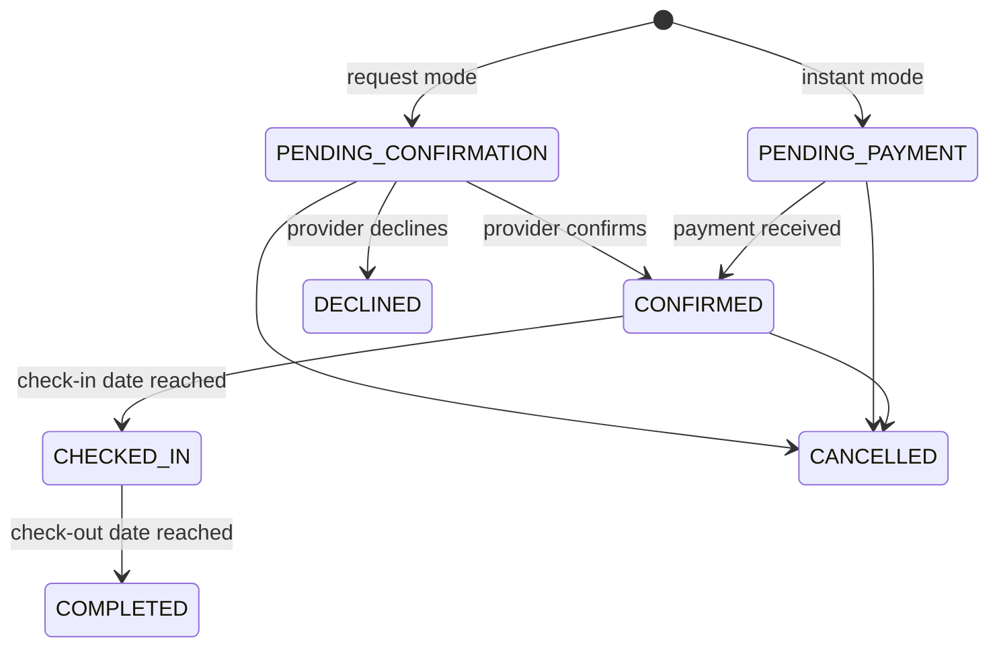

# Epic: Production-Grade Accommodation Platform Prisma Schema Upgrade

---

# Production-Grade Accommodation Platform — Data Model & Architecture Spec

## Overview

This spec defines the normalized Prisma schema upgrade for the Creapy accommodation platform. The goal is to replace all untyped `Json` blobs with proper relational models, introduce missing domain concepts, and produce a schema that is production-safe, indexed for search, and enforces booking conflict prevention at the database level.

**Scope:** file:real-app-backend-main/prisma/schema.prisma and the new Prisma migration. Existing controllers are **not** rewritten — they are updated only where field names change.

## Accommodation Types Supported

The platform must support the following accommodation categories via a Prisma enum:

```
HOTEL | LODGE | BNB | APARTMENT | GUEST_HOUSE | HOSTEL
```

## Entity Relationship Diagram



## Model Specifications

### 1. `Accommodation` — Normalized Provider Property

Replaces the `providerProfile: Json?` blob on `User`. Each approved provider owns one or more `Accommodation` records.

| Field | Type | Notes |
| --- | --- | --- |
| `id` | `String @id @default(cuid())` |  |
| `ownerId` | `String` | FK → `User.id` |
| `type` | `AccommodationType` (enum) | `HOTEL \| LODGE \| BNB \| APARTMENT \| GUEST_HOUSE \| HOSTEL` |
| `name` | `String` | Indexed |
| `slug` | `String @unique` | URL-safe identifier, indexed |
| `description` | `String` |  |
| `registrationNumber` | `String?` | Business registration |
| `contactPhone` | `String` |  |
| `province` | `String` | Indexed |
| `city` | `String` | Indexed |
| `addressLine` | `String` |  |
| `lat` | `Float?` | Geo search |
| `lng` | `Float?` | Geo search |
| `verificationStatus` | `VerificationStatus` (enum) | `PENDING \| APPROVED \| REJECTED` |
| `commissionRate` | `Decimal @default(10)` | Platform fee % |
| `isPublished` | `Boolean @default(false)` |  |
| `deletedAt` | `DateTime?` | Soft delete |
| `createdAt` | `DateTime @default(now())` |  |
| `updatedAt` | `DateTime @updatedAt` |  |

**Relations:** `owner`, `rooms[]`, `images[]`, `amenities[]`, `cancellationPolicy?`, `checkInOutRules?`

**Indexes:** `[ownerId]`, `[province, city]`, `[type, verificationStatus, isPublished]`, `[slug]`

### 2. `Room` — Normalized Room Record

The existing `Room` model is retained but upgraded: `amenities`, `imageUrls`, and `pricingRules` Json blobs are replaced with proper relations.

| Field | Type | Notes |
| --- | --- | --- |
| `id` | `String @id @default(cuid())` |  |
| `accommodationId` | `String` | FK → `Accommodation.id` |
| `name` | `String` |  |
| `description` | `String?` |  |
| `roomType` | `RoomType` (enum) | `SINGLE \| DOUBLE \| TWIN \| SUITE \| DORMITORY \| STUDIO \| ENTIRE_UNIT` |
| `basePricePerNight` | `Decimal` | Authoritative base rate |
| `status` | `RoomStatus` (enum) | `AVAILABLE \| UNAVAILABLE \| MAINTENANCE` |
| `bookingMode` | `BookingMode` (enum) | `INSTANT \| REQUEST` |
| `maxAdvanceBookingDays` | `Int @default(90)` |  |
| `minNights` | `Int @default(1)` | Minimum stay |
| `maxNights` | `Int?` | Maximum stay |
| `deletedAt` | `DateTime?` | Soft delete |
| `createdAt` | `DateTime @default(now())` |  |
| `updatedAt` | `DateTime @updatedAt` |  |

**Relations:** `accommodation`, `images[]`, `seasonalRates[]`, `availabilityBlocks[]`, `bookings[]`, `occupancyRule?`

**Indexes:** `[accommodationId, status]`, `[status, bookingMode]`

### 3. `OccupancyRule` — Per-Room Guest Constraints

One-to-one with `Room`. Replaces the single `capacity: Int?` field.

| Field | Type | Notes |
| --- | --- | --- |
| `id` | `String @id @default(cuid())` |  |
| `roomId` | `String @unique` | FK → `Room.id` |
| `maxGuests` | `Int` | Hard ceiling |
| `maxAdults` | `Int` |  |
| `maxChildren` | `Int @default(0)` |  |
| `maxInfants` | `Int @default(0)` |  |
| `minGuests` | `Int @default(1)` |  |

### 4. `SeasonalRate` — Structured Pricing Rules

Replaces `pricingRules: Json[]` on `Room`. Each row is one pricing rule.

| Field | Type | Notes |
| --- | --- | --- |
| `id` | `String @id @default(cuid())` |  |
| `roomId` | `String` | FK → `Room.id` |
| `label` | `String` | e.g. "Christmas Peak", "Weekend Rate" |
| `rateType` | `RateType` (enum) | `SEASONAL \| WEEKEND \| WEEKDAY \| HOLIDAY \| LONG_STAY` |
| `pricePerNight` | `Decimal` |  |
| `startDate` | `DateTime?` | Null = applies by day-of-week only |
| `endDate` | `DateTime?` |  |
| `daysOfWeek` | `Int[]` | 0=Sun … 6=Sat; empty = all days |
| `minNightsToApply` | `Int @default(1)` | For `LONG_STAY` rules |
| `priority` | `Int @default(0)` | Higher wins on overlap |
| `createdAt` | `DateTime @default(now())` |  |

**Indexes:** `[roomId, rateType]`, `[roomId, startDate, endDate]`

### 5. `AvailabilityBlock` — Calendar Blocks

Renames `BlockedDate` to `AvailabilityBlock` for clarity. Adds a `blockType` enum.

| Field | Type | Notes |
| --- | --- | --- |
| `id` | `String @id @default(cuid())` |  |
| `roomId` | `String` | FK → `Room.id` |
| `blockType` | `BlockType` (enum) | `MANUAL \| MAINTENANCE \| EXTERNAL_SYNC` |
| `startDate` | `DateTime` |  |
| `endDate` | `DateTime` |  |
| `reason` | `String?` |  |
| `createdBy` | `String?` | FK → `User.id` |
| `createdAt` | `DateTime @default(now())` |  |
| `updatedAt` | `DateTime @updatedAt` |  |

**Indexes:** `[roomId, startDate, endDate]`

### 6. `Booking` — Upgraded with Enum States

The existing `Booking` model is retained. `status`, `paymentStatus`, `settlementStatus`, `cancelledBy` are promoted from `String` to enums. Duplicate price fields (`totalAmount` / `totalPrice`) are consolidated.

| Field | Type | Change |
| --- | --- | --- |
| `status` | `BookingStatus` (enum) | Was `String` |
| `paymentStatus` | `PaymentStatus` (enum) | Was `String` |
| `settlementStatus` | `SettlementStatus` (enum) | Was `String` |
| `cancelledBy` | `CancelledBy?` (enum) | Was `String?` |
| `totalPrice` | `Decimal` | Canonical amount; `totalAmount` removed |
| `pricePerNight` | `Decimal` | Was `Float?` |
| `commissionRate` | `Decimal?` | Was `Float?` |
| `commissionAmount` | `Decimal?` | Was `Float?` |
| `netPayout` | `Decimal?` | Was `Float?` |
| `refundAmount` | `Decimal @default(0)` | Was `Float` |
| `adultCount` | `Int @default(1)` | New — replaces `guestCount` |
| `childCount` | `Int @default(0)` | New |
| `infantCount` | `Int @default(0)` | New |
| `appliedRateId` | `String?` | FK → `SeasonalRate.id` — audit trail |
| `cancellationPolicySnapshot` | `Json?` | Snapshot of policy at booking time |
| `deletedAt` | `DateTime?` | Soft delete |

**Booking Status State Machine:**



**Enums:**

- `BookingStatus`: `PENDING_CONFIRMATION | PENDING_PAYMENT | CONFIRMED | DECLINED | CANCELLED | CHECKED_IN | COMPLETED | EXPIRED`
- `PaymentStatus`: `UNPAID | PENDING | PAID | REFUNDED | PARTIALLY_REFUNDED | FAILED`
- `SettlementStatus`: `PENDING | SETTLED | DISPUTED`
- `CancelledBy`: `GUEST | PROVIDER | ADMIN | SYSTEM`

### 7. `CancellationPolicy` — Structured Policy Model

Replaces `cancellationPolicy: String?` on both `Room` and `Accommodation`.

| Field | Type | Notes |
| --- | --- | --- |
| `id` | `String @id @default(cuid())` |  |
| `accommodationId` | `String @unique` | FK → `Accommodation.id` |
| `policyType` | `CancellationPolicyType` (enum) | `FLEXIBLE \| MODERATE \| STRICT \| NON_REFUNDABLE \| CUSTOM` |
| `freeCancellationHours` | `Int?` | Hours before check-in for free cancel |
| `refundPercentage` | `Decimal?` | 0–100 |
| `customDescription` | `String?` | For `CUSTOM` type |
| `createdAt` | `DateTime @default(now())` |  |
| `updatedAt` | `DateTime @updatedAt` |  |

### 8. `CheckInOutRules` — Structured Check-In/Out

Replaces `checkInTime`/`checkOutTime` in the `providerProfile` JSON blob.

| Field | Type | Notes |
| --- | --- | --- |
| `id` | `String @id @default(cuid())` |  |
| `accommodationId` | `String @unique` | FK → `Accommodation.id` |
| `checkInFrom` | `String` | e.g. `"14:00"` (HH:mm) |
| `checkInUntil` | `String` | e.g. `"22:00"` |
| `checkOutBy` | `String` | e.g. `"11:00"` |
| `selfCheckIn` | `Boolean @default(false)` |  |
| `selfCheckInMethod` | `String?` | e.g. "lockbox", "smart lock" |
| `lateCheckOutFee` | `Decimal?` |  |
| `instructions` | `String?` |  |

### 9. `Amenity` + `AccommodationAmenity` — Amenity System

Replaces `amenities: Json` on both `Room` and `Accommodation`.

**`Amenity`** — global catalogue:

| Field | Type | Notes |
| --- | --- | --- |
| `id` | `String @id @default(cuid())` |  |
| `slug` | `String @unique` | e.g. `"wifi"`, `"pool"` |
| `label` | `String` | e.g. `"Wi-Fi"` |
| `category` | `AmenityCategory` (enum) | `CONNECTIVITY \| COMFORT \| SAFETY \| RECREATION \| FOOD \| TRANSPORT \| ACCESSIBILITY` |
| `icon` | `String?` | Icon identifier |

**`AccommodationAmenity`** — join table:

| Field | Type |
| --- | --- |
| `accommodationId` | `String` |
| `amenityId` | `String` |
| `isHighlighted` | `Boolean @default(false)` |

**`RoomAmenity`** — join table for room-specific amenities:

| Field | Type |
| --- | --- |
| `roomId` | `String` |
| `amenityId` | `String` |

### 10. `AccommodationImage` + `RoomImage` — Image Galleries

Replaces `imageUrls: Json` on both `Accommodation` (via `providerProfile`) and `Room`.

**`AccommodationImage`****:**

| Field | Type | Notes |
| --- | --- | --- |
| `id` | `String @id @default(cuid())` |  |
| `accommodationId` | `String` | FK → `Accommodation.id` |
| `url` | `String` |  |
| `altText` | `String?` |  |
| `isCover` | `Boolean @default(false)` |  |
| `sortOrder` | `Int @default(0)` |  |
| `createdAt` | `DateTime @default(now())` |  |

**`RoomImage`****:**

| Field | Type | Notes |
| --- | --- | --- |
| `id` | `String @id @default(cuid())` |  |
| `roomId` | `String` | FK → `Room.id` |
| `url` | `String` |  |
| `altText` | `String?` |  |
| `isCover` | `Boolean @default(false)` |  |
| `sortOrder` | `Int @default(0)` |  |
| `createdAt` | `DateTime @default(now())` |  |

### 11. `Review` — Guest Review Relationships

New model. One review per completed booking.

| Field | Type | Notes |
| --- | --- | --- |
| `id` | `String @id @default(cuid())` |  |
| `bookingId` | `String @unique` | FK → `Booking.id` |
| `guestId` | `String` | FK → `User.id` |
| `accommodationId` | `String` | FK → `Accommodation.id` |
| `overallRating` | `Int` | 1–5, DB check constraint |
| `cleanlinessRating` | `Int?` | 1–5 |
| `locationRating` | `Int?` | 1–5 |
| `valueRating` | `Int?` | 1–5 |
| `serviceRating` | `Int?` | 1–5 |
| `comment` | `String?` |  |
| `providerResponse` | `String?` | Provider reply |
| `isPublished` | `Boolean @default(true)` |  |
| `deletedAt` | `DateTime?` | Soft delete |
| `createdAt` | `DateTime @default(now())` |  |
| `updatedAt` | `DateTime @updatedAt` |  |

**Indexes:** `[accommodationId, isPublished]`, `[guestId]`

## Migration Strategy

The upgrade is delivered as a **single additive Prisma migration** that:

1. Creates all new tables (`Accommodation`, `OccupancyRule`, `SeasonalRate`, `AvailabilityBlock`, `CancellationPolicy`, `CheckInOutRules`, `Amenity`, `AccommodationAmenity`, `RoomAmenity`, `AccommodationImage`, `RoomImage`, `Review`)
2. Adds all new enums
3. Adds `accommodationId` FK to `Room` (nullable initially, then required after data backfill)
4. Adds `deletedAt` to `Room`, `Booking`, `Review`
5. Adds `adultCount`, `childCount`, `infantCount` to `Booking`
6. Adds `appliedRateId`, `cancellationPolicySnapshot` to `Booking`
7. Promotes `Booking.status`, `paymentStatus`, `settlementStatus`, `cancelledBy` to enums
8. Removes `Room.amenities`, `Room.imageUrls`, `Room.pricingRules` Json blobs **after** data migration

<user_quoted_section>Backward compatibility: The User.providerProfile Json field is retained during transition. A data migration script populates Accommodation records from existing providerProfile blobs. Once validated, providerProfile is deprecated (not dropped immediately).</user_quoted_section>

## Booking Conflict Prevention

The existing `ensureRoomAvailability` check in file:real-app-backend-main/controllers/bookingController.js is correct in logic but relies on application-level locking only. The upgraded schema adds a **PostgreSQL exclusion constraint** via a raw migration SQL block:

```sql
-- Prevent overlapping confirmed/pending bookings at DB level
CREATE EXTENSION IF NOT EXISTS btree_gist;
ALTER TABLE "Booking" ADD CONSTRAINT "no_overlapping_bookings"
  EXCLUDE USING gist (
    "roomId" WITH =,
    tsrange("checkIn", "checkOut") WITH &&
  )
  WHERE (status NOT IN ('CANCELLED', 'DECLINED', 'EXPIRED', 'COMPLETED'));
```

This makes conflict prevention atomic and race-condition-proof.

## Indexed Search Fields

| Table | Index | Purpose |
| --- | --- | --- |
| `Accommodation` | `[province, city]` | Location search |
| `Accommodation` | `[type, verificationStatus, isPublished]` | Filtered browse |
| `Accommodation` | `[slug]` | URL lookup |
| `Room` | `[accommodationId, status]` | Provider room list |
| `Room` | `[status, bookingMode]` | Search filter |
| `SeasonalRate` | `[roomId, startDate, endDate]` | Pricing resolution |
| `Booking` | `[roomId, checkIn, checkOut, status]` | Conflict check |
| `Booking` | `[guestId, createdAt]` | Guest booking history |
| `Review` | `[accommodationId, isPublished]` | Public review feed |
| `AvailabilityBlock` | `[roomId, startDate, endDate]` | Availability query |

## Files Affected

| File | Change |
| --- | --- |
| file:real-app-backend-main/prisma/schema.prisma | Full rewrite of accommodation domain models |
| file:real-app-backend-main/prisma/migrations/ | New migration SQL |
| file:real-app-backend-main/utils/pricingResolver.js | Update to read from `SeasonalRate` relation instead of `pricingRules` Json |
| file:real-app-backend-main/controllers/stayController.js | Update field references (`amenities` filter, `providerProfile` → `Accommodation`) |
| file:real-app-backend-main/controllers/roomController.js | Update create/update to use new relational fields |
| file:real-app-backend-main/controllers/bookingController.js | Update enum status strings to match new `BookingStatus` enum values |
| file:real-app-backend-main/controllers/providerController.js | Update to create/read `Accommodation` records instead of `providerProfile` Json |