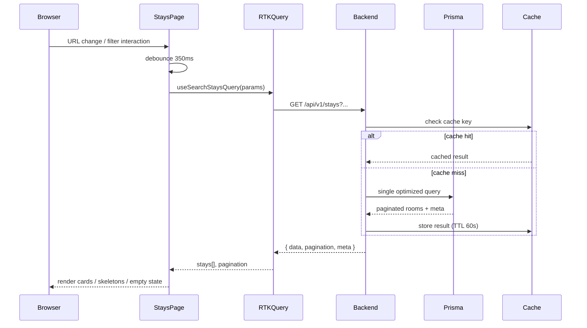
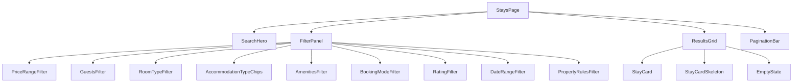

# Epic: Production-Grade Accommodation Search Engine Upgrade

---

# Accommodation Discovery Engine — Architecture & Design

## Overview

Upgrade the existing temporary-stay search system into a production-grade accommodation discovery engine. The work is **additive and improvement-only** — no unrelated pages are touched.

## System Architecture



## Backend Design

### 1. Endpoint

`GET /api/v1/stays` — already wired in `app.js`. No new route needed.

### 2. Query Parameters (full surface)

| Param | Type | Notes |
| --- | --- | --- |
| `location` | string | Province / city text search (existing) |
| `lat` / `lng` / `radius` | float / km | Geo bounding-box filter using `lat`/`lng` on `Accommodation` |
| `minPrice` / `maxPrice` | float | `basePricePerNight` range (existing) |
| `guests` | int | `capacity >= guests` (existing) |
| `roomType` | enum | `RoomType` enum: SINGLE, DOUBLE, TWIN, SUITE, DORMITORY, STUDIO, ENTIRE_UNIT |
| `businessType` | enum | `AccommodationType` (existing) |
| `amenities` | string[] | Slug-based, pushed into DB `WHERE` via `RoomAmenity` join (replaces in-memory filter) |
| `bookingMode` | INSTANT \| REQUEST | Existing |
| `minRating` | float | Filter accommodations by average review rating |
| `checkIn` / `checkOut` | ISO date | Availability exclusion (existing) |
| `petsAllowed` / `smokingAllowed` / `selfCheckIn` | bool | From `CheckInOutRules.selfCheckIn` and future `OccupancyRule` fields |
| `sort` | enum | `price_asc`, `price_desc`, `rating_desc`, `newest`, `distance` |
| `page` | int | 1-based, default 1 |
| `limit` | int | Default 12, max 48 |

### 3. Optimized Single-Pass Query Strategy

**Current problem:** Two sequential Prisma queries (accommodations → rooms) with in-memory amenity filtering. This is O(N) in application memory and cannot be paginated correctly.

**Solution:** Collapse into a single `prisma.room.findMany` with nested `where` on `accommodation` relation, plus a `prisma.room.count` for pagination metadata. Amenity filtering moves from in-memory to a `RoomAmenity` existence sub-query.

```
room.findMany({
  where: {
    accommodation: { verificationStatus, isPublished, type, location, avgRating },
    roomType, capacity, basePricePerNight, bookingMode,
    amenities: { some: { amenity: { slug: { in: slugs } } } }  // per amenity
  },
  select: { /* minimal projection */ },
  orderBy: [...],
  skip, take
})
```

### 4. Geo-Aware Filtering

PostgreSQL does not have a native `ST_DWithin` without PostGIS. The approach uses a **bounding-box approximation** computed in JavaScript before the query:

- `lat ± (radius / 111)` degrees latitude
- `lng ± (radius / (111 * cos(lat * π/180)))` degrees longitude

This is applied as `accommodation.lat` / `accommodation.lng` range filters in Prisma. Accuracy is sufficient for city-level radius searches (≤ 100 km).

### 5. Rating Filter

`Review` records exist per `Accommodation`. A `minRating` filter is implemented by:

1. Pre-querying `accommodationId`s whose average `overallRating` meets the threshold (a single `groupBy` query).
2. Passing those IDs into the main room query's `accommodation.id IN [...]` filter.

This avoids a raw SQL subquery while staying within Prisma's API.

### 6. Availability Filtering (deterministic)

Existing logic is correct. It is preserved and moved to run **after** the paginated room fetch, with a compensating over-fetch strategy:

- Fetch `limit * 2` rooms from DB.
- Filter out unavailable rooms.
- Return the first `limit` results.
- Set `hasMore` based on whether the DB returned more than `limit` after filtering.

This keeps availability filtering deterministic without requiring a second count query.

### 7. Sorting

| Sort value | DB `orderBy` |
| --- | --- |
| `price_asc` | `basePricePerNight asc` |
| `price_desc` | `basePricePerNight desc` |
| `newest` | `createdAt desc` |
| `rating_desc` | Pre-sorted accommodation IDs by avg rating, then `createdAt desc` |
| `distance` | Computed in JS after geo-filter (Haversine distance, ascending) |

### 8. Minimal Payload (`select` projection)

Replace `include: { accommodation: true }` (returns all 20+ columns) with a `select` that returns only fields the frontend consumes:

```
select: {
  id, name, description, roomType, capacity,
  basePricePerNight, bookingMode, createdAt,
  images: { where: { isCover: true }, take: 1 },
  amenities: { select: { amenity: { select: { slug, label } } } },
  accommodation: {
    select: { id, name, type, city, province, lat, lng,
              cancellationPolicy: { select: { policyType } },
              checkInOutRules: { select: { selfCheckIn } },
              reviews: { select: { overallRating }, where: { isPublished: true } }
    }
  }
}
```

### 9. Caching Strategy

Use an **in-process LRU cache** (no Redis dependency) with:

- Cache key: deterministic hash of the full query-string (sorted params).
- TTL: 60 seconds for search results.
- Max entries: 200 (evict LRU on overflow).
- Cache is **bypassed** when `checkIn`/`checkOut` are present (availability is time-sensitive).
- Cache is **invalidated** on room/accommodation write operations (existing tag invalidation in RTK Query handles the frontend side).

A lightweight `Map`-based LRU is implemented in `utils/searchCache.js` — no new npm dependency.

### 10. Search Analytics Hooks

A thin, non-blocking analytics hook is added to `searchStays`:

```
// fire-and-forget, never throws
logSearchEvent({ params, resultCount, durationMs, userId })
```

`logSearchEvent` writes to a `SearchAnalyticsEvent` table (new Prisma model, append-only). The migration adds the table; no existing queries are affected.

### 11. New DB Indexes

Added via a new Prisma migration:

| Model | Index |
| --- | --- |
| `Room` | `(accommodationId, status, basePricePerNight)` |
| `Room` | `(accommodationId, status, roomType)` |
| `Accommodation` | `(lat, lng)` — for geo bounding-box |
| `Accommodation` | `(verificationStatus, isPublished, type)` — already exists, verify |
| `Review` | `(accommodationId, overallRating, isPublished)` |

## Frontend Design

### Component Map



### State Management

All filter state lives **exclusively in the URL** (`useSearchParams`). The `form` local state is a draft that is only committed to the URL on submit (for text inputs) or immediately (for toggles/chips). This is the existing pattern in `Stays/index.tsx` — it is preserved and extended.

A new `useStayFilters` hook encapsulates:

- Reading from `URLSearchParams` → typed `StayFilterState`
- Writing back to `URLSearchParams`
- Debouncing text inputs (350 ms via `useRef` + `setTimeout`)

### Debounced Search

Text fields (`location`, `searchTerm`) use a 350 ms debounce before updating the URL. Toggle/chip filters update the URL immediately (no debounce needed — they are discrete values).

### Pagination

Replace the "Show More" append pattern with **cursor-style pagination**:

- Backend returns `{ data, pagination: { page, limit, total, hasMore } }`.
- Frontend renders a "Load more" button that appends the next page to the existing list (infinite-scroll style, matching the existing UX).
- RTK Query `merge` option is used to accumulate pages in the cache.

### Loading Skeletons

Replace `DotLoader` with MUI `Skeleton` cards that match the `StayCard` layout (image placeholder + 3 text lines + price row). Shown while `isLoading || isFetching`.

### Empty State

When `stays.length === 0` and not loading:

- Show an illustrated empty state with a headline ("No stays found"), a sub-message listing the active filters, and a "Clear filters" CTA that resets the URL to `/stays`.

### Mobile Filter UX

The existing bottom-drawer pattern is preserved. Improvements:

- Add a filter-count badge on the FAB (e.g., "Filters · 3").
- Add a "Clear all" button inside the drawer header.
- Drawer is scrollable with a sticky "Apply" button at the bottom.

### Error Handling

Replace the bare `Alert` with a structured error card that shows:

- A human-readable message.
- A "Retry" button that calls `refetch()`.

## Wireframes

### Desktop — Stays Search Page

```wireframe

<html>
<head>
<style>
* { box-sizing: border-box; margin: 0; padding: 0; font-family: sans-serif; }
body { background: #f8fafc; }
.hero { background: linear-gradient(135deg, #0f172a 0%, #1e293b 50%, #0f766e 100%); padding: 32px; color: #fff; border-radius: 12px; margin: 16px; }
.hero h1 { font-size: 22px; font-weight: 700; margin-bottom: 4px; }
.hero p { font-size: 13px; opacity: 0.75; margin-bottom: 20px; }
.search-row { display: flex; gap: 10px; flex-wrap: wrap; }
.search-row input { flex: 1; min-width: 120px; padding: 10px 12px; border-radius: 8px; border: none; font-size: 13px; }
.search-row button { padding: 10px 20px; background: #fff; color: #0f172a; border: none; border-radius: 8px; font-weight: 600; cursor: pointer; }
.chips { display: flex; gap: 8px; margin-top: 16px; flex-wrap: wrap; }
.chip { padding: 6px 14px; border-radius: 999px; border: 1px solid rgba(255,255,255,0.3); color: #fff; font-size: 12px; cursor: pointer; background: rgba(255,255,255,0.08); }
.chip.active { background: #0f766e; border-color: #0f766e; }
.layout { display: flex; gap: 16px; padding: 0 16px 16px; }
.sidebar { width: 260px; flex-shrink: 0; }
.panel { background: #fff; border-radius: 12px; padding: 16px; margin-bottom: 12px; box-shadow: 0 1px 3px rgba(0,0,0,0.06); }
.panel h3 { font-size: 14px; font-weight: 600; margin-bottom: 12px; color: #0f172a; }
.filter-row { display: flex; gap: 8px; margin-bottom: 8px; }
.filter-row input { flex: 1; padding: 8px; border: 1px solid #e2e8f0; border-radius: 6px; font-size: 12px; }
.check-row { display: flex; align-items: center; gap: 8px; margin-bottom: 6px; font-size: 12px; color: #334155; }
.check-row input[type=checkbox] { width: 14px; height: 14px; }
.radio-row { display: flex; align-items: center; gap: 8px; margin-bottom: 6px; font-size: 12px; color: #334155; }
.stars { color: #f59e0b; font-size: 13px; }
.results { flex: 1; }
.results-header { display: flex; justify-content: space-between; align-items: center; margin-bottom: 12px; }
.results-header span { font-size: 13px; color: #64748b; }
.results-header select { padding: 6px 10px; border: 1px solid #e2e8f0; border-radius: 6px; font-size: 12px; }
.grid { display: grid; grid-template-columns: repeat(3, 1fr); gap: 14px; }
.card { background: #fff; border-radius: 12px; overflow: hidden; box-shadow: 0 1px 3px rgba(0,0,0,0.06); }
.card-img { height: 160px; background: #e2e8f0; position: relative; }
.card-img .badge { position: absolute; top: 8px; left: 8px; background: #0f766e; color: #fff; font-size: 10px; padding: 3px 8px; border-radius: 999px; }
.card-body { padding: 14px; }
.card-body h4 { font-size: 14px; font-weight: 600; margin-bottom: 4px; }
.card-body .loc { font-size: 11px; color: #64748b; margin-bottom: 6px; }
.card-body .desc { font-size: 11px; color: #94a3b8; margin-bottom: 10px; line-height: 1.4; }
.card-footer { display: flex; justify-content: space-between; align-items: center; }
.price { font-size: 16px; font-weight: 700; color: #0f172a; }
.price span { font-size: 11px; color: #64748b; font-weight: 400; }
.btn-sm { padding: 6px 14px; background: #0f766e; color: #fff; border: none; border-radius: 6px; font-size: 11px; cursor: pointer; }
.skel { background: linear-gradient(90deg, #e2e8f0 25%, #f1f5f9 50%, #e2e8f0 75%); border-radius: 6px; }
.pagination { text-align: center; margin-top: 20px; }
.pagination button { padding: 10px 28px; background: #0f172a; color: #fff; border: none; border-radius: 8px; font-size: 13px; cursor: pointer; }
</style>
</head>
<body>
<div class="hero">
  <h1>Temporary Stays</h1>
  <p>Search short-stay rooms, compare nightly pricing, and move straight into the booking flow.</p>
  <div class="search-row">
    <input placeholder="Location — Harare, Bulawayo..." data-element-id="location-input" />
    <input type="date" data-element-id="checkin-input" />
    <input type="date" data-element-id="checkout-input" />
    <input type="number" placeholder="Guests" style="max-width:90px" data-element-id="guests-input" />
    <input placeholder="Suite, wifi..." data-element-id="search-term-input" />
    <button data-element-id="search-btn">Search stays</button>
  </div>
  <div class="chips">
    <div class="chip active" data-element-id="type-all">All</div>
    <div class="chip" data-element-id="type-hotel">Hotel</div>
    <div class="chip" data-element-id="type-lodge">Lodge</div>
    <div class="chip" data-element-id="type-bnb">BnB</div>
    <div class="chip" data-element-id="type-apartment">Apartment</div>
    <div class="chip" data-element-id="type-hostel">Hostel</div>
    <div class="chip" data-element-id="type-guesthouse">Guest House</div>
  </div>
</div>

<div class="layout">
  <div class="sidebar">
    <div class="panel">
      <h3>Price per Night</h3>
      <div class="filter-row">
        <input placeholder="Min $" data-element-id="min-price" />
        <input placeholder="Max $" data-element-id="max-price" />
      </div>
    </div>
    <div class="panel">
      <h3>Room Type</h3>
      <div class="check-row"><input type="checkbox" data-element-id="rt-single" /> Single</div>
      <div class="check-row"><input type="checkbox" data-element-id="rt-double" /> Double</div>
      <div class="check-row"><input type="checkbox" data-element-id="rt-twin" /> Twin</div>
      <div class="check-row"><input type="checkbox" data-element-id="rt-suite" /> Suite</div>
      <div class="check-row"><input type="checkbox" data-element-id="rt-studio" /> Studio</div>
      <div class="check-row"><input type="checkbox" data-element-id="rt-entire" /> Entire Unit</div>
    </div>
    <div class="panel">
      <h3>Min Rating</h3>
      <div class="radio-row"><input type="radio" name="rating" data-element-id="r-any" checked /> Any</div>
      <div class="radio-row"><input type="radio" name="rating" data-element-id="r-3" /> <span class="stars">★★★</span> 3+</div>
      <div class="radio-row"><input type="radio" name="rating" data-element-id="r-4" /> <span class="stars">★★★★</span> 4+</div>
      <div class="radio-row"><input type="radio" name="rating" data-element-id="r-5" /> <span class="stars">★★★★★</span> 5 only</div>
    </div>
    <div class="panel">
      <h3>Amenities</h3>
      <div class="check-row"><input type="checkbox" data-element-id="am-wifi" /> Wi-Fi</div>
      <div class="check-row"><input type="checkbox" data-element-id="am-breakfast" /> Breakfast Included</div>
      <div class="check-row"><input type="checkbox" data-element-id="am-parking" /> Secure Parking</div>
      <div class="check-row"><input type="checkbox" data-element-id="am-pool" /> Swimming Pool</div>
      <div class="check-row"><input type="checkbox" data-element-id="am-ac" /> Air Conditioning</div>
      <div class="check-row"><input type="checkbox" data-element-id="am-conf" /> Conference Room</div>
    </div>
    <div class="panel">
      <h3>Booking Type</h3>
      <div class="radio-row"><input type="radio" name="bm" data-element-id="bm-all" checked /> All</div>
      <div class="radio-row"><input type="radio" name="bm" data-element-id="bm-instant" /> ⚡ Instant Book</div>
      <div class="radio-row"><input type="radio" name="bm" data-element-id="bm-request" /> Request to Book</div>
    </div>
    <div class="panel">
      <h3>Property Rules</h3>
      <div class="check-row"><input type="checkbox" data-element-id="pr-selfcheckin" /> Self Check-in</div>
      <div class="check-row"><input type="checkbox" data-element-id="pr-pets" /> Pets Allowed</div>
      <div class="check-row"><input type="checkbox" data-element-id="pr-smoking" /> Smoking Allowed</div>
    </div>
  </div>

  <div class="results">
    <div class="results-header">
      <span>24 results</span>
      <select data-element-id="sort-select">
        <option>Price Low to High</option>
        <option>Price High to Low</option>
        <option>Highest Rated</option>
        <option>Newest</option>
        <option>Distance</option>
      </select>
    </div>
    <div class="grid">
      <div class="card">
        <div class="card-img"><div class="badge">⚡ Instant</div></div>
        <div class="card-body">
          <h4>Deluxe Double Room</h4>
          <div class="loc">📍 Harare, Avondale</div>
          <div class="desc">Spacious room with en-suite bathroom, air conditioning and city views...</div>
          <div class="card-footer">
            <div class="price">$45 <span>/night</span></div>
            <button class="btn-sm" data-element-id="view-btn-1">View details</button>
          </div>
        </div>
      </div>
      <div class="card">
        <div class="card-img"></div>
        <div class="card-body">
          <h4>Executive Suite</h4>
          <div class="loc">📍 Bulawayo, CBD</div>
          <div class="desc">Premium suite with lounge area, breakfast included and free parking...</div>
          <div class="card-footer">
            <div class="price">$120 <span>/night</span></div>
            <button class="btn-sm" data-element-id="view-btn-2">View details</button>
          </div>
        </div>
      </div>
      <div class="card">
        <div class="card-img"></div>
        <div class="card-body">
          <h4>Twin Room</h4>
          <div class="loc">📍 Victoria Falls</div>
          <div class="desc">Comfortable twin room near the falls, Wi-Fi and pool access included...</div>
          <div class="card-footer">
            <div class="price">$65 <span>/night</span></div>
            <button class="btn-sm" data-element-id="view-btn-3">View details</button>
          </div>
        </div>
      </div>
    </div>
    <div class="pagination">
      <button data-element-id="load-more-btn">Load more stays</button>
    </div>
  </div>
</div>
</body>
</html>
```

### Mobile — Filter Drawer

```wireframe

<html>
<head>
<style>
* { box-sizing: border-box; margin: 0; padding: 0; font-family: sans-serif; }
body { background: #f8fafc; max-width: 390px; margin: 0 auto; position: relative; min-height: 700px; }
.page-bg { padding: 16px; }
.card { background: #fff; border-radius: 12px; padding: 14px; margin-bottom: 12px; box-shadow: 0 1px 3px rgba(0,0,0,0.06); }
.card h4 { font-size: 14px; font-weight: 600; margin-bottom: 4px; }
.card .loc { font-size: 11px; color: #64748b; margin-bottom: 8px; }
.card .price { font-size: 16px; font-weight: 700; }
.fab { position: fixed; bottom: 24px; right: 20px; background: #0f766e; color: #fff; border: none; border-radius: 999px; padding: 12px 20px; font-size: 13px; font-weight: 600; display: flex; align-items: center; gap: 8px; box-shadow: 0 4px 12px rgba(0,0,0,0.2); cursor: pointer; }
.badge { background: #fff; color: #0f766e; border-radius: 999px; padding: 1px 7px; font-size: 11px; font-weight: 700; }
.drawer { position: fixed; bottom: 0; left: 0; right: 0; background: #fff; border-radius: 20px 20px 0 0; padding: 0; max-height: 85vh; overflow-y: auto; box-shadow: 0 -4px 24px rgba(0,0,0,0.12); }
.drawer-handle { width: 48px; height: 4px; background: #cbd5e1; border-radius: 999px; margin: 12px auto 0; }
.drawer-header { display: flex; justify-content: space-between; align-items: center; padding: 16px 16px 8px; border-bottom: 1px solid #f1f5f9; }
.drawer-header h3 { font-size: 16px; font-weight: 700; }
.drawer-header button { background: none; border: none; color: #64748b; font-size: 12px; cursor: pointer; }
.drawer-body { padding: 16px; }
.section { margin-bottom: 20px; }
.section h4 { font-size: 13px; font-weight: 600; margin-bottom: 10px; color: #0f172a; }
.price-row { display: flex; gap: 8px; }
.price-row input { flex: 1; padding: 8px; border: 1px solid #e2e8f0; border-radius: 8px; font-size: 12px; }
.check-row { display: flex; align-items: center; gap: 8px; margin-bottom: 8px; font-size: 13px; color: #334155; }
.check-row input { width: 16px; height: 16px; }
.chips { display: flex; gap: 6px; flex-wrap: wrap; }
.chip { padding: 6px 12px; border-radius: 999px; border: 1px solid #e2e8f0; font-size: 11px; cursor: pointer; }
.chip.active { background: #0f766e; color: #fff; border-color: #0f766e; }
.drawer-footer { padding: 12px 16px; border-top: 1px solid #f1f5f9; position: sticky; bottom: 0; background: #fff; }
.apply-btn { width: 100%; padding: 14px; background: #0f172a; color: #fff; border: none; border-radius: 10px; font-size: 14px; font-weight: 600; cursor: pointer; }
</style>
</head>
<body>
<div class="page-bg">
  <div class="card">
    <h4>Deluxe Double Room</h4>
    <div class="loc">📍 Harare, Avondale</div>
    <div class="price">$45 <span style="font-size:11px;color:#64748b;font-weight:400">/night</span></div>
  </div>
  <div class="card">
    <h4>Executive Suite</h4>
    <div class="loc">📍 Bulawayo, CBD</div>
    <div class="price">$120 <span style="font-size:11px;color:#64748b;font-weight:400">/night</span></div>
  </div>
</div>

<button class="fab" data-element-id="filter-fab">
  ⚙ Filters <span class="badge">3</span>
</button>

<div class="drawer">
  <div class="drawer-handle"></div>
  <div class="drawer-header">
    <h3>Filters</h3>
    <button data-element-id="clear-all-btn">Clear all</button>
  </div>
  <div class="drawer-body">
    <div class="section">
      <h4>Price per Night</h4>
      <div class="price-row">
        <input placeholder="Min $" data-element-id="mob-min-price" />
        <input placeholder="Max $" data-element-id="mob-max-price" />
      </div>
    </div>
    <div class="section">
      <h4>Room Type</h4>
      <div class="chips">
        <div class="chip active" data-element-id="mob-rt-double">Double</div>
        <div class="chip" data-element-id="mob-rt-single">Single</div>
        <div class="chip" data-element-id="mob-rt-suite">Suite</div>
        <div class="chip" data-element-id="mob-rt-studio">Studio</div>
        <div class="chip" data-element-id="mob-rt-entire">Entire Unit</div>
      </div>
    </div>
    <div class="section">
      <h4>Min Rating</h4>
      <div class="chips">
        <div class="chip" data-element-id="mob-r-any">Any</div>
        <div class="chip active" data-element-id="mob-r-3">★★★ 3+</div>
        <div class="chip" data-element-id="mob-r-4">★★★★ 4+</div>
      </div>
    </div>
    <div class="section">
      <h4>Amenities</h4>
      <div class="check-row"><input type="checkbox" checked data-element-id="mob-wifi" /> Wi-Fi</div>
      <div class="check-row"><input type="checkbox" data-element-id="mob-breakfast" /> Breakfast Included</div>
      <div class="check-row"><input type="checkbox" checked data-element-id="mob-parking" /> Secure Parking</div>
      <div class="check-row"><input type="checkbox" data-element-id="mob-pool" /> Swimming Pool</div>
    </div>
    <div class="section">
      <h4>Booking Type</h4>
      <div class="chips">
        <div class="chip" data-element-id="mob-bm-all">All</div>
        <div class="chip active" data-element-id="mob-bm-instant">⚡ Instant</div>
        <div class="chip" data-element-id="mob-bm-request">Request</div>
      </div>
    </div>
    <div class="section">
      <h4>Property Rules</h4>
      <div class="check-row"><input type="checkbox" data-element-id="mob-selfcheckin" /> Self Check-in</div>
      <div class="check-row"><input type="checkbox" data-element-id="mob-pets" /> Pets Allowed</div>
    </div>
  </div>
  <div class="drawer-footer">
    <button class="apply-btn" data-element-id="apply-btn">Apply Filters</button>
  </div>
</div>
</body>
</html>
```

### Empty State

```wireframe

<html>
<head>
<style>
* { box-sizing: border-box; margin: 0; padding: 0; font-family: sans-serif; }
body { background: #f8fafc; display: flex; align-items: center; justify-content: center; min-height: 400px; }
.empty { text-align: center; padding: 48px 32px; max-width: 400px; }
.icon { font-size: 56px; margin-bottom: 16px; }
.title { font-size: 20px; font-weight: 700; color: #0f172a; margin-bottom: 8px; }
.sub { font-size: 14px; color: #64748b; margin-bottom: 8px; line-height: 1.5; }
.filters-used { font-size: 12px; color: #94a3b8; margin-bottom: 24px; }
.btn { padding: 12px 28px; background: #0f172a; color: #fff; border: none; border-radius: 8px; font-size: 14px; font-weight: 600; cursor: pointer; }
</style>
</head>
<body>
<div class="empty">
  <div class="icon">🏨</div>
  <div class="title">No stays found</div>
  <div class="sub">We couldn't find any rooms matching your current filters.</div>
  <div class="filters-used">Active filters: Harare · $20–$80 · Wi-Fi · Instant Book</div>
  <button class="btn" data-element-id="clear-filters-btn">Clear all filters</button>
</div>
</body>
</html>
```

## Files Changed

### Backend

| File | Change |
| --- | --- |
| `real-app-backend-main/controllers/stayController.js` | Rewrite `searchStays`: single-pass query, pagination, geo-filter, rating filter, room-type filter, property-rules filter, server-side sort, minimal `select`, analytics hook |
| `real-app-backend-main/utils/searchCache.js` | **New** — LRU in-process cache utility |
| `real-app-backend-main/utils/searchAnalytics.js` | **New** — fire-and-forget analytics logger |
| `real-app-backend-main/prisma/schema.prisma` | Add `SearchAnalyticsEvent` model; add new indexes |
| `real-app-backend-main/prisma/migrations/…` | New migration for indexes + analytics table |

### Frontend

| File | Change |
| --- | --- |
| `real-app-frontend-main/src/views/Stays/index.tsx` | Add all new filters, skeletons, empty state, pagination, error retry, analytics hook calls |
| `real-app-frontend-main/src/redux/api/stayApiSlice.ts` | Fix endpoint URL (`stays` not `rooms/search`), add pagination support, extend `StaySearchParams` |
| `real-app-frontend-main/src/hooks/useStayFilters.ts` | **New** — debounced URL-synced filter hook |
| `real-app-frontend-main/src/components/stays/StayCard.tsx` | **New** — extracted card component with rating badge, booking-mode badge |
| `real-app-frontend-main/src/components/stays/StayCardSkeleton.tsx` | **New** — MUI Skeleton card |
| `real-app-frontend-main/src/components/stays/EmptyState.tsx` | **New** — empty state with active-filter summary and clear CTA |
| `real-app-frontend-main/src/components/stays/FilterPanel.tsx` | **New** — extracted, reusable filter panel (used in both desktop sidebar and mobile drawer) |