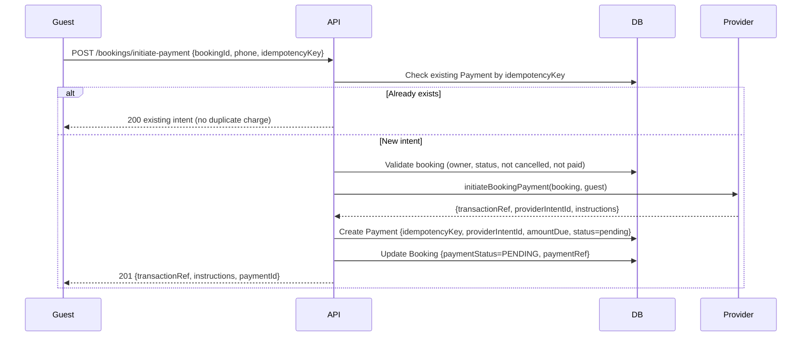
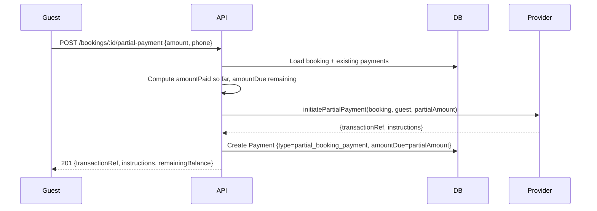
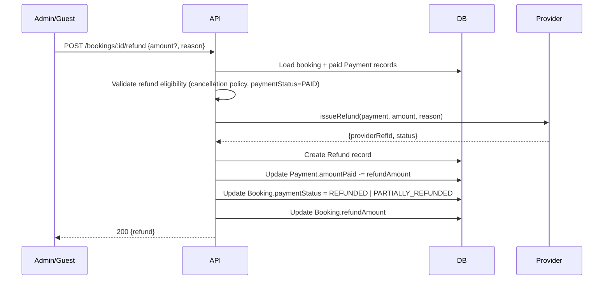
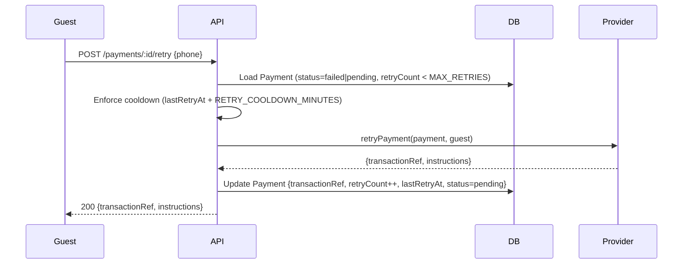

# Epic: Production-Grade Checkout Architecture for Temporary Stays

---

# Production-Grade Checkout Architecture — Temporary Stay Payments

## Overview

This spec upgrades the existing temporary-stay payment system from a basic Paynow integration into a production-grade, multi-provider checkout architecture. The system must support Paynow (live) and Stripe (ready-to-activate), partial payments, refunds, payment retries, idempotency, webhook safety, and booking-payment reconciliation.

## Current Architecture Gaps

| Area | Current State | Required State |
| --- | --- | --- |
| Payment model | Flat `Payment` row, string statuses | Typed enums, `PaymentIntent` concept, `Refund` sub-records |
| Providers | Paynow + Mock | Paynow + Stripe adapter (provider-agnostic interface) |
| Partial payments | Not supported | Supported via `amountPaid` / `amountDue` tracking |
| Refunds | DB flag only, no provider call | Provider refund API call + `Refund` record |
| Retries | Not supported | Retry counter, cooldown, max-retry guard |
| Webhook safety | `webhookVerified` flag (idempotent) | HMAC/signature verification per provider + idempotency |
| Reconciliation | None | Scheduled status-poll job for pending payments |
| Idempotency | None on initiation | `idempotencyKey` on every payment creation |

## Domain Model Changes

### `Payment` model additions

The existing `Payment` model in file:real-app-backend-main/prisma/schema.prisma needs the following new fields:

| Field | Type | Purpose |
| --- | --- | --- |
| `idempotencyKey` | `String @unique` | Prevents duplicate payment creation on retries |
| `providerIntentId` | `String?` | Provider-side intent/session ID (Stripe PaymentIntent ID, Paynow poll URL) |
| `amountPaid` | `Float @default(0)` | Cumulative amount confirmed paid (for partial payments) |
| `amountDue` | `Float` | Total amount expected |
| `retryCount` | `Int @default(0)` | Number of retry attempts |
| `lastRetryAt` | `DateTime?` | Timestamp of last retry |
| `providerMeta` | `Json?` | Raw provider response snapshot |
| `currency` | `String @default("USD")` | ISO currency code |

### New `Refund` model

```
model Refund {
  id            String   @id @default(cuid())
  paymentId     String
  payment       Payment  @relation(...)
  bookingId     String?
  amount        Float
  reason        String?
  status        String   @default("pending")  // pending | success | failed
  providerRefId String?
  initiatedBy   String   // userId
  createdAt     DateTime @default(now())
  updatedAt     DateTime @updatedAt
}
```

### New `WebhookEvent` model (idempotency log)

```
model WebhookEvent {
  id          String   @id @default(cuid())
  provider    String   // "paynow" | "stripe"
  eventId     String   @unique  // provider event ID or hash
  payload     Json
  processedAt DateTime @default(now())
}
```

## Provider Interface Contract

All payment providers must implement a unified interface. The existing file:real-app-backend-main/utils/paymentProvider.js interface is extended:

```
interface PaymentProvider {
  // Existing
  initiateListingFee(listing, landlord): Promise<IntentResult>
  initiatePremiumSubscription(user): Promise<IntentResult>
  initiateBookingPayment(booking, guest): Promise<IntentResult>
  verifyWebhook(payload, headers): Promise<WebhookResult>

  // New
  initiatePartialPayment(booking, guest, amount): Promise<IntentResult>
  retryPayment(payment, guest): Promise<IntentResult>
  issueRefund(payment, amount, reason): Promise<RefundResult>
  pollPaymentStatus(payment): Promise<StatusResult>
}
```

Where:

- `IntentResult` → `{ transactionRef, providerIntentId, instructions, pollUrl? }`
- `WebhookResult` → `{ valid, eventId, transactionRef, status, amountPaid? }`
- `RefundResult` → `{ providerRefId, status }`
- `StatusResult` → `{ status, amountPaid? }`

## Payment Intent Flow



## Partial Payment Flow



On webhook success for a partial payment:

- Accumulate `amountPaid` across all `Payment` records for the booking
- If `amountPaid >= booking.totalPrice` → set `paymentStatus = PAID`
- Otherwise → set `paymentStatus = PARTIALLY_PAID` (new enum value)

## Refund Flow



The existing `cancelBooking` in file:real-app-backend-main/controllers/bookingController.js currently only writes `refundAmount` to the DB. It must be extended to call the provider refund API when `paymentStatus === PAID`.

## Payment Retry Flow



Constants (env-configurable):

- `MAX_PAYMENT_RETRIES` — default 3
- `RETRY_COOLDOWN_MINUTES` — default 5

## Webhook Safety Architecture

### Paynow Webhook

The existing file:real-app-backend-main/controllers/webhookController.js uses `paynow.verifyHash(formFields)` for signature verification. This is correct but must be hardened:

1. **Signature verification** — `verifyHash` must be called before any DB access; reject with `200 ignored` on failure (never `4xx` to avoid Paynow retries)
2. **Idempotency** — Before processing, insert a `WebhookEvent` row with `eventId = hash(provider + transactionRef + status)`. If the insert fails with a unique constraint violation, return `200 already processed`
3. **Atomic claim** — The existing `updateMany` with `webhookVerified: false` guard is correct; keep it
4. **Side-effect isolation** — Side effects (booking status, emails) run inside a try/catch; on failure, reset `webhookVerified` to `false` so the event can be reprocessed

### Stripe Webhook (ready-to-activate)

A new `handleStripeWebhook` handler in file:real-app-backend-main/controllers/webhookController.js:

1. Read raw body (requires `express.raw({ type: 'application/json' })` on the route — **not** `express.json()`)
2. Verify signature via `stripe.webhooks.constructEvent(rawBody, sig, STRIPE_WEBHOOK_SECRET)`
3. Insert `WebhookEvent` for idempotency
4. Handle `payment_intent.succeeded`, `payment_intent.payment_failed`, `charge.refunded`

The route in file:real-app-backend-main/routes/webhookRoutes.js must mount the Stripe handler **before** the global `express.json()` middleware.

## Stripe Provider Adapter

A new file:real-app-backend-main/utils/providers/stripeProvider.js implementing the full `PaymentProvider` interface:

- `initiateBookingPayment` → creates a Stripe `PaymentIntent` with `metadata: { bookingId, userId }`
- `issueRefund` → calls `stripe.refunds.create({ payment_intent, amount })`
- `pollPaymentStatus` → retrieves the `PaymentIntent` and maps its status
- `verifyWebhook` → uses `stripe.webhooks.constructEvent`

The provider factory in file:real-app-backend-main/utils/paymentProvider.js adds:

```js
if (paymentProvider === 'stripe') return StripeProvider;
```

## Payment Status Reconciliation

A new file:real-app-backend-main/utils/reconciliationJob.js scheduled cron (configurable interval, default every 15 minutes):

1. Query all `Payment` records with `status = 'pending'` and `createdAt < now - RECONCILIATION_STALE_MINUTES`
2. For each, call `provider.pollPaymentStatus(payment)`
3. If status changed → update `Payment` and trigger the same side-effects as the webhook handler (booking status, emails)
4. If `retryCount >= MAX_PAYMENT_RETRIES` → mark `status = 'expired'`

The job must be registered in file:real-app-backend-main/app.js or `server.js` using `node-cron` or a similar lightweight scheduler.

## New API Endpoints

| Method | Path | Auth | Description |
| --- | --- | --- | --- |
| `POST` | `/api/v1/bookings/:id/partial-payment` | Guest (owner) | Initiate a partial booking payment |
| `POST` | `/api/v1/bookings/:id/refund` | Admin or Guest (owner) | Issue a refund for a paid booking |
| `POST` | `/api/v1/payments/:id/retry` | Guest (owner) | Retry a failed/pending payment |
| `GET` | `/api/v1/payments/:id/status` | Guest (owner) | Poll current payment status |
| `POST` | `/webhooks/stripe` | Public (signature-verified) | Stripe webhook receiver |

## Validation & Security

All new endpoints use `express-validator` chains in file:real-app-backend-main/middleware/paymentValidators.js:

- `idempotencyKey` — required string, min 8 chars, on all payment initiation endpoints
- `amount` — positive finite number, ≤ `booking.totalPrice`, on partial payment
- `reason` — optional string, max 500 chars, on refund
- Rate limiting — existing `paymentLimiter` applied to all new payment routes

## Booking-Payment Synchronization Rules

| Booking `paymentStatus` | Condition |
| --- | --- |
| `UNPAID` | No payment initiated |
| `PENDING` | Payment initiated, webhook not yet received |
| `PARTIALLY_PAID` | Sum of confirmed payments < `totalPrice` |
| `PAID` | Sum of confirmed payments ≥ `totalPrice` |
| `REFUNDED` | Full refund issued |
| `PARTIALLY_REFUNDED` | Partial refund issued |
| `FAILED` | All payment attempts failed |

The `PARTIALLY_PAID` value must be added to the `PaymentStatus` enum in the Prisma schema.

## Email Notifications

Extend file:real-app-backend-main/utils/emailTemplates/stayEmails.js with:

- `paymentRefundInitiated` — sent to guest when refund is created
- `paymentRetryAvailable` — sent to guest when a payment fails (with retry link)
- `paymentPartialReceived` — sent to guest when a partial payment is confirmed

## Environment Variables

| Variable | Description |
| --- | --- |
| `STRIPE_SECRET_KEY` | Stripe API secret |
| `STRIPE_WEBHOOK_SECRET` | Stripe webhook signing secret |
| `MAX_PAYMENT_RETRIES` | Max retry attempts (default: 3) |
| `RETRY_COOLDOWN_MINUTES` | Cooldown between retries (default: 5) |
| `RECONCILIATION_STALE_MINUTES` | Age threshold for reconciliation (default: 15) |
| `RECONCILIATION_INTERVAL_CRON` | Cron expression (default: `*/15 * * * *`) |