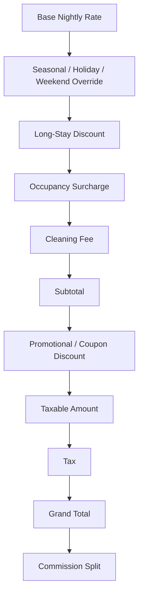
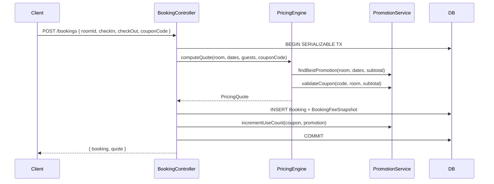

# Epic: Production-Grade Pricing Engine for Temporary Stays

---

# Production-Grade Pricing Engine — Architecture & Design

## Overview

This spec defines the complete pricing engine for the Creapy temporary-stays platform. The engine is **server-authoritative**: all totals are computed on the backend and the frontend only renders what the server returns. The frontend never independently calculates a final price.

## Pricing Layers (Evaluation Order)

Every booking quote is assembled by stacking independent pricing layers in a deterministic sequence:



| Layer | Source | Notes |
| --- | --- | --- |
| Base nightly rate | `Room.basePricePerNight` | Fallback when no rate rule matches |
| Seasonal / Holiday / Weekend | `SeasonalRate` (existing) | Priority-ordered; highest priority wins per night |
| Long-stay discount | `SeasonalRate` with `rateType=LONG_STAY` | Applied when `nights >= minNightsToApply` |
| Occupancy surcharge | New `OccupancyPricingRule` | Extra charge per guest above a threshold |
| Cleaning fee | New `RoomFee` (type=CLEANING) | Flat or per-stay amount |
| Promotional discount | New `Promotion` + `Coupon` | Percentage or fixed; applied after subtotal |
| Tax | New `TaxRule` (per accommodation) | Percentage applied to taxable subtotal |
| Commission | `Accommodation.commissionRate` (existing) | Applied to grand total for payout split |

## New Database Models

### `RoomFee`

Stores per-room fees (cleaning, linen, etc.).

| Field | Type | Notes |
| --- | --- | --- |
| `id` | String (cuid) | PK |
| `roomId` | String | FK → Room |
| `feeType` | Enum: `CLEANING \| LINEN \| PET \| OTHER` |  |
| `label` | String | Display name |
| `amount` | Decimal | Absolute amount |
| `currency` | String | Default `USD` |
| `isPerStay` | Boolean | `true` = flat per booking; `false` = per night |
| `isOptional` | Boolean | Guest can opt out |

### `TaxRule`

Per-accommodation tax configuration.

| Field | Type | Notes |
| --- | --- | --- |
| `id` | String (cuid) | PK |
| `accommodationId` | String | FK → Accommodation (unique) |
| `label` | String | e.g. "VAT", "Tourism Levy" |
| `percentage` | Decimal | e.g. `15.00` for 15% |
| `isInclusive` | Boolean | If true, tax is already included in the price |
| `appliesTo` | Enum: `SUBTOTAL \| CLEANING \| ALL` | What the tax applies to |

### `OccupancyPricingRule`

Extra charge when guest count exceeds a threshold.

| Field | Type | Notes |
| --- | --- | --- |
| `id` | String (cuid) | PK |
| `roomId` | String | FK → Room (unique) |
| `baseGuestCount` | Int | Guests included in base price |
| `extraGuestFeePerNight` | Decimal | Fee per extra guest per night |

### `Promotion`

Time-bounded promotional campaigns.

| Field | Type | Notes |
| --- | --- | --- |
| `id` | String (cuid) | PK |
| `accommodationId` | String? | Scoped to accommodation (null = platform-wide) |
| `roomId` | String? | Scoped to room |
| `name` | String |  |
| `discountType` | Enum: `PERCENTAGE \| FIXED` |  |
| `discountValue` | Decimal |  |
| `minNights` | Int | Minimum stay to qualify |
| `minSubtotal` | Decimal? | Minimum subtotal to qualify |
| `startDate` | DateTime |  |
| `endDate` | DateTime |  |
| `isActive` | Boolean |  |
| `stackable` | Boolean | Can combine with coupon |
| `maxUses` | Int? |  |
| `useCount` | Int |  |

### `Coupon`

Redeemable coupon codes.

| Field | Type | Notes |
| --- | --- | --- |
| `id` | String (cuid) | PK |
| `code` | String (unique) | Case-insensitive |
| `promotionId` | String | FK → Promotion |
| `maxUses` | Int? |  |
| `useCount` | Int |  |
| `expiresAt` | DateTime? |  |
| `isActive` | Boolean |  |

### `BookingFeeSnapshot`

Immutable snapshot of all fee line items at booking time.

| Field | Type | Notes |
| --- | --- | --- |
| `id` | String (cuid) | PK |
| `bookingId` | String (unique) | FK → Booking |
| `lineItems` | Json | Array of `{ label, type, amount, isDiscount }` |
| `subtotal` | Decimal | Before discounts |
| `discountAmount` | Decimal | Total discounts applied |
| `taxAmount` | Decimal |  |
| `grandTotal` | Decimal |  |
| `couponCode` | String? | Applied coupon |
| `promotionId` | String? | Applied promotion |

### Booking model additions

New fields on the existing `Booking` model:

| Field | Type | Notes |
| --- | --- | --- |
| `cleaningFee` | Decimal | Snapshot at booking time |
| `taxAmount` | Decimal | Snapshot at booking time |
| `discountAmount` | Decimal | Snapshot at booking time |
| `couponCode` | String? | Applied coupon code |
| `promotionId` | String? | Applied promotion |

## Backend Services

### `pricingEngine.js` (new — replaces/extends `pricingResolver.js`)

The central service that computes a full `PricingQuote` object. All other services call this.

**Input:**

```
{ room, checkIn, checkOut, adultCount, childCount, infantCount, couponCode? }
```

**Output (****`PricingQuote`****):**

```
{
  nights,
  nightlyBreakdown: [{ date, pricePerNight, rateLabel }],
  accommodationSubtotal,
  cleaningFee,
  occupancySurcharge,
  subtotal,
  promotionDiscount,
  couponDiscount,
  taxAmount,
  grandTotal,
  lineItems: [{ label, type, amount, isDiscount }],
  appliedPromotion: { id, name } | null,
  appliedCoupon: { code } | null,
  currency
}
```

All arithmetic uses integer-cent math internally and rounds to 2 decimal places at output boundaries. No floating-point accumulation.

### `promotionService.js` (new)

Responsible for:

- Finding the best applicable `Promotion` for a given room + dates + subtotal
- Validating and redeeming a `Coupon` code
- Enforcing `maxUses`, `isActive`, date windows, `minNights`, `minSubtotal`
- Incrementing `useCount` atomically inside the booking transaction

### `cancellationFeeService.js` (new — extends `bookingService.js`)

Computes the **cancellation fee** (what the guest owes, not the refund amount). Distinct from `computeRefundAmount`.

Logic:

- `FLEXIBLE`: no fee if cancelled within free window; otherwise 1 night charge
- `MODERATE`: 50% of total if < 5 days before check-in
- `STRICT`: 50% of total if < 7 days; 100% if < 24 hours
- `NON_REFUNDABLE`: 100% of total
- `CUSTOM`: uses `refundPercentage` from snapshot

## API Endpoints

### `POST /api/pricing/quote` *(new)*

Public (no auth required for preview). Computes a full pricing quote without creating a booking.

**Request body:**

```json
{
  "roomId": "...",
  "checkIn": "2026-06-01",
  "checkOut": "2026-06-05",
  "adultCount": 2,
  "childCount": 1,
  "couponCode": "SUMMER10"
}
```

**Response:**

```json
{
  "status": "success",
  "data": {
    "quote": { ...PricingQuote }
  }
}
```

### `POST /api/pricing/validate-coupon` *(new)*

Validates a coupon code for a given room + dates without consuming it.

### `GET /api/rooms/:id/seasonal-rates` *(new)*

Returns all `SeasonalRate` records for a room (provider-authenticated).

### `POST /api/rooms/:id/seasonal-rates` *(new)*

Creates a seasonal rate rule.

### `PUT /api/rooms/:id/seasonal-rates/:rateId` *(new)*

Updates a seasonal rate rule.

### `DELETE /api/rooms/:id/seasonal-rates/:rateId` *(new)*

Deletes a seasonal rate rule.

### `GET /api/rooms/:id/fees` *(new)*

Returns all `RoomFee` records for a room.

### `POST /api/rooms/:id/fees` *(new)*

Creates a room fee.

### `GET /api/accommodations/:id/tax` *(new)*

Returns the `TaxRule` for an accommodation.

### `PUT /api/accommodations/:id/tax` *(new)*

Upserts the `TaxRule`.

### `GET /api/promotions` *(new, admin)*

Lists all promotions.

### `POST /api/promotions` *(new, admin/provider)*

Creates a promotion.

### `POST /api/promotions/:id/coupons` *(new, admin/provider)*

Generates coupon codes for a promotion.

## Booking Flow Integration

The existing `createBooking` and `modifyBooking` flows in `bookingController.js` are extended to:

1. Call `pricingEngine.computeQuote(...)` instead of the current `resolveBookingPricing`
2. Validate and redeem the coupon (if provided) inside the serializable transaction
3. Persist the `BookingFeeSnapshot` and the new `Booking` fields atomically
4. Return the full `quote` alongside the booking in the response



## Frontend Architecture

### `usePricingQuote` hook (new)

A debounced RTK Query hook that calls `POST /api/pricing/quote` whenever `checkIn`, `checkOut`, or guest counts change. Replaces the current inline price calculation in `RoomDetail.tsx`.

### `PriceBreakdown` component (new)

Renders the full `PricingQuote` as a transparent line-item list. Used in:

- The booking sidebar on `RoomDetail.tsx`
- The booking confirmation page `BookingConfirmation.tsx`
- The booking detail page

### `CouponInput` component (new)

An inline input + "Apply" button that calls `POST /api/pricing/validate-coupon`, then triggers a re-fetch of the pricing quote with the validated code.

## Wireframes

### Booking Sidebar — Price Breakdown

```wireframe

<html>
<head>
<style>
* { box-sizing: border-box; margin: 0; padding: 0; font-family: sans-serif; font-size: 14px; }
body { background: #f5f5f5; display: flex; justify-content: center; padding: 24px; }
.card { background: #fff; border: 1px solid #ddd; border-radius: 10px; width: 340px; padding: 20px; }
.card-title { font-size: 18px; font-weight: 700; margin-bottom: 4px; }
.card-subtitle { color: #666; font-size: 12px; margin-bottom: 16px; }
.date-row { display: flex; gap: 8px; margin-bottom: 12px; }
.date-box { flex: 1; border: 1px solid #ccc; border-radius: 6px; padding: 8px 10px; }
.date-box label { display: block; font-size: 10px; color: #888; text-transform: uppercase; }
.date-box span { font-weight: 600; }
.divider { border: none; border-top: 1px solid #eee; margin: 12px 0; }
.line-item { display: flex; justify-content: space-between; padding: 4px 0; }
.line-item.muted { color: #888; }
.line-item.discount { color: #2e7d32; }
.line-item.bold { font-weight: 700; font-size: 15px; }
.line-item.tax { color: #555; font-size: 13px; }
.coupon-row { display: flex; gap: 8px; margin: 12px 0; }
.coupon-input { flex: 1; border: 1px solid #ccc; border-radius: 6px; padding: 8px 10px; font-size: 13px; }
.coupon-btn { background: #1a1a1a; color: #fff; border: none; border-radius: 6px; padding: 8px 14px; cursor: pointer; font-size: 13px; }
.coupon-success { font-size: 12px; color: #2e7d32; margin-top: -8px; margin-bottom: 8px; }
.book-btn { width: 100%; background: #1a1a1a; color: #fff; border: none; border-radius: 8px; padding: 14px; font-size: 15px; font-weight: 600; cursor: pointer; margin-top: 8px; }
.nights-label { font-size: 12px; color: #888; text-align: center; margin-bottom: 8px; }
</style>
</head>
<body>
<div class="card">
  <div class="card-title">$85 <span style="font-weight:400;font-size:14px;">/ night</span></div>
  <div class="card-subtitle">Prices may vary by date</div>

  <div class="date-row">
    <div class="date-box" data-element-id="checkin-box">
      <label>Check-in</label>
      <span>Jun 1, 2026</span>
    </div>
    <div class="date-box" data-element-id="checkout-box">
      <label>Check-out</label>
      <span>Jun 5, 2026</span>
    </div>
  </div>

  <div class="nights-label">4 nights · 2 adults, 1 child</div>

  <hr class="divider">

  <div class="line-item muted">
    <span>$85 × 2 nights (weekday)</span><span>$170.00</span>
  </div>
  <div class="line-item muted">
    <span>$95 × 2 nights (weekend)</span><span>$190.00</span>
  </div>
  <div class="line-item muted">
    <span>Occupancy surcharge (1 extra guest)</span><span>$20.00</span>
  </div>
  <div class="line-item muted">
    <span>Cleaning fee</span><span>$25.00</span>
  </div>

  <hr class="divider">

  <div class="line-item">
    <span>Subtotal</span><span>$405.00</span>
  </div>

  <div class="coupon-row">
    <input class="coupon-input" data-element-id="coupon-input" placeholder="Coupon code" value="SUMMER10">
    <button class="coupon-btn" data-element-id="apply-coupon-btn">Apply</button>
  </div>
  <div class="coupon-success">✓ SUMMER10 applied — 10% off</div>

  <div class="line-item discount">
    <span>Discount (SUMMER10 · 10%)</span><span>−$40.50</span>
  </div>
  <div class="line-item tax">
    <span>VAT (15%)</span><span>$54.68</span>
  </div>

  <hr class="divider">

  <div class="line-item bold">
    <span>Total</span><span>$419.18</span>
  </div>

  <button class="book-btn" data-element-id="book-btn">Reserve</button>
  <div style="text-align:center;font-size:11px;color:#888;margin-top:8px;">You won't be charged yet</div>
</div>
</body>
</html>
```

### Admin — Seasonal Rate Manager

```wireframe

<html>
<head>
<style>
* { box-sizing: border-box; margin: 0; padding: 0; font-family: sans-serif; font-size: 13px; }
body { background: #f5f5f5; padding: 24px; }
h2 { font-size: 18px; font-weight: 700; margin-bottom: 16px; }
.toolbar { display: flex; justify-content: space-between; align-items: center; margin-bottom: 12px; }
.add-btn { background: #1a1a1a; color: #fff; border: none; border-radius: 6px; padding: 8px 16px; cursor: pointer; }
table { width: 100%; border-collapse: collapse; background: #fff; border-radius: 8px; overflow: hidden; }
th { background: #f0f0f0; text-align: left; padding: 10px 12px; font-weight: 600; }
td { padding: 10px 12px; border-top: 1px solid #eee; }
.badge { display: inline-block; padding: 2px 8px; border-radius: 12px; font-size: 11px; font-weight: 600; }
.badge-seasonal { background: #e3f2fd; color: #1565c0; }
.badge-weekend { background: #fce4ec; color: #880e4f; }
.badge-holiday { background: #fff3e0; color: #e65100; }
.badge-long { background: #e8f5e9; color: #2e7d32; }
.action-btn { background: none; border: 1px solid #ccc; border-radius: 4px; padding: 4px 10px; cursor: pointer; margin-right: 4px; }
</style>
</head>
<body>
<h2>Seasonal Rate Rules — Deluxe Suite</h2>
<div class="toolbar">
  <span style="color:#666;">4 rules configured</span>
  <button class="add-btn" data-element-id="add-rate-btn">+ Add Rule</button>
</div>
<table>
  <thead>
    <tr>
      <th>Label</th>
      <th>Type</th>
      <th>Price/Night</th>
      <th>Date Range</th>
      <th>Days</th>
      <th>Priority</th>
      <th>Actions</th>
    </tr>
  </thead>
  <tbody>
    <tr>
      <td>Christmas Peak</td>
      <td><span class="badge badge-seasonal">SEASONAL</span></td>
      <td>$150</td>
      <td>Dec 20 – Jan 5</td>
      <td>All</td>
      <td>10</td>
      <td>
        <button class="action-btn" data-element-id="edit-rate-1">Edit</button>
        <button class="action-btn" data-element-id="delete-rate-1">Delete</button>
      </td>
    </tr>
    <tr>
      <td>Weekend Rate</td>
      <td><span class="badge badge-weekend">WEEKEND</span></td>
      <td>$95</td>
      <td>—</td>
      <td>Fri, Sat</td>
      <td>3</td>
      <td>
        <button class="action-btn" data-element-id="edit-rate-2">Edit</button>
        <button class="action-btn" data-element-id="delete-rate-2">Delete</button>
      </td>
    </tr>
    <tr>
      <td>Public Holiday</td>
      <td><span class="badge badge-holiday">HOLIDAY</span></td>
      <td>$120</td>
      <td>Apr 18 – Apr 21</td>
      <td>All</td>
      <td>4</td>
      <td>
        <button class="action-btn" data-element-id="edit-rate-3">Edit</button>
        <button class="action-btn" data-element-id="delete-rate-3">Delete</button>
      </td>
    </tr>
    <tr>
      <td>7-Night Discount</td>
      <td><span class="badge badge-long">LONG_STAY</span></td>
      <td>$70</td>
      <td>—</td>
      <td>All</td>
      <td>1</td>
      <td>
        <button class="action-btn" data-element-id="edit-rate-4">Edit</button>
        <button class="action-btn" data-element-id="delete-rate-4">Delete</button>
      </td>
    </tr>
  </tbody>
</table>
</body>
</html>
```

### Admin — Promotion & Coupon Manager

```wireframe

<html>
<head>
<style>
* { box-sizing: border-box; margin: 0; padding: 0; font-family: sans-serif; font-size: 13px; }
body { background: #f5f5f5; padding: 24px; }
h2 { font-size: 18px; font-weight: 700; margin-bottom: 16px; }
.promo-card { background: #fff; border: 1px solid #ddd; border-radius: 8px; padding: 16px; margin-bottom: 12px; }
.promo-header { display: flex; justify-content: space-between; align-items: center; margin-bottom: 8px; }
.promo-name { font-weight: 700; font-size: 15px; }
.status-active { color: #2e7d32; font-size: 12px; font-weight: 600; }
.status-inactive { color: #c62828; font-size: 12px; font-weight: 600; }
.promo-meta { color: #666; margin-bottom: 10px; }
.coupon-list { display: flex; flex-wrap: wrap; gap: 6px; margin-bottom: 10px; }
.coupon-tag { background: #f0f0f0; border-radius: 4px; padding: 3px 8px; font-size: 12px; font-family: monospace; }
.promo-actions { display: flex; gap: 8px; }
.btn-sm { border: 1px solid #ccc; background: none; border-radius: 4px; padding: 5px 12px; cursor: pointer; }
.btn-primary { background: #1a1a1a; color: #fff; border: none; border-radius: 4px; padding: 5px 12px; cursor: pointer; }
.add-btn { background: #1a1a1a; color: #fff; border: none; border-radius: 6px; padding: 8px 16px; cursor: pointer; margin-bottom: 16px; }
</style>
</head>
<body>
<h2>Promotions & Coupons</h2>
<button class="add-btn" data-element-id="add-promo-btn">+ New Promotion</button>

<div class="promo-card">
  <div class="promo-header">
    <span class="promo-name">Summer 2026 — 10% Off</span>
    <span class="status-active">● Active</span>
  </div>
  <div class="promo-meta">Jun 1 – Aug 31, 2026 · Min 3 nights · Percentage · 10% · 45/100 uses</div>
  <div class="coupon-list">
    <span class="coupon-tag">SUMMER10</span>
    <span class="coupon-tag">SUMMER10B</span>
    <span class="coupon-tag">SUMMER10C</span>
  </div>
  <div class="promo-actions">
    <button class="btn-sm" data-element-id="edit-promo-1">Edit</button>
    <button class="btn-primary" data-element-id="gen-coupons-1">Generate Coupons</button>
    <button class="btn-sm" data-element-id="deactivate-promo-1">Deactivate</button>
  </div>
</div>

<div class="promo-card">
  <div class="promo-header">
    <span class="promo-name">New Guest — $20 Off</span>
    <span class="status-inactive">● Inactive</span>
  </div>
  <div class="promo-meta">Jan 1 – Dec 31, 2026 · Min 1 night · Fixed · $20 · 12/50 uses</div>
  <div class="coupon-list">
    <span class="coupon-tag">NEWGUEST20</span>
  </div>
  <div class="promo-actions">
    <button class="btn-sm" data-element-id="edit-promo-2">Edit</button>
    <button class="btn-primary" data-element-id="gen-coupons-2">Generate Coupons</button>
    <button class="btn-sm" data-element-id="activate-promo-2">Activate</button>
  </div>
</div>
</body>
</html>
```

## Determinism & Correctness Guarantees

1. **Integer-cent arithmetic** — all intermediate values are multiplied by 100, accumulated as integers, then divided at output. No floating-point drift.
2. **Snapshot on booking** — `BookingFeeSnapshot` and the new `Booking` fields are written atomically in the same serializable transaction as the booking row. The quote seen by the guest is exactly what is stored.
3. **Coupon redemption is atomic** — `useCount` is incremented with a conditional `UPDATE ... WHERE useCount < maxUses` inside the transaction. Concurrent redemptions cannot exceed `maxUses`.
4. **Server-authoritative** — the frontend `totalPrice` field sent in `createBooking` is ignored; the server always recomputes from scratch.
5. **Backward compatibility** — existing bookings without a `BookingFeeSnapshot` continue to work; the new fields are nullable.

## File Map

| File | Status | Purpose |
| --- | --- | --- |
| `real-app-backend-main/utils/pricingEngine.js` | **New** | Full quote computation |
| `real-app-backend-main/utils/promotionService.js` | **New** | Promotion + coupon logic |
| `real-app-backend-main/utils/cancellationFeeService.js` | **New** | Cancellation fee calculation |
| `real-app-backend-main/controllers/pricingController.js` | **New** | `/pricing/quote` + `/pricing/validate-coupon` |
| `real-app-backend-main/controllers/promotionController.js` | **New** | CRUD for promotions + coupons |
| `real-app-backend-main/routes/pricingRoutes.js` | **New** | Pricing API routes |
| `real-app-backend-main/routes/promotionRoutes.js` | **New** | Promotion API routes |
| `real-app-backend-main/prisma/schema.prisma` | **Modified** | New models + Booking fields |
| `real-app-backend-main/controllers/bookingController.js` | **Modified** | Use `pricingEngine`, persist snapshot |
| `real-app-backend-main/utils/bookingService.js` | **Modified** | Add cancellation fee logic |
| `real-app-frontend-main/src/redux/api/stayApiSlice.ts` | **Modified** | Add `getPricingQuote`, `validateCoupon` endpoints |
| `real-app-frontend-main/src/components/stays/PriceBreakdown.tsx` | **New** | Line-item breakdown component |
| `real-app-frontend-main/src/components/stays/CouponInput.tsx` | **New** | Coupon code input + validation |
| `real-app-frontend-main/src/hooks/usePricingQuote.ts` | **New** | Debounced pricing quote hook |
| `real-app-frontend-main/src/views/Stays/RoomDetail.tsx` | **Modified** | Use `usePricingQuote` + `PriceBreakdown` |