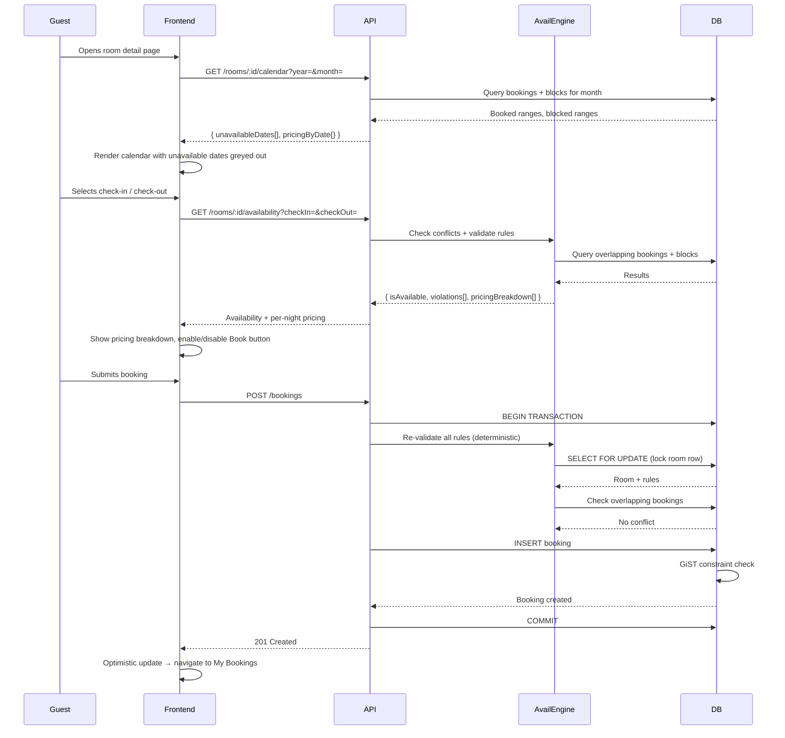

# Epic: Production-Grade Reservation Availability Engine Implementation

---

# Production-Grade Reservation Availability Engine

## Overview

This spec defines the complete production-grade reservation availability engine for the Creapy temporary stays platform. The platform already has a solid foundation (PostgreSQL GiST exclusion constraint, `AvailabilityBlock`, `SeasonalRate`, `OccupancyRule`, `CheckInOutRules` models). This spec closes the remaining gaps: rule enforcement during booking, a calendar-based availability API, timezone-safe date handling, per-night pricing breakdown, and a visual booking calendar on the frontend.

## Current State vs. Target State

| Capability | Current State | Target State |
| --- | --- | --- |
| Overlapping booking prevention | ✅ DB GiST constraint | ✅ Keep + wrap in transaction |
| Blocked dates | ✅ `AvailabilityBlock` model + API | ✅ Keep |
| Maintenance windows | ✅ `blockType: MAINTENANCE` stored | ✅ Add dedicated API + enforce in search |
| Date conflict detection | ✅ `ensureRoomAvailability` | ✅ Wrap in transaction |
| Minimum stay rules | ⚠️ Stored, not enforced | ✅ Enforce in `createBooking` |
| Maximum stay rules | ⚠️ Stored, not enforced | ✅ Enforce in `createBooking` |
| Check-in/check-out restrictions | ⚠️ Stored, not enforced | ✅ Enforce day-of-week + advance window |
| Occupancy / guest count validation | ⚠️ Stored, not enforced | ✅ Enforce in `createBooking` |
| Max advance booking days | ⚠️ Stored, not enforced | ✅ Enforce in `createBooking` |
| Transactional booking protection | ⚠️ Two-query TOCTOU gap | ✅ Single Prisma `$transaction` |
| Calendar availability API | ❌ Missing | ✅ `GET /rooms/:id/calendar?year=&month=` |
| `isAvailable` in availability response | ❌ Missing | ✅ Add to `getRoomAvailability` |
| Timezone-safe calculations | ⚠️ UTC-only | ✅ Normalize to accommodation timezone |
| Per-night pricing breakdown | ⚠️ Single rate for whole stay | ✅ Per-night array from `pricingResolver` |
| Dynamic nightly pricing display | ❌ Flat rate only | ✅ Per-night breakdown in UI |
| Visual booking calendar | ❌ Plain `<input type="date">` | ✅ Interactive calendar with unavailable dates |
| Live availability updates | ⚠️ Polling on date change | ✅ RTK Query auto-refetch |

## Architecture



## Backend Changes

### 1. Transactional Booking Creation

The `createBooking` handler in file:real-app-backend-main/controllers/bookingController.js must wrap the availability check and booking insert in a single `prisma.$transaction(async (tx) => { ... })` call. This eliminates the TOCTOU gap between `ensureRoomAvailability` and `prisma.booking.create`. The PostgreSQL GiST exclusion constraint remains as the final safety net.

### 2. Rule Enforcement in `createBooking`

All rules stored in the database must be validated inside the transaction before the booking is inserted. The validation order is:

1. **Date sanity** — `checkOut > checkIn`, both are valid dates
2. **Past date guard** — `checkIn >= today` (UTC midnight)
3. **Max advance booking** — `checkIn <= today + room.maxAdvanceBookingDays`
4. **Minimum stay** — `nights >= room.minNights`
5. **Maximum stay** — if `room.maxNights` is set, `nights <= room.maxNights`
6. **Occupancy** — if `room.occupancyRule` exists, `totalGuests <= occupancyRule.maxGuests`, `adultCount <= occupancyRule.maxAdults`, etc.
7. **Availability conflict** — no overlapping active bookings or blocks
8. **Room status** — `room.status === 'AVAILABLE'`

Each violation returns a specific `400` error with a machine-readable `code` field (e.g., `MIN_STAY_VIOLATION`, `MAX_GUESTS_EXCEEDED`) so the frontend can display targeted messages.

### 3. Enhanced Availability Response

`getRoomAvailability` in file:real-app-backend-main/controllers/roomController.js must be extended to return:

```
{
  isAvailable: boolean,
  violations: [{ code, message }],
  bookedRanges: [...],
  blockedRanges: [...],
  pricingBreakdown: [{ date, pricePerNight }],
  totalPrice: number,
  nights: number,
  minNights: number,
  maxNights: number | null
}
```

The `isAvailable` boolean is `true` only when there are no conflicts AND all rules pass for the queried date range.

### 4. Calendar Availability API

New endpoint: `GET /rooms/:id/calendar?year=YYYY&month=MM`

Returns a month-level view used to render the booking calendar. Response shape:

```
{
  year: number,
  month: number,
  unavailableDates: ["2026-06-03", "2026-06-04", ...],
  pricingByDate: { "2026-06-01": 85, "2026-06-02": 120, ... },
  minNights: number,
  maxNights: number | null,
  checkInFrom: "14:00" | null,
  checkOutBy: "11:00" | null
}
```

The `unavailableDates` array is the union of:

- All dates covered by active bookings in the month
- All dates covered by `AvailabilityBlock` records in the month
- Dates where `room.status !== 'AVAILABLE'`

`pricingByDate` is computed by running `resolvePrice` for each date in the month as a single-night stay, giving the guest a per-night price preview.

Route: `GET /rooms/:id/calendar` — public, no auth required (same as the existing availability endpoint).

### 5. Per-Night Pricing Breakdown in `pricingResolver`

file:real-app-backend-main/utils/pricingResolver.js currently returns a single price for the whole stay (the first matching rate). It must be extended to export a second function `resolvePriceBreakdown(room, checkIn, checkOut)` that returns an array of `{ date: string, pricePerNight: number }` — one entry per night. The existing `resolvePrice` function is kept unchanged for backward compatibility.

### 6. Timezone-Safe Date Normalization

A new utility file:real-app-backend-main/utils/dateUtils.js will provide:

- `toUtcMidnight(dateString, timezone?)` — parses a date string and returns a UTC `Date` at midnight of that date in the given timezone (defaulting to `'Africa/Harare'` for the Zimbabwe market)
- `toLocalDateString(date, timezone?)` — formats a UTC `Date` as `YYYY-MM-DD` in the given timezone

All booking creation and availability queries will use `toUtcMidnight` to normalize `checkIn` and `checkOut` before comparison. The accommodation's timezone (stored as a new optional `timezone` field on `Accommodation`, defaulting to `'Africa/Harare'`) is used for normalization.

### 7. Maintenance Window API

Providers need a way to create maintenance blocks separately from manual blocks. The existing `POST /rooms/:id/block` endpoint will accept a `blockType` field (`MANUAL` | `MAINTENANCE`). A new `GET /rooms/:id/blocks` endpoint (provider-only) returns all blocks for a room with their type, reason, and date range — used by the provider dashboard.

## Database Changes

### New field: `Accommodation.timezone`

```prisma
timezone  String  @default("Africa/Harare")
```

This is a new optional migration. All existing records default to `'Africa/Harare'`.

### New index on `Booking`

The existing GiST index covers overlap prevention. A new B-tree index on `(roomId, status, checkIn)` improves the calendar query performance for fetching a month's bookings.

## Frontend Changes

### 1. Visual Booking Calendar Component

A new `BookingCalendar` component replaces the two plain `<input type="date">` fields in file:real-app-frontend-main/src/views/Stays/RoomDetail.tsx.

The calendar:

- Renders a month grid (Sun–Sat)
- Fetches `GET /rooms/:id/calendar?year=&month=` on mount and on month navigation
- Greys out / strikes through unavailable dates
- Shows the per-night price below each available date cell
- Highlights the selected check-in → check-out range
- Enforces `minNights` by disabling check-out dates that are too close to check-in
- Shows check-in/check-out time restrictions as a caption below the calendar
- Supports month navigation (prev/next arrows)

```wireframe

<html>
<head>
<style>
  body { font-family: system-ui, sans-serif; background: #f8fafc; margin: 0; padding: 16px; }
  .calendar-card { background: #fff; border-radius: 12px; border: 1px solid #e2e8f0; padding: 20px; max-width: 420px; }
  .cal-header { display: flex; justify-content: space-between; align-items: center; margin-bottom: 16px; }
  .cal-title { font-weight: 700; font-size: 16px; color: #0f172a; }
  .nav-btn { background: none; border: 1px solid #e2e8f0; border-radius: 6px; padding: 4px 10px; cursor: pointer; font-size: 14px; color: #475569; }
  .day-labels { display: grid; grid-template-columns: repeat(7, 1fr); gap: 2px; margin-bottom: 4px; }
  .day-label { text-align: center; font-size: 11px; font-weight: 600; color: #94a3b8; padding: 4px 0; }
  .cal-grid { display: grid; grid-template-columns: repeat(7, 1fr); gap: 2px; }
  .cal-day { border-radius: 6px; padding: 6px 2px; text-align: center; cursor: pointer; min-height: 52px; display: flex; flex-direction: column; align-items: center; justify-content: center; }
  .cal-day:hover:not(.unavailable):not(.empty) { background: #f0fdf4; }
  .cal-day .date-num { font-size: 13px; font-weight: 600; color: #0f172a; }
  .cal-day .price { font-size: 10px; color: #64748b; margin-top: 2px; }
  .cal-day.unavailable { background: #f1f5f9; cursor: not-allowed; }
  .cal-day.unavailable .date-num { color: #cbd5e1; text-decoration: line-through; }
  .cal-day.unavailable .price { display: none; }
  .cal-day.selected-start { background: #0f766e; border-radius: 6px 0 0 6px; }
  .cal-day.selected-start .date-num, .cal-day.selected-start .price { color: #fff; }
  .cal-day.selected-end { background: #0f766e; border-radius: 0 6px 6px 0; }
  .cal-day.selected-end .date-num, .cal-day.selected-end .price { color: #fff; }
  .cal-day.in-range { background: #ccfbf1; border-radius: 0; }
  .cal-day.in-range .date-num { color: #0f766e; }
  .cal-day.empty { cursor: default; }
  .cal-day.past { opacity: 0.35; cursor: not-allowed; }
  .cal-footer { margin-top: 14px; padding-top: 12px; border-top: 1px solid #f1f5f9; font-size: 12px; color: #64748b; }
  .legend { display: flex; gap: 12px; flex-wrap: wrap; margin-top: 8px; }
  .legend-item { display: flex; align-items: center; gap: 4px; font-size: 11px; color: #64748b; }
  .legend-dot { width: 10px; height: 10px; border-radius: 2px; }
</style>
</head>
<body>
<div class="calendar-card">
  <div class="cal-header">
    <button class="nav-btn">←</button>
    <span class="cal-title">June 2026</span>
    <button class="nav-btn">→</button>
  </div>
  <div class="day-labels">
    <div class="day-label">Su</div><div class="day-label">Mo</div><div class="day-label">Tu</div>
    <div class="day-label">We</div><div class="day-label">Th</div><div class="day-label">Fr</div><div class="day-label">Sa</div>
  </div>
  <div class="cal-grid">
    <div class="cal-day empty"></div>
    <div class="cal-day past"><span class="date-num">1</span><span class="price">$85</span></div>
    <div class="cal-day past"><span class="date-num">2</span><span class="price">$85</span></div>
    <div class="cal-day past"><span class="date-num">3</span><span class="price">$85</span></div>
    <div class="cal-day past"><span class="date-num">4</span><span class="price">$85</span></div>
    <div class="cal-day past"><span class="date-num">5</span><span class="price">$120</span></div>
    <div class="cal-day past"><span class="date-num">6</span><span class="price">$120</span></div>
    <div class="cal-day past"><span class="date-num">7</span><span class="price">$85</span></div>
    <div class="cal-day past"><span class="date-num">8</span><span class="price">$85</span></div>
    <div class="cal-day past"><span class="date-num">9</span><span class="price">$85</span></div>
    <div class="cal-day past"><span class="date-num">10</span><span class="price">$85</span></div>
    <div class="cal-day past"><span class="date-num">11</span><span class="price">$85</span></div>
    <div class="cal-day past"><span class="date-num">12</span><span class="price">$120</span></div>
    <div class="cal-day past"><span class="date-num">13</span><span class="price">$120</span></div>
    <div class="cal-day past"><span class="date-num">14</span><span class="price">$85</span></div>
    <div class="cal-day past"><span class="date-num">15</span><span class="price">$85</span></div>
    <div class="cal-day selected-start"><span class="date-num">16</span><span class="price">$85</span></div>
    <div class="cal-day in-range"><span class="date-num">17</span><span class="price">$85</span></div>
    <div class="cal-day in-range"><span class="date-num">18</span><span class="price">$85</span></div>
    <div class="cal-day selected-end"><span class="date-num">19</span><span class="price">$120</span></div>
    <div class="cal-day"><span class="date-num">20</span><span class="price">$120</span></div>
    <div class="cal-day unavailable"><span class="date-num">21</span><span class="price">$85</span></div>
    <div class="cal-day unavailable"><span class="date-num">22</span><span class="price">$85</span></div>
    <div class="cal-day unavailable"><span class="date-num">23</span><span class="price">$85</span></div>
    <div class="cal-day unavailable"><span class="date-num">24</span><span class="price">$85</span></div>
    <div class="cal-day"><span class="date-num">25</span><span class="price">$85</span></div>
    <div class="cal-day"><span class="date-num">26</span><span class="price">$85</span></div>
    <div class="cal-day"><span class="date-num">27</span><span class="price">$120</span></div>
    <div class="cal-day"><span class="date-num">28</span><span class="price">$120</span></div>
    <div class="cal-day"><span class="date-num">29</span><span class="price">$85</span></div>
    <div class="cal-day"><span class="date-num">30</span><span class="price">$85</span></div>
  </div>
  <div class="cal-footer">
    <div>Check-in from 14:00 &nbsp;·&nbsp; Check-out by 11:00</div>
    <div class="legend">
      <div class="legend-item"><div class="legend-dot" style="background:#0f766e"></div> Selected</div>
      <div class="legend-item"><div class="legend-dot" style="background:#ccfbf1"></div> In range</div>
      <div class="legend-item"><div class="legend-dot" style="background:#f1f5f9"></div> Unavailable</div>
    </div>
  </div>
</div>
</body>
</html>
```

### 2. Per-Night Pricing Breakdown Panel

Below the calendar, a pricing breakdown table replaces the current flat `$X × N nights` summary:

```wireframe

<html>
<head>
<style>
  body { font-family: system-ui, sans-serif; background: #f8fafc; margin: 0; padding: 16px; }
  .pricing-card { background: #fff; border-radius: 12px; border: 1px solid #e2e8f0; padding: 20px; max-width: 420px; }
  .pricing-title { font-weight: 700; font-size: 15px; color: #0f172a; margin-bottom: 12px; }
  .pricing-row { display: flex; justify-content: space-between; padding: 6px 0; border-bottom: 1px solid #f1f5f9; font-size: 13px; color: #334155; }
  .pricing-row:last-of-type { border-bottom: none; }
  .pricing-row .label { color: #64748b; }
  .pricing-total { display: flex; justify-content: space-between; padding: 12px 0 0; font-weight: 700; font-size: 16px; color: #0f172a; border-top: 2px solid #e2e8f0; margin-top: 8px; }
  .rate-badge { font-size: 10px; background: #fef3c7; color: #b45309; border-radius: 4px; padding: 1px 5px; margin-left: 6px; }
</style>
</head>
<body>
<div class="pricing-card">
  <div class="pricing-title">Pricing breakdown</div>
  <div class="pricing-row"><span class="label">Mon 16 Jun</span><span>$85.00</span></div>
  <div class="pricing-row"><span class="label">Tue 17 Jun</span><span>$85.00</span></div>
  <div class="pricing-row"><span class="label">Wed 18 Jun</span><span>$85.00</span></div>
  <div class="pricing-row"><span class="label">Thu 19 Jun <span class="rate-badge">Weekend rate</span></span><span>$120.00</span></div>
  <div class="pricing-total"><span>Total (4 nights)</span><span>$375.00</span></div>
</div>
</body>
</html>
```

### 3. Occupancy Selector

The guests field in `RoomDetail` is enhanced to show adult / child / infant sub-selectors when the room has an `OccupancyRule`. The total is validated against `occupancyRule.maxGuests` client-side before submission.

### 4. RTK Query — New `getRoomCalendar` Endpoint

A new `getRoomCalendar` query is added to file:real-app-frontend-main/src/redux/api/stayApiSlice.ts:

```
getRoomCalendar(roomId, year, month) → GET /rooms/:id/calendar?year=&month=
```

The `BookingCalendar` component calls this on mount and on month navigation. The `getRoomAvailability` query continues to be called when the user has selected both dates, returning the `isAvailable` boolean and `pricingBreakdown`.

### 5. Optimistic Frontend Updates

When a booking is submitted, the frontend immediately navigates to `/stays/bookings` and shows the new booking in a pending state (optimistic insert into the RTK Query cache for `StayBooking`). If the server returns an error, the optimistic update is rolled back and the error toast is shown.

## Validation Rules Summary

| Rule | Source | Error Code | HTTP |
| --- | --- | --- | --- |
| `checkOut > checkIn` | Always | `INVALID_DATE_RANGE` | 400 |
| `checkIn >= today` | Always | `PAST_DATE` | 400 |
| `checkIn <= today + maxAdvanceBookingDays` | `room.maxAdvanceBookingDays` | `ADVANCE_BOOKING_EXCEEDED` | 400 |
| `nights >= minNights` | `room.minNights` | `MIN_STAY_VIOLATION` | 400 |
| `nights <= maxNights` | `room.maxNights` | `MAX_STAY_VIOLATION` | 400 |
| `totalGuests <= maxGuests` | `OccupancyRule` | `MAX_GUESTS_EXCEEDED` | 400 |
| `adultCount <= maxAdults` | `OccupancyRule` | `MAX_ADULTS_EXCEEDED` | 400 |
| No overlapping booking | `Booking` table | `DATE_CONFLICT` | 409 |
| No overlapping block | `AvailabilityBlock` | `DATE_BLOCKED` | 409 |
| `room.status === AVAILABLE` | `Room.status` | `ROOM_UNAVAILABLE` | 409 |

## Race Condition Prevention

The booking creation flow uses a Prisma interactive transaction (`prisma.$transaction`) with `isolationLevel: 'Serializable'`. Inside the transaction, the room row is fetched with `SELECT ... FOR UPDATE` (via Prisma's `findUnique` inside the transaction context). The PostgreSQL GiST exclusion constraint on `Booking` (`no_overlapping_bookings`) is the final hard guard — it will throw a unique constraint violation if two concurrent transactions both pass the application-level check and attempt to insert overlapping bookings simultaneously.

## Files Affected

**Backend (new/modified):**

- file:real-app-backend-main/controllers/bookingController.js — transactional creation, rule enforcement
- file:real-app-backend-main/controllers/roomController.js — enhanced availability response, new calendar endpoint
- file:real-app-backend-main/routes/roomRoutes.js — add `GET /:id/calendar`
- file:real-app-backend-main/utils/pricingResolver.js — add `resolvePriceBreakdown`
- file:real-app-backend-main/utils/dateUtils.js — new timezone utility
- file:real-app-backend-main/prisma/schema.prisma — add `Accommodation.timezone`
- New migration for `timezone` field

**Frontend (new/modified):**

- file:real-app-frontend-main/src/components/stays/BookingCalendar.tsx — new visual calendar component
- file:real-app-frontend-main/src/views/Stays/RoomDetail.tsx — replace date inputs with `BookingCalendar`, add pricing breakdown, enhance occupancy selector
- file:real-app-frontend-main/src/redux/api/stayApiSlice.ts — add `getRoomCalendar` query, optimistic booking update

</TRAYCER_SPEC>