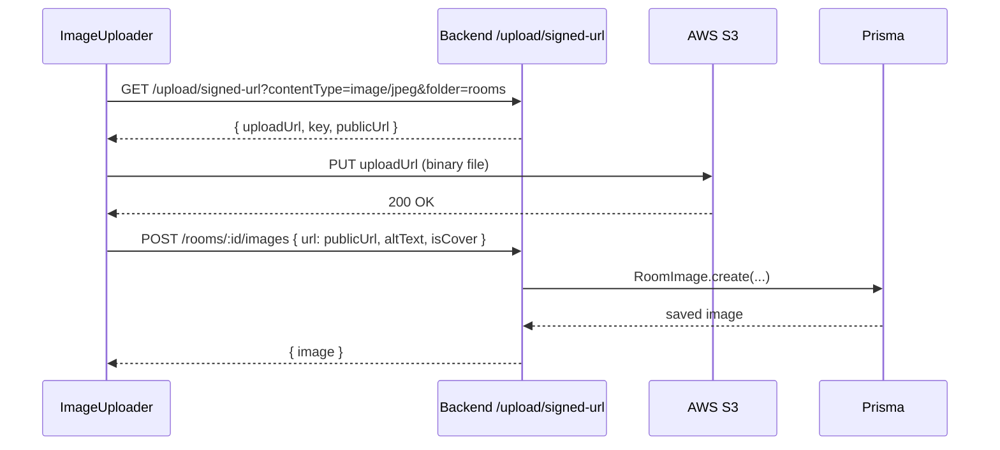
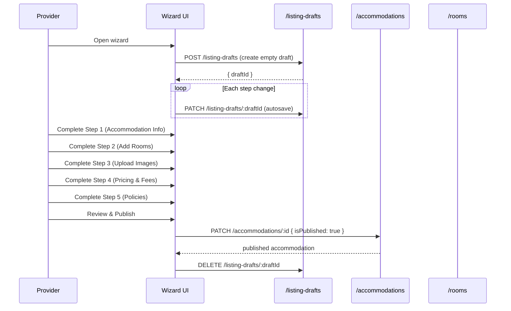
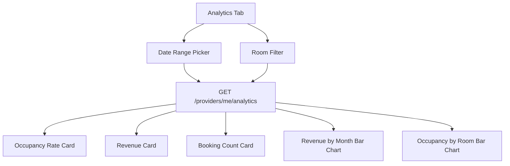

# Epic: Production-Grade Provider Management System for Temporary Stay Hosts

---

# Provider Management System — Architecture & Design

## Overview

This spec defines the production-grade provider management system for Creapy's temporary-stay hosting platform. It covers the full lifecycle a provider needs: onboarding, listing creation, room management, pricing, calendar, booking management, payout preparation, analytics, and policy configuration.

## Current State Assessment

### What Exists

| Layer | Component | Status |
| --- | --- | --- |
| DB | `Accommodation`, `Room`, `Booking`, `SeasonalRate`, `RoomFee`, `AvailabilityBlock`, `CancellationPolicy`, `TaxRule`, `Promotion`, `Review` | ✅ Complete |
| Backend | `roomController` — CRUD, blocks, seasonal rates, fees, tax | ✅ Complete |
| Backend | `bookingController` — create, confirm, decline, cancel, settle | ✅ Complete |
| Backend | `providerController` — register, profile, list, verify | ✅ Partial |
| Backend | `uploadController` — S3 presigned URL generation | ✅ Complete |
| Frontend | `Provider.tsx` — monolithic dashboard (rooms/bookings/availability/profile/settlements) | ⚠️ Exists but monolithic |
| Frontend | `providerApiSlice.ts` — RTK Query endpoints | ⚠️ Partial |
| Frontend | Listing wizard | ❌ Missing |
| Frontend | Image management UI | ❌ Missing |
| Frontend | Pricing management UI (seasonal rates, fees, tax) | ❌ Missing |
| Frontend | Calendar management UI | ❌ Missing |
| Frontend | Occupancy analytics | ❌ Missing |
| Frontend | Policy management UI | ❌ Missing |
| Backend | Analytics aggregation endpoint | ❌ Missing |
| Backend | Image-attach endpoints for rooms/accommodations | ❌ Missing |
| Backend | `PATCH /providers/me` (partial update) | ❌ Missing |

## System Architecture

```mermaid
graph TD
    A[Provider Dashboard Shell] --> B[Listing Wizard]
    A --> C[Room Manager]
    A --> D[Calendar Manager]
    A --> E[Booking Manager]
    A --> F[Analytics Panel]
    A --> G[Policy Manager]
    A --> H[Payout Panel]

    B --> B1[Step 1: Accommodation Info]
    B --> B2[Step 2: Rooms]
    B --> B3[Step 3: Images]
    B --> B4[Step 4: Pricing & Fees]
    B --> B5[Step 5: Policies]
    B --> B6[Step 6: Review & Publish]

    C --> C1[Room CRUD]
    C --> C2[Image Upload]
    C --> C3[Seasonal Rates]
    C --> C4[Room Fees]

    D --> D1[Month Calendar View]
    D --> D2[Block Dates]
    D --> D3[Unblock Dates]

    E --> E1[Pending Requests]
    E --> E2[Confirmed Bookings]
    E --> E3[Confirm / Decline]

    F --> F1[Occupancy Rate]
    F --> F2[Revenue Chart]
    F --> F3[Booking Trends]

    G --> G1[Cancellation Policy]
    G --> G2[Check-in/out Rules]
    G --> G3[Tax Rules]
    G --> G4[House Rules]

    H --> H1[Pending Payouts]
    H --> H2[Settlement History]
```



## Frontend Architecture

### Modular Dashboard

The existing `Provider.tsx` (1,485 lines) must be decomposed into focused sub-components. Each tab becomes its own module under `src/views/Dashboard/provider/`:

```
src/views/Dashboard/provider/
  ProviderDashboardShell.tsx      ← layout, tab routing, stat cards
  tabs/
    RoomsTab.tsx                  ← room list + create/edit form
    BookingsTab.tsx               ← booking cards + confirm/decline
    CalendarTab.tsx               ← month-view calendar per room
    PricingTab.tsx                ← seasonal rates + fees + tax
    AnalyticsTab.tsx              ← occupancy + revenue charts
    PolicyTab.tsx                 ← cancellation + check-in/out + house rules
    PayoutsTab.tsx                ← settlement summary + history
  wizard/
    ListingWizard.tsx             ← multi-step stepper
    steps/
      AccommodationStep.tsx
      RoomsStep.tsx
      ImagesStep.tsx
      PricingStep.tsx
      PoliciesStep.tsx
      ReviewStep.tsx
  components/
    ImageUploader.tsx             ← drag-drop, presigned URL, progress
    RoomCard.tsx
    BookingCard.tsx
    CalendarGrid.tsx
    OccupancyChart.tsx
    RevenueChart.tsx
```

### Autosave Strategy

The listing wizard uses a `ListingDraft` (already in schema) to persist wizard state. Each step change triggers a debounced `PATCH /listing-drafts/:id` call. The draft is loaded on wizard mount and cleared on publish.

### Optimistic Updates

RTK Query `onQueryStarted` callbacks apply optimistic cache patches for:

- Room status toggles
- Booking confirm/decline
- Availability block creation/deletion

### Media Upload Flow



## Backend Additions

### New Endpoints Required

| Method | Path | Controller | Purpose |
| --- | --- | --- | --- |
| `PATCH` | `/providers/me` | `providerController.updateMyProfile` | Partial profile update |
| `POST` | `/rooms/:id/blocks` | `roomController.createRoomBlock` | Alias for `/block` (frontend uses both) |
| `DELETE` | `/rooms/:id/blocks/:blockId` | `roomController.deleteRoomBlock` | Alias for `/block/:blockId` |
| `GET` | `/rooms/:id/blocks` | `roomController.listRoomBlocks` | List all blocks for a room |
| `POST` | `/rooms/:id/images` | `roomController.addRoomImage` | Attach uploaded image to room |
| `DELETE` | `/rooms/:id/images/:imageId` | `roomController.deleteRoomImage` | Remove room image |
| `PATCH` | `/rooms/:id/images/:imageId` | `roomController.updateRoomImage` | Set cover, update sort order |
| `POST` | `/accommodations/:id/images` | `accommodationController.addImage` | Attach image to accommodation |
| `DELETE` | `/accommodations/:id/images/:imageId` | `accommodationController.deleteImage` | Remove accommodation image |
| `GET` | `/providers/me/analytics` | `providerController.getMyAnalytics` | Occupancy + revenue aggregation |
| `PUT` | `/accommodations/:id/cancellation-policy` | `accommodationController.upsertCancellationPolicy` | Manage cancellation policy |
| `PUT` | `/accommodations/:id/checkin-rules` | `accommodationController.upsertCheckInRules` | Manage check-in/out rules |
| `GET` | `/accommodations/:id` | `accommodationController.getMyAccommodation` | Provider reads own accommodation |
| `PATCH` | `/accommodations/:id` | `accommodationController.updateAccommodation` | Update accommodation details |

### Analytics Aggregation (`GET /providers/me/analytics`)

Query parameters: `from`, `to` (ISO date strings), `roomId` (optional).

Response shape:

```json
{
  "occupancyRate": 0.72,
  "totalRevenue": 4850.00,
  "netPayout": 4365.00,
  "bookingCount": 34,
  "avgNights": 2.8,
  "revenueByMonth": [{ "month": "2026-04", "revenue": 1200 }],
  "occupancyByRoom": [{ "roomId": "...", "name": "Deluxe", "rate": 0.85 }]
}
```

Computed from `Booking` records where `status IN (CONFIRMED, CHECKED_IN, COMPLETED)` and `providerId = req.user.id`.

### Ownership Validation Pattern

All provider-scoped endpoints follow the same guard:

1. Authenticate via JWT (`authController.protect`)
2. Require `provider` role (`authController.requireRole("provider")`)
3. Verify resource ownership via `ownerId` / `providerId` match before any mutation

## Listing Wizard Flow



## Calendar Management

The calendar view renders a month grid per room. Each day cell shows:

- **Available** — white, shows nightly price from `pricingByDate`
- **Booked** — striped, shows guest initials on hover
- **Blocked** — grey, shows block reason on hover

Data source: `GET /rooms/:id/calendar?year=YYYY&month=MM` (already implemented in `roomController.getRoomCalendar`).

Provider can click a date range to create a block (`POST /rooms/:id/blocks`) or click an existing block to delete it.

## Occupancy Analytics



Charts use MUI's `@mui/x-charts` (or a lightweight recharts integration). No new dependencies required if using MUI X Charts which is already in the MUI ecosystem.

## Policy Management

Three policy sub-sections managed under the provider's accommodation:

| Policy | Endpoint | Model |
| --- | --- | --- |
| Cancellation Policy | `PUT /accommodations/:id/cancellation-policy` | `CancellationPolicy` |
| Check-in / Check-out Rules | `PUT /accommodations/:id/checkin-rules` | `CheckInOutRules` |
| Tax Rule | `PUT /accommodations/:id/tax` | `TaxRule` (already exists) |

## Payout Preparation Hooks

The existing `settlementStatus` / `settledAt` / `netPayout` fields on `Booking` are the source of truth. The payout panel:

1. Fetches `GET /providers/me/settlements` (already in `providerApiSlice`)
2. Groups bookings by `settlementStatus`: `PENDING` vs `SETTLED`
3. Displays `netPayout` per booking (= `totalPrice - commissionAmount`)
4. Admin triggers `POST /bookings/:id/settle` to mark as settled

No external payout gateway integration is in scope — the system prepares the data for manual or future automated disbursement.

## Mobile Responsiveness

All new components use MUI's responsive grid (`Grid`, `useMediaQuery`). The dashboard shell collapses tabs into a bottom navigation bar on mobile (`xs` breakpoint). The listing wizard stacks steps vertically on small screens.

## Granular Permissions Summary

| Action | Required Role | Ownership Check |
| --- | --- | --- |
| Create room | `provider` + `APPROVED` verification | `accommodation.ownerId === req.user.id` |
| Edit room | `provider` | `room.providerId === req.user.id` |
| Block dates | `provider` | `room.providerId === req.user.id` |
| Confirm booking | `provider` | `booking.room.accommodation.ownerId === req.user.id` |
| View analytics | `provider` | Scoped to `providerId` in query |
| Set policies | `provider` | `accommodation.ownerId === req.user.id` |
| Settle booking | `admin` | N/A |
| Verify provider | `admin` | N/A |