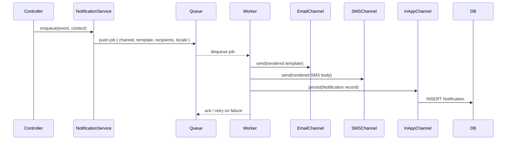

# Epic: Temporary Stay Notification System Implementation

---

# Temporary Stay Notification System

## Overview

This spec defines the notification system for the Creapy temporary stay platform. The system upgrades the current fire-and-forget `sendEmailSafe` pattern into a structured, queue-based, multi-channel notification pipeline with retry support, localization-ready templates, and an in-app notification store.

## Current State

The backend already has:

- file:real-app-backend-main/utils/email.js — nodemailer/Gmail transport with a mock fallback
- file:real-app-backend-main/utils/sms.js — Africa's Talking SMS with a mock fallback
- file:real-app-backend-main/utils/emailTemplates/stayEmails.js — 12 plain-text email template functions covering all major booking lifecycle events
- file:real-app-backend-main/utils/paymentSideEffects.js — inline `sendEmailSafe` calls on payment success
- file:real-app-backend-main/controllers/bookingController.js — inline `sendEmailSafe` calls on booking create, cancel, confirm, decline
- file:real-app-backend-main/controllers/providerController.js — inline `sendEmail` call on provider approval
- file:real-app-backend-main/utils/reconciliationJob.js — `node-cron` already running every 15 minutes

**Gaps:**

- No queue or retry mechanism — failed emails are silently swallowed
- No in-app notification model or API
- No check-in reminder scheduling
- No SMS dispatch for booking events
- No HTML email templates (only plain text)
- No localization structure
- Provider approval notification is missing (admin `verifyProvider` sends nothing)

## Architecture



## Notification Events

| Event | Trigger | Recipients |
| --- | --- | --- |
| `booking.request_submitted` | Guest creates REQUEST booking | Provider |
| `booking.confirmed_instant` | INSTANT booking created | Guest + Provider |
| `booking.request_accepted` | Provider confirms REQUEST booking | Guest |
| `booking.request_declined` | Provider declines REQUEST booking | Guest |
| `booking.cancelled_by_guest` | Guest cancels | Provider |
| `booking.cancelled_by_provider` | Provider cancels | Guest |
| `booking.payment_success` | Full payment received | Guest + Provider |
| `booking.payment_partial` | Partial payment received | Guest |
| `booking.payment_retry` | Payment retry available | Guest |
| `booking.refund_initiated` | Refund triggered | Guest |
| `booking.settlement_completed` | Admin settles booking | Provider |
| `booking.checkin_reminder` | 24h before check-in (cron) | Guest |
| `booking.checkout_reminder` | 24h before check-out (cron) | Guest |
| `provider.approved` | Admin approves provider | Provider |
| `provider.rejected` | Admin rejects provider | Provider |

## Queue Design

The queue is implemented **in-process** using a lightweight persistent job table in PostgreSQL (no external broker required). This keeps the stack consistent with the existing Prisma + PostgreSQL setup.

### `NotificationJob` Prisma model

| Field | Type | Notes |
| --- | --- | --- |
| `id` | `String @id @default(cuid())` |  |
| `event` | `String` | e.g. `booking.confirmed_instant` |
| `channel` | `String` | `email`, `sms`, `in_app` |
| `recipientId` | `String?` | User ID (for in-app) |
| `recipientAddress` | `String?` | Email or phone |
| `templateKey` | `String` | Template identifier |
| `context` | `Json` | Serialized template variables |
| `locale` | `String @default("en")` |  |
| `status` | `String @default("pending")` | `pending`, `sent`, `failed`, `dead` |
| `attempts` | `Int @default(0)` |  |
| `lastError` | `String?` |  |
| `scheduledAt` | `DateTime @default(now())` | Allows future scheduling |
| `processedAt` | `DateTime?` |  |
| `createdAt` | `DateTime @default(now())` |  |

### `Notification` Prisma model (in-app store)

| Field | Type | Notes |
| --- | --- | --- |
| `id` | `String @id @default(cuid())` |  |
| `userId` | `String` | FK → User |
| `event` | `String` |  |
| `title` | `String` | Rendered title |
| `body` | `String` | Rendered body |
| `isRead` | `Boolean @default(false)` |  |
| `metadata` | `Json?` | e.g. `{ bookingId }` |
| `createdAt` | `DateTime @default(now())` |  |

## Notification Service (`utils/notificationService.js`)

Central entry point. Controllers call `notificationService.enqueue(event, context)` instead of calling `sendEmailSafe` directly.

**Responsibilities:**

1. Resolve recipients (guest email, provider email, phone numbers) from context
2. Determine which channels are active for the event (email always on; SMS if `SMS_ENABLED=true`; in-app always on)
3. Insert one `NotificationJob` row per channel per recipient
4. Return immediately (non-blocking)

## Notification Worker (`utils/notificationWorker.js`)

Runs on the existing `node-cron` scheduler (new expression, e.g. every 30 seconds). Processes pending `NotificationJob` rows.

**Processing loop:**

1. Fetch up to `NOTIFICATION_BATCH_SIZE` (default 20) jobs where `status = 'pending'` AND `scheduledAt <= now()`
2. For each job:
  - Render the template using `templateKey` + `context` + `locale`
  - Dispatch to the appropriate channel adapter
  - On success → mark `status = 'sent'`, set `processedAt`
  - On failure → increment `attempts`; if `attempts >= MAX_NOTIFICATION_RETRIES` (default 3) → mark `status = 'dead'`; else leave `status = 'pending'` with exponential back-off via `scheduledAt`

## Template System (`utils/notificationTemplates/`)

### Structure

```
utils/notificationTemplates/
  index.js          ← registry: templateKey → { email, sms, inApp }
  en/
    booking.js      ← all booking event templates for locale "en"
    provider.js     ← provider event templates for locale "en"
```

Each template export is a function `(context) => { subject, html, text, smsBody, inAppTitle, inAppBody }`.

The existing plain-text functions in file:real-app-backend-main/utils/emailTemplates/stayEmails.js are preserved and wrapped — the new system adds HTML variants and SMS/in-app bodies alongside them.

### HTML Email Template

A single base HTML layout (`utils/notificationTemplates/baseEmail.html`) with slots for `{{subject}}`, `{{body}}`, `{{ctaLabel}}`, `{{ctaUrl}}`. Each template fills these slots. This keeps HTML maintenance in one place.

### Localization Readiness

- Templates are organized under locale directories (`en/`, `fr/`, etc.)
- The worker resolves locale from `NotificationJob.locale`
- Default locale is `en`; unknown locales fall back to `en`
- No i18n library is introduced — locale selection is a simple directory lookup

## Channel Adapters

### Email (`utils/channels/emailChannel.js`)

Wraps the existing `sendEmail` from file:real-app-backend-main/utils/email.js. Accepts `{ to, subject, html, text }`.

### SMS (`utils/channels/smsChannel.js`)

Wraps the existing `sendSms` from file:real-app-backend-main/utils/sms.js. Accepts `{ to, message }`. Only dispatched when `process.env.SMS_ENABLED === 'true'`.

### In-App (`utils/channels/inAppChannel.js`)

Writes a `Notification` record to the database. No external call.

## Reminder Scheduling

The existing `reconciliationJob` cron is extended (or a new cron job is added) to run a **reminder scan** once per hour:

1. Query bookings where `status IN ('CONFIRMED', 'CHECKED_IN')` and `checkIn` is between `now()` and `now() + 25h` (24h window with 1h buffer)
2. For each, check if a `checkin_reminder` `NotificationJob` already exists for that booking (stored in `context.bookingId`)
3. If not, enqueue a `booking.checkin_reminder` job with `scheduledAt = checkIn - 24h`
4. Same logic for `checkout_reminder` using `checkOut`

## In-App Notification API

New routes mounted at `/api/notifications`:

| Method | Path | Description |
| --- | --- | --- |
| `GET` | `/api/notifications` | Fetch current user's notifications (paginated, newest first) |
| `GET` | `/api/notifications/unread-count` | Returns `{ count: N }` |
| `PUT` | `/api/notifications/:id/read` | Mark one notification as read |
| `PUT` | `/api/notifications/read-all` | Mark all as read |

All routes are protected by the existing auth middleware.

## Frontend In-App Notification UI

A notification bell icon is added to the `Header` component. It shows an unread badge count and opens a dropdown panel listing recent notifications.

```wireframe

<html>
<head>
<style>
  body { font-family: sans-serif; margin: 0; background: #f1f5f9; }
  .header { background: #fff; border-bottom: 1px solid #e2e8f0; padding: 0 24px; height: 64px; display: flex; align-items: center; justify-content: space-between; }
  .logo { font-weight: 700; font-size: 20px; color: #1e293b; }
  .header-right { display: flex; align-items: center; gap: 16px; }
  .bell-wrap { position: relative; cursor: pointer; }
  .bell-icon { font-size: 22px; }
  .badge { position: absolute; top: -4px; right: -6px; background: #ef4444; color: #fff; border-radius: 999px; font-size: 10px; font-weight: 700; padding: 1px 5px; min-width: 16px; text-align: center; }
  .dropdown { position: absolute; top: 40px; right: 0; width: 340px; background: #fff; border: 1px solid #e2e8f0; border-radius: 10px; box-shadow: 0 8px 24px rgba(0,0,0,0.10); z-index: 100; }
  .dropdown-header { padding: 14px 16px 10px; display: flex; justify-content: space-between; align-items: center; border-bottom: 1px solid #f1f5f9; }
  .dropdown-title { font-weight: 700; font-size: 15px; color: #1e293b; }
  .mark-all { font-size: 12px; color: #6366f1; cursor: pointer; }
  .notif-item { padding: 12px 16px; border-bottom: 1px solid #f1f5f9; display: flex; gap: 10px; align-items: flex-start; }
  .notif-item.unread { background: #f0f4ff; }
  .notif-dot { width: 8px; height: 8px; border-radius: 50%; background: #6366f1; margin-top: 5px; flex-shrink: 0; }
  .notif-dot.read { background: transparent; border: 1px solid #cbd5e1; }
  .notif-title { font-size: 13px; font-weight: 600; color: #1e293b; margin-bottom: 2px; }
  .notif-body { font-size: 12px; color: #64748b; line-height: 1.5; }
  .notif-time { font-size: 11px; color: #94a3b8; margin-top: 3px; }
  .dropdown-footer { padding: 10px 16px; text-align: center; font-size: 13px; color: #6366f1; cursor: pointer; }
  .avatar { width: 32px; height: 32px; border-radius: 50%; background: #e2e8f0; }
</style>
</head>
<body>
<div class="header">
  <div class="logo">Creapy</div>
  <div class="header-right">
    <div class="bell-wrap" data-element-id="notification-bell">
      <span class="bell-icon">🔔</span>
      <span class="badge" data-element-id="unread-badge">3</span>
      <div class="dropdown" data-element-id="notification-dropdown">
        <div class="dropdown-header">
          <span class="dropdown-title">Notifications</span>
          <span class="mark-all" data-element-id="mark-all-read">Mark all as read</span>
        </div>
        <div class="notif-item unread" data-element-id="notif-1">
          <div class="notif-dot"></div>
          <div>
            <div class="notif-title">Booking Confirmed</div>
            <div class="notif-body">Your booking at Sunset Lodge has been confirmed for 22–25 Jun.</div>
            <div class="notif-time">2 minutes ago</div>
          </div>
        </div>
        <div class="notif-item unread" data-element-id="notif-2">
          <div class="notif-dot"></div>
          <div>
            <div class="notif-title">Payment Received</div>
            <div class="notif-body">Full payment of $240 received for booking #abc123.</div>
            <div class="notif-time">1 hour ago</div>
          </div>
        </div>
        <div class="notif-item unread" data-element-id="notif-3">
          <div class="notif-dot"></div>
          <div>
            <div class="notif-title">Check-in Reminder</div>
            <div class="notif-body">Your stay at Green Valley BnB starts tomorrow. Check-in from 14:00.</div>
            <div class="notif-time">3 hours ago</div>
          </div>
        </div>
        <div class="notif-item" data-element-id="notif-4">
          <div class="notif-dot read"></div>
          <div>
            <div class="notif-title">Booking Cancelled</div>
            <div class="notif-body">Guest John cancelled booking #xyz789. Refund of $80 initiated.</div>
            <div class="notif-time">Yesterday</div>
          </div>
        </div>
        <div class="dropdown-footer" data-element-id="view-all">View all notifications</div>
      </div>
    </div>
    <div class="avatar" data-element-id="user-avatar"></div>
  </div>
</div>
</body>
</html>
```

### Frontend Components

| Component | Location | Purpose |
| --- | --- | --- |
| `NotificationBell` | `src/components/Header/NotificationBell.tsx` | Bell icon + badge + dropdown |
| `NotificationItem` | `src/components/Header/NotificationItem.tsx` | Single notification row |
| `notificationApiSlice` | `src/redux/api/notificationApiSlice.ts` | RTK Query endpoints for notifications |

The bell polls `GET /api/notifications/unread-count` every 60 seconds using RTK Query's `pollingInterval`. Clicking a notification marks it as read and navigates to the relevant booking if `metadata.bookingId` is present.

## Environment Variables

| Variable | Default | Purpose |
| --- | --- | --- |
| `SMS_ENABLED` | `false` | Enable SMS channel dispatch |
| `MAX_NOTIFICATION_RETRIES` | `3` | Max attempts before marking `dead` |
| `NOTIFICATION_BATCH_SIZE` | `20` | Jobs processed per worker tick |
| `NOTIFICATION_WORKER_CRON` | `*/30 * * * * *` | Worker schedule (every 30s) |
| `REMINDER_SCAN_CRON` | `0 * * * *` | Reminder scan schedule (hourly) |

## Migration

A new Prisma migration adds:

- `NotificationJob` table
- `Notification` table (with FK to `User`)

No existing tables are modified.

## Backward Compatibility

- All existing `sendEmailSafe` call sites in `bookingController.js` and `paymentSideEffects.js` are replaced with `notificationService.enqueue(...)` calls
- The existing `stayEmails.js` template functions are preserved and re-used internally by the new template registry
- The existing `email.js` and `sms.js` utilities are unchanged