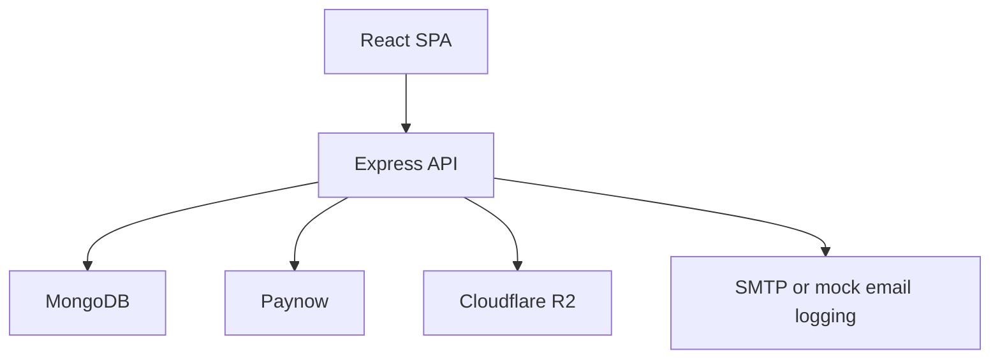

# High Level and Low Level Design

## High-level design

## Low-level data design

### User

- fields: `username`, `email`, `password`, `avatar`, `role`, `premiumExpiry`
- hooks: password hash on save
- methods: `correctPassword(candidatePassword, userPassword)`

### Listing

- core fields: `name`, `description`, `address`, `phoneNumber`, `monthlyRent`, `location`
- amenity flags: `solar`, `borehole`, `security`, `parking`, `internet`
- lifecycle fields: `status`, `earlyAccessUntil`, `publishedAt`, `paymentDeadline`
- ownership: `user` reference
- index: partial unique index on `user` for statuses `active`, `pending_payment`, `early_access`

### Payment

- fields: `user`, `amount`, `method`, `status`, `type`, `listing`, `transactionRef`, `webhookVerified`
- index behavior: sparse unique `transactionRef`

### SavedSearch

- fields: `user`, `name`, `criteria`, `notifyBy`, `isActive`, `lastNotifiedAt`
- indexed fields: `user`, `isActive`

## Low-level request design examples

- Listing create validation enforces non-empty `name`, `description`, `address`, `location`, positive `monthlyRent`, integer `bedrooms`/`bathrooms`, and `type === "rent"`.
- Payment validators require a valid ObjectId `listingId` for listing-fee requests and a string `phone`.
- Upload signing requires `contentType`; optional `folder` defaults to `uploads`.
