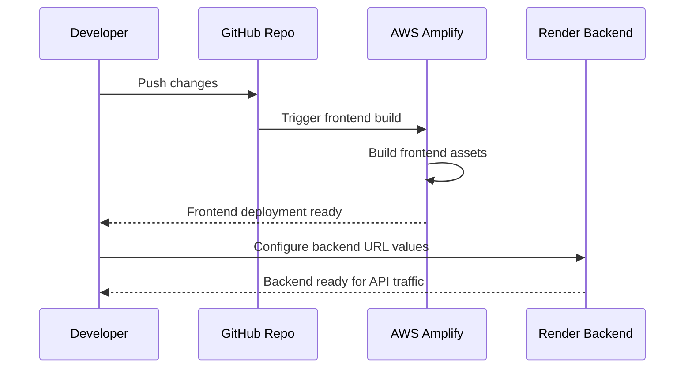

---
title: Deployment
description: Deployment guide for the Town Ruins platform, covering architecture, build process, environment variables, Prisma migrations, DNS, and health checks.
tags:
  - deployment
  - devops
  - infrastructure
  - amplify
  - elastic-beanstalk
aliases:
  - Deploy
  - Infrastructure
---

# Deployment

End-to-end deployment procedures, infrastructure setup, environment configuration, and post-deployment verification for the Town Ruins platform.

<a class="tr-folder-nav-item" href="./DEPLOYMENT">
&#128640;
Deployment Guide
</a>

<a class="tr-folder-nav-item" href="./ENVIRONMENT_VARIABLES">
&#128295;
Environment Variables
</a>

<a class="tr-folder-nav-item" href="./PRE_DEPLOYMENT_CHECKLIST">
&#128220;
Pre-Deployment Checklist
</a>

<a class="tr-folder-nav-item" href="./POST_DEPLOYMENT_CHECKLIST">
&#128220;
Post-Deployment Checklist
</a>

<h3>Purpose</h3>

This folder contains all deployment-related documentation for the Town Ruins platform. It covers the full deployment lifecycle from environment setup through post-deployment verification.

<h3>Overview</h3>

Deployments are managed through a structured workflow that includes pre-deployment checks, environment variable configuration, Prisma migrations, DNS updates, and health verification. Use the guides and checklists in this folder to ensure safe and repeatable releases.

<h3>Related Areas</h3>
<ul>
<li><a href="../operations/">Operations</a></li>
<li><a href="../testing/">Testing</a></li>
<li><a href="../architecture/">Architecture</a></li>
<li><a href="../reference/">Reference</a></li>
</ul>

<h3>Frequently Accessed Pages</h3>
<ul>
<li><a href="./DEPLOYMENT">Deployment Guide</a></li>
<li><a href="./PRE_DEPLOYMENT_CHECKLIST">Pre-Deployment Checklist</a></li>
<li><a href="./POST_DEPLOYMENT_CHECKLIST">Post-Deployment Checklist</a></li>
<li><a href="./ENVIRONMENT_VARIABLES">Environment Variables</a></li>
</ul>

# Deployment

## Last Verified

Last Verified: 2026-07-15

Branch context: awsfullmig

## Related Documents

- [docs/deployment/ENVIRONMENT_VARIABLES.md](ENVIRONMENT_VARIABLES.md)
- [docs/operations/OPERATIONS_RUNBOOK.md](../operations/OPERATIONS_RUNBOOK.md)
- [README.md](../../README.md)

## Prerequisites

- Review the root deployment flow in [README.md](../../README.md)
- Review [amplify.yml](../../amplify.yml)
- Review [real-app-backend-main/render.yaml](../../real-app-backend-main/render.yaml)

## Derived Documents

- [docs/operations/OPERATIONS_RUNBOOK.md](../operations/OPERATIONS_RUNBOOK.md)
- [docs/reference/REPOSITORY_GUIDE.md](../reference/REPOSITORY_GUIDE.md)

## Deployment Flow

1. Deploy the frontend app from [real-app-frontend-main](../../real-app-frontend-main) through the Amplify build flow defined in [amplify.yml](../../amplify.yml).
2. Deploy or configure the backend from [real-app-backend-main](../../real-app-backend-main) using the Render configuration in [real-app-backend-main/render.yaml](../../real-app-backend-main/render.yaml).
3. Synchronize the frontend and backend URL values in the environment configuration so the frontend can reach the API and the backend can return to the frontend.

## Notes

- The root deployment guidance in [README.md](../../README.md) remains the entry point for the current deployment sequence.
- Any deployment detail not visible in the repository is marked as **Planned**.

