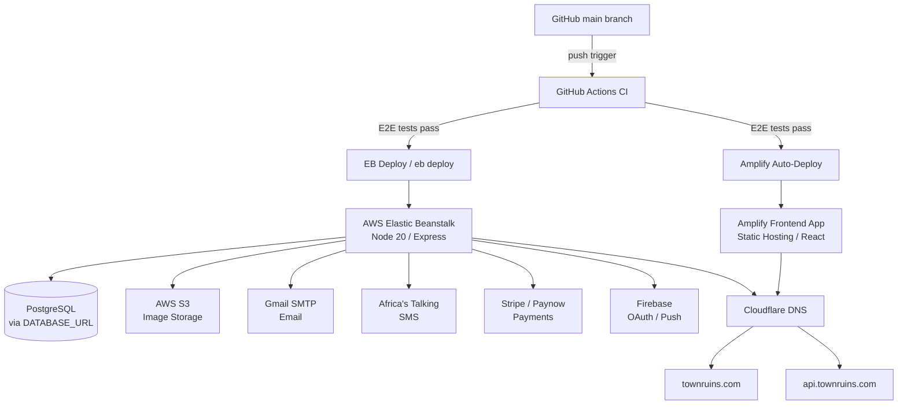
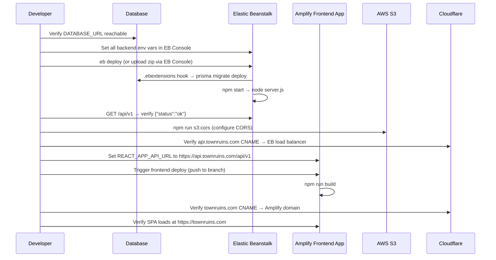
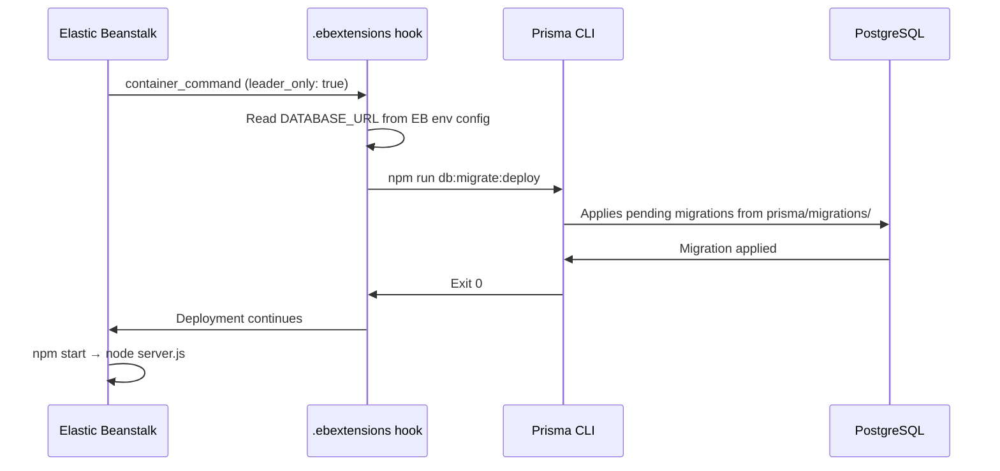

# DEPLOYMENT.md — Town Ruins v1.1 Master Deployment Guide

> **Status:** Implemented & Configured
> **Version:** 1.1
> **Last Updated:** Based on repository state at v1.1
> **Canonical Platform:** AWS Amplify (frontend static hosting) + AWS Elastic Beanstalk (backend API) + AWS S3 (storage) + Cloudflare (DNS & domain)

## Table of Contents

1. [Deployment Architecture](#1-deployment-architecture)
2. [Environments](#2-environments)
3. [Prerequisites](#3-prerequisites)
4. [Deployment Order](#4-deployment-order)
5. [AWS Elastic Beanstalk — Backend Deployment](#5-aws-elastic-beanstalk--backend-deployment)
6. [AWS Amplify — Frontend Deployment](#6-aws-amplify--frontend-deployment)
7. [Build Process](#7-build-process)
8. [Environment Variables](#8-environment-variables)
9. [Secrets Management](#9-secrets-management)
10. [Prisma Migration Process](#10-prisma-migration-process)
11. [DNS & SSL Requirements](#11-dns--ssl-requirements)
12. [Custom Domains](#12-custom-domains)
13. [Health Verification](#13-health-verification)
14. [Smoke Tests](#14-smoke-tests)
15. [Rollback Overview](#15-rollback-overview)

## 1. Deployment Architecture



**Key architectural facts (from repository):**

| Component | Platform | Runtime | Entry Point |
|-----------|----------|---------|-------------|
| Backend API | **AWS Elastic Beanstalk** | Node.js 20 | `server.js` |
| Frontend SPA | AWS Amplify Static Hosting | React 18 / CRA | `build/index.html` |
| Database | PostgreSQL | — | `DATABASE_URL` env var |
| Image Storage | AWS S3 | — | `S3_BUCKET` env var |
| DNS & Domain | **Cloudflare** | — | Managed via Cloudflare dashboard |
| Email | Gmail via Nodemailer | — | `GMAIL_USER` / `GMAIL_APP_PASSWORD` |
| SMS | Africa's Talking | — | `AT_API_KEY` / `AT_USERNAME` |
| Payments | Paynow or Stripe (configurable) | — | `PAYMENT_PROVIDER` env var |
| Auth (OAuth) | Firebase | — | `REACT_APP_FIREBASE_API_KEY` |

> Legacy / alternative platform files in the repository:
> Render.com — `real-app-backend-main/render.yaml` (legacy fallback reference only)
> Netlify — `real-app-frontend-main/netlify.toml` (legacy fallback reference only)
> Amplify backend SSR — `real-app-backend-main/amplify.yml` (not used; EB is the canonical backend)

## 2. Environments

| Environment | Purpose | Database | Payment Provider | Notes |
|-------------|---------|----------|------------------|-------|
| `development` | Local dev | Local PostgreSQL | `mock` | `.env.development` used |
| `test` | CI / E2E | Ephemeral PostgreSQL (Docker) | `mock` | GitHub Actions |
| `production` | Live | PostgreSQL | `paynow` or `stripe` | EB Console env vars |

## 3. Prerequisites

### Infrastructure (requires confirmation — see `OPERATIONS_RUNBOOK.md`)

- [ ] AWS account with Amplify, Elastic Beanstalk, S3, and IAM access
- [ ] PostgreSQL instance provisioned and reachable from EB
- [ ] S3 bucket created for image uploads
- [ ] Firebase project `smtp-a6e98` configured with Google OAuth enabled
- [ ] Paynow and/or Stripe accounts with webhook endpoints registered
- [ ] Africa's Talking account (if SMS enabled)
- [ ] Gmail account with App Password generated
- [ ] Cloudflare account managing the `townruins.com` zone

### Developer Tooling

- [ ] Node.js 20 installed locally
- [ ] `npm` available
- [ ] AWS CLI configured
- [ ] EB CLI installed (`pip install awsebcli`)
- [ ] Prisma CLI available (`npx prisma`)
- [ ] Access to Amplify Console and EB Console

## 4. Deployment Order

> Critical: The backend must be deployed and healthy before the frontend is deployed, because the frontend build bakes in the backend API URL.



## 5. AWS Elastic Beanstalk — Backend Deployment

**Source:** `real-app-backend-main/.ebextensions/01_prisma_migrate.config`, `real-app-backend-main/package.json`

### Elastic Beanstalk Configuration

| Setting | Value |
|---------|-------|
| Platform | Node.js 20 on Amazon Linux 2023 |
| Application root | `real-app-backend-main/` |
| Entry point | `server.js` (via `npm start`) |
| Port | `5000` (or `PORT` env var; EB proxies via nginx on port 80/443) |
| Migration hook | `.ebextensions/01_prisma_migrate.config` |

### Deployment Steps

1. Ensure all environment variables are set in the EB environment (EB Console → Configuration → Software → Environment Properties)
2. Package the application: `zip -r deploy.zip . -x '*.git*' 'node_modules/*'` (from `real-app-backend-main/`)
3. Deploy via EB CLI: `eb deploy`, or upload the zip via the EB Console
4. EB runs the `.ebextensions` hooks during deployment
5. The `01_prisma_migrate.config` hook runs `npm run db:migrate:deploy` on the leader instance only
6. EB starts the application with `npm start` → `node server.js`

### EB Extension — Prisma Migration Hook

**Source:** `real-app-backend-main/.ebextensions/01_prisma_migrate.config`

The hook runs `prisma migrate deploy` as a `container_command` with `leader_only: true`, ensuring migrations run exactly once per deployment even in multi-instance environments. It reads `DATABASE_URL` from the EB environment configuration if not already set in the shell.

### Runtime Behaviour

Four background cron jobs start automatically in non-test environments:

| Job | Default Cron | Env Override |
|-----|-------------|--------------|
| Payment Reconciliation | `*/15 * * * *` | `RECONCILIATION_INTERVAL_CRON` |
| Notification Worker | `*/30 * * * * *` | `NOTIFICATION_WORKER_CRON` |
| Reminder Scanner | `0 * * * *` | `REMINDER_SCAN_CRON` |
| Listing Expiry Scanner | `*/30 * * * *` | `EXPIRY_SCAN_CRON` |

> **DECISION NEEDED — Infrastructure Owner:** Confirm EB environment name, region, instance type, auto-scaling group configuration, and load balancer type (ALB/CLB). Required for production deployment setup. Document these values in `OPERATIONS_RUNBOOK.md` Section 2 (Access & Credentials) and Section 5 (Scaling).

## 6. AWS Amplify — Frontend Deployment

**Source:** `real-app-frontend-main/amplify.yml`

### Amplify App Configuration

| Setting | Value |
|---------|-------|
| App root directory | `real-app-frontend-main` |
| Build spec | `real-app-frontend-main/amplify.yml` |
| Artifact base directory | `build` |
| SPA redirect | `/*` → `/index.html` (HTTP 200) |

### Build Phases

**preBuild:** `npm ci`

**build:**

1. Export `REACT_APP_*` env vars to `.env.production`
2. `npm run build` (CRA with `--openssl-legacy-provider`)

### SPA Routing

The Amplify redirect rule handles client-side routing:

```
source: /^[^.]+$|\.(?!(css|gif|ico|jpg|js|png|txt|svg|woff|woff2|ttf|map|json|webp)$)([^.]+$)/
target: /index.html
status: 200
```

## 7. Build Process

### Backend Build Artifacts

For Elastic Beanstalk, the application is packaged as a zip file containing the `real-app-backend-main/` directory (excluding `node_modules` and `.git`). EB installs dependencies via `npm install` (which also triggers `postinstall` → `prisma generate`).

### Frontend Build Artifacts

Standard CRA production build output in `build/`. Static assets are served directly by Amplify CDN.

### Monorepo Root

`amplify.yml` at the repository root exists for Amplify monorepo detection but applies only to the **frontend** Amplify app. The backend is deployed independently via Elastic Beanstalk and does not use Amplify.

## 8. Environment Variables

See `ENVIRONMENT_VARIABLES.md` for the complete reference table.

**Backend variables** are set in the **Elastic Beanstalk Console** → Configuration → Software → Environment Properties. They are available to the Node.js process as `process.env.*` at runtime.

**Frontend variables** are set in the **Amplify Console** for the frontend app and exported to `.env.production` during the build phase.

> ⚠️ Never commit real secret values. The `.env.production` file in the repository contains only placeholders.

## 9. Secrets Management

| Secret | Storage Location | Notes |
|--------|-----------------|-------|
| `DATABASE_URL` | **EB Console** → Environment Properties | Contains credentials — mark as secret |
| `JWT_SECRET` | **EB Console** → Environment Properties | Mark as secret |
| `GMAIL_APP_PASSWORD` | **EB Console** → Environment Properties | Mark as secret |
| `STRIPE_SECRET_KEY` | **EB Console** → Environment Properties | Mark as secret |
| `STRIPE_WEBHOOK_SECRET` | **EB Console** → Environment Properties | Mark as secret |
| `PAYNOW_INTEGRATION_KEY` | **EB Console** → Environment Properties | Mark as secret |
| `VAPID_PRIVATE_KEY` | **EB Console** → Environment Properties | Mark as secret |
| `AT_API_KEY` | **EB Console** → Environment Properties | Mark as secret |
| `SEED_API_KEY` | **EB Console** → Environment Properties + GitHub Secrets | Used by E2E CI |
| `REACT_APP_FIREBASE_API_KEY` | **Amplify Console** env vars | Firebase web API key |

> **DECISION NEEDED — Infrastructure Owner:** Confirm whether AWS Secrets Manager or Parameter Store is used in addition to EB environment properties. Required for secrets management strategy. If used, document the path/parameter names and access policies in `OPERATIONS_RUNBOOK.md` Section 9 (Security Operations).

## 10. Prisma Migration Process

**Source:** `real-app-backend-main/prisma/schema.prisma`, `real-app-backend-main/.ebextensions/01_prisma_migrate.config`

### Migration Flow



### Migration History (v1.1)

| Migration | Description |
|-----------|-------------|
| `20231231000000_init` | Initial schema |
| `20240101000000_add_phone_otp` | Phone OTP fields |
| `20260510135100_add_listing_drafts` | Listing drafts |
| `20260514000000_accommodation_platform_upgrade` | Accommodation platform |
| `20260514193000_search_engine_upgrade` | Search engine |
| `20260515000000_add_accommodation_timezone` | Timezone field |
| `20260515120000_booking_refunded_and_guest_info` | Booking guest info |
| `20260515200000_pricing_engine` | Pricing engine |
| `20260518_notification_system` | Notification system |
| `20260518000000_payment_checkout_upgrade` | Payment checkout |
| `20260519000000_moderation_system` | Moderation |
| `20260522000000_engagement_and_verification` | Engagement & verification |
| `20260522210000_repair_user_auth_columns` | Auth column repair |
| `20260523000000_add_consent_and_legal_docs` | Consent & legal docs |
| `20260523100000_push_notifications` | Push notifications |
| `20260523200000_legal_documents` | Legal documents |
| `20260607000000_v1_1_wallet_and_listing_lifecycle` | **v1.1** Wallet & listing lifecycle |

### Important Notes

- `prisma generate` runs automatically via the `postinstall` script in `package.json` when `npm install` is executed during EB deployment — no separate generate step needed.
- The `.ebextensions` hook runs `npm run db:migrate:deploy` on the leader instance only — safe for multi-instance EB environments.
- Binary targets in `schema.prisma` include `rhel-openssl-3.0.x` which is compatible with Amazon Linux 2023.
- If the database is unreachable during deployment, the hook will fail and the EB deployment will be rolled back automatically.

## 11. DNS & SSL Requirements

**DNS is managed via Cloudflare.** All records are configured in the Cloudflare dashboard for the `townruins.com` zone.

| Domain | Record Type | Target | Cloudflare Proxy | Purpose |
|--------|-------------|--------|-------------------|---------|
| `townruins.com` | CNAME | Amplify frontend domain | ✅ Proxied | Frontend SPA |
| `www.townruins.com` | CNAME | Amplify frontend domain | ✅ Proxied | Frontend SPA (www redirect) |
| `app.townruins.com` | CNAME | Amplify frontend domain | ✅ Proxied | Frontend SPA (app subdomain) |
| `api.townruins.com` | CNAME | EB load balancer DNS name | ✅ Proxied | Backend API |

> **DECISION NEEDED — Infrastructure Owner:** Confirm the exact Cloudflare DNS record values (Amplify domain, EB load balancer DNS name). Required for DNS configuration. Document these values in `OPERATIONS_RUNBOOK.md` Section 2 (Access & Credentials) under DNS details.

### SSL Configuration

| Layer | SSL Provider | Notes |
|-------|-------------|-------|
| Cloudflare → Browser | Cloudflare Universal SSL | Auto-provisioned; covers `*.townruins.com` |
| Cloudflare → Amplify | Full (Strict) | Amplify provides ACM cert; use **Full (Strict)** mode |
| Cloudflare → EB Load Balancer | Full (Strict) recommended | EB load balancer must have an ACM certificate |

> Important: Set Cloudflare SSL/TLS mode to Full (Strict) for both origins to prevent SSL stripping between Cloudflare and AWS.

> **DECISION NEEDED — Infrastructure Owner:** Confirm Cloudflare SSL/TLS mode (Full Strict recommended) and whether the EB load balancer has an ACM certificate attached. Required for production HTTPS. Document the SSL certificate ARN and validation status in `OPERATIONS_RUNBOOK.md` Section 2 (Access & Credentials).

## 12. Custom Domains

CORS is pre-configured in `real-app-backend-main/app.js` to allow:

- `https://townruins.com`
- `https://www.townruins.com`
- `https://app.townruins.com`
- Any `*.amplifyapp.com` subdomain (for Amplify preview branches)
- `FRONTEND_URL` env var value
- `CORS_ALLOWED_ORIGINS` env var (comma-separated)

### Cloudflare Custom Domain Notes

- Cloudflare proxies requests, so the `Origin` header seen by the backend will be the custom domain — CORS works correctly.
- Ensure `FRONTEND_URL` is set to the Cloudflare-proxied domain (e.g., `https://townruins.com`), not the raw Amplify domain.
- For Amplify domain setup, temporarily set Cloudflare to **DNS-only (grey cloud)** during ACM certificate validation, then switch back to proxied.
- For the EB backend, `api.townruins.com` points to the EB load balancer DNS name via Cloudflare CNAME. No custom domain setup is needed in EB itself.

After adding or changing a custom domain, run the S3 CORS script:

```
npm run s3:cors
```

(Requires `S3_BUCKET`, `S3_REGION`, and `FRONTEND_URL` to be set.)

## 13. Health Verification

| Endpoint | Expected Response |
|----------|-------------------|
| `GET /` | `{"status":"ok","message":"Town Ruins API is running."}` |
| `GET /api/v1` | `{"status":"ok","message":"Town Ruins API v1 is running."}` |

**Elastic Beanstalk health check:** EB performs HTTP health checks against `/`. The `/` route in `app.js` returns `{"status":"ok"}` which satisfies this requirement.

> **DECISION NEEDED — Infrastructure Owner:** Confirm the EB health check path, interval, and healthy/unhealthy threshold settings. Required for EB to properly monitor application health. Document these values in `OPERATIONS_RUNBOOK.md` Section 16 (Monitoring & Logging).

## 14. Smoke Tests

See `SMOKE_TEST_PLAN.md` for the full 15–30 minute launch-day verification guide.

## 15. Rollback Overview

See `ROLLBACK.md` for the complete rollback strategy including database migration considerations.

**Quick reference:**

- Frontend rollback: Amplify Console → Deployments → Redeploy previous build
- Backend rollback: EB Console → Application Versions → Deploy previous version (or `eb deploy --version <label>` via EB CLI)
- Database: Migrations are forward-only by default — see `ROLLBACK.md` for safe rollback procedures
