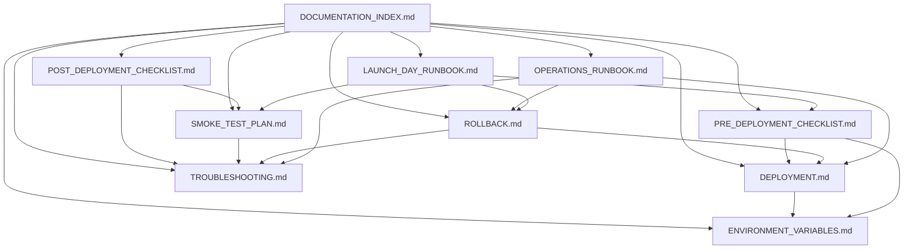

# DOCUMENTATION_INDEX.md — Deployment & Operations Documentation Index

> **Version:** 1.1
> **Purpose:** Master index of all deployment and operational documentation
> **Owner:** Engineering Lead
> **Update frequency:** Whenever a new document is added or an existing document is significantly revised
> **Location:** `workflow/deployment/`

## Document Registry

| # | Document | Purpose | Primary Audience | Owner | Update Frequency | Status |
|---|---|---|---|---|---|---|
| 1 | `DEPLOYMENT.md` | Master deployment guide — architecture, build process, env vars, Prisma migrations, DNS, and health checks | DevOps, Engineers | DevOps | Every release | ✅ Current |
| 2 | `PRE_DEPLOYMENT_CHECKLIST.md` | Complete production readiness checklist before every deployment | DevOps, QA, Infra Owner | DevOps | Every release | ✅ Current |
| 3 | `POST_DEPLOYMENT_CHECKLIST.md` | Verification checklist after every deployment | QA, DevOps | QA | Every release | ✅ Current |
| 4 | `SMOKE_TEST_PLAN.md` | Fast 15–30 minute launch-day verification of critical workflows | QA, DevOps | QA | Every major release | ✅ Current |
| 5 | `TROUBLESHOOTING.md` | Symptoms, causes, diagnostics, and resolutions for common issues | Engineers, DevOps | Engineering Lead | As issues are discovered | ✅ Current |
| 6 | `ROLLBACK.md` | Rollback strategy, database migration safety, and post-rollback verification | DevOps, Engineering Lead | Engineering Lead | Every release | ✅ Current |
| 7 | `ENVIRONMENT_VARIABLES.md` | Complete reference table for all environment variables | DevOps, Engineers | DevOps | Every release | ✅ Current |
| 8 | `OPERATIONS_RUNBOOK.md` | Day-to-day operational procedures, monitoring, and incident response | DevOps, On-call Engineers | DevOps | After every infra change | ✅ Current |
| 9 | `LAUNCH_DAY_RUNBOOK.md` | Chronological launch guide with roles, timelines, and rollback decision points | All roles | Engineering Lead | Before each major launch | ✅ Current |
| 10 | `DOCUMENTATION_INDEX.md` | This document — master index | All roles | Engineering Lead | When docs change | ✅ Current |
| 11 | `END_USER_GUIDE.md` | End user guide for all platform users (tenants, landlords, guests) | All users | Product Owner | When user flows change | ✅ Current |
| 12 | `LANDLORD_GUIDE.md` | Guide for property owners listing and managing rentals | Landlords | Product Owner | When landlord flows change | ✅ Current |
| 13 | `ADMIN_GUIDE.md` | Administrator guide for platform management and moderation | Admins, Super Admins | Engineering Lead | When admin features change | ✅ Current |
| 14 | `MODERATOR_GUIDE.md` | Moderator guide for content review and dispute handling | Moderators | Engineering Lead | When moderation policies change | ✅ Current |

## Document Dependencies

## Audience Guide

| Role | Must Read | Should Read | Reference As Needed |
|---|---|---|---|
| New Engineer | `DEPLOYMENT.md`, `ENVIRONMENT_VARIABLES.md` | `TROUBLESHOOTING.md` | `OPERATIONS_RUNBOOK.md` |
| DevOps | All documents | — | — |
| QA | `SMOKE_TEST_PLAN.md`, `POST_DEPLOYMENT_CHECKLIST.md` | `TROUBLESHOOTING.md` | `DEPLOYMENT.md` |
| Engineering Lead | `ROLLBACK.md`, `LAUNCH_DAY_RUNBOOK.md` | All documents | — |
| Infrastructure Owner | `OPERATIONS_RUNBOOK.md`, `ENVIRONMENT_VARIABLES.md` | `DEPLOYMENT.md`, `ROLLBACK.md` | All documents |
| Product Owner | `LAUNCH_DAY_RUNBOOK.md` | `PRE_DEPLOYMENT_CHECKLIST.md` | — |

## Open Decision Tracker

The following sections require Infrastructure Owner input before they are complete:

| Document | Section | Decision Needed |
|---|---|---|
| `DEPLOYMENT.md` | EB Configuration | Confirm EB environment name, region, instance type, auto-scaling group configuration, and load balancer type (ALB/CLB) |
| `DEPLOYMENT.md` | DNS Requirements | Confirm exact Cloudflare DNS record values (Amplify domain, EB load balancer DNS name) |
| `DEPLOYMENT.md` | DNS Requirements | Confirm Cloudflare proxy mode (orange cloud vs. grey cloud) per record |
| `DEPLOYMENT.md` | SSL Configuration | Confirm Cloudflare SSL/TLS mode (Full Strict) and EB load balancer ACM certificate |
| `DEPLOYMENT.md` | Health Verification | Confirm EB health check path, interval, and thresholds |
| `DEPLOYMENT.md` | Secrets Management | Confirm whether AWS Secrets Manager or Parameter Store is used alongside EB env properties |
| `PRE_DEPLOYMENT_CHECKLIST.md` | Infrastructure | Confirm VPC/networking between EB and PostgreSQL |
| `PRE_DEPLOYMENT_CHECKLIST.md` | Database | Confirm backup schedule and retention policy |
| `PRE_DEPLOYMENT_CHECKLIST.md` | AWS / EB | Confirm EB instance type and auto-scaling configuration |
| `PRE_DEPLOYMENT_CHECKLIST.md` | Email | Consider migrating to a transactional email service (SendGrid, SES) |
| `PRE_DEPLOYMENT_CHECKLIST.md` | Security | Confirm Cloudflare WAF rules / firewall rules |
| `PRE_DEPLOYMENT_CHECKLIST.md` | Firebase | Should `real-app-frontend-main/src/firebase/index.ts` be migrated to fully environment-driven Firebase configuration? |
| `ROLLBACK.md` | Database Backup Restore | Document PostgreSQL backup restore procedure, RTO / RPO |
| `OPERATIONS_RUNBOOK.md` | Access & Credentials | Provide all access details (AWS, Cloudflare, Firebase, payment providers) |
| `OPERATIONS_RUNBOOK.md` | Monitoring | Confirm monitoring service, dashboards, alert thresholds |
| `OPERATIONS_RUNBOOK.md` | Scaling | Confirm EB instance type, auto-scaling policies |
| `OPERATIONS_RUNBOOK.md` | Backup & Recovery | Confirm backup schedule, RTO / RPO, restore procedure |
| `OPERATIONS_RUNBOOK.md` | Maintenance Windows | Confirm scheduled maintenance window |

## Codebase Cross-References

| Document | Key Source Files |
|---|---|
| `DEPLOYMENT.md` | `real-app-backend-main/.ebextensions/01_prisma_migrate.config`, `real-app-frontend-main/amplify.yml`, `real-app-backend-main/server.js`, `real-app-backend-main/package.json` |
| `ENVIRONMENT_VARIABLES.md` | `real-app-backend-main/render.yaml`, `real-app-backend-main/app.js`, `real-app-frontend-main/.env.production` |
| `TROUBLESHOOTING.md` | `real-app-backend-main/app.js`, `real-app-backend-main/utils/email.js`, `real-app-backend-main/utils/sms.js`, `real-app-frontend-main/src/firebase/index.ts` |
| `OPERATIONS_RUNBOOK.md` | `real-app-backend-main/utils/notificationWorker.js`, `real-app-backend-main/utils/reconciliationJob.js`, `real-app-backend-main/utils/reminderScanner.js`, `real-app-backend-main/utils/listingExpiryScanner.js` |
| `ROLLBACK.md` | `real-app-backend-main/prisma/migrations/` |

## Version History

| Version | Date | Changes | Author |
|---|---|---|---|
| 1.0 | 2026-06-29 | Initial documentation suite created for v1.1 | Tea |
| 1.1 | 2026-06-29 | Corrected infrastructure: backend is AWS Elastic Beanstalk (not Amplify SSR); DNS is Cloudflare-managed | Tea |
