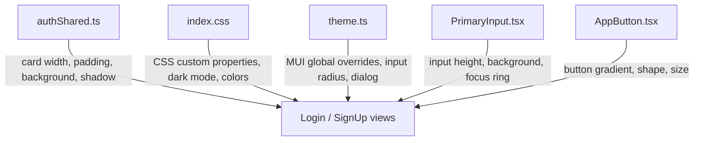

# Epic: Town Ruins Go-Live: What’s Next

---

# Town Ruins — Auth Form Styling & Responsiveness Guide

## Overview

This spec is the manual editing reference for all auth form styling in Town Ruins. It maps every visual concern (width, color, spacing, responsiveness, input appearance, button shape) to the exact file and property to change. No other files need to be touched for auth form styling.

## Styling Architecture

All auth form styling flows through 4 files. Changes in the wrong file will either have no effect or affect the entire app unintentionally.



## File Map — What to Touch for What

| Concern | File | Scope |
| --- | --- | --- |
| Card width, padding, background, shadow, border radius | file:real-app-frontend-main/src/views/auth/authShared.ts | Auth pages only |
| Brand colors, dark mode, page background | file:real-app-frontend-main/src/index.css | Whole app |
| Input height, border radius, background, focus ring | file:real-app-frontend-main/src/components/PrimaryInput/PrimaryInput.tsx | All PrimaryInput uses |
| Button shape, gradient, size | file:real-app-frontend-main/src/components/ui/AppButton.tsx | All AppButton uses |
| MUI global overrides (fallback) | file:real-app-frontend-main/src/theme.ts | Whole app |
| Login form content/layout | file:real-app-frontend-main/src/views/Login/index.tsx | Login only |
| SignUp form content/layout | file:real-app-frontend-main/src/views/SignUp/index.tsx | SignUp only |

<user_quoted_section>Priority rule: PrimaryInput.tsx InputProps.sx overrides theme.ts for input fields. If you change theme.ts and see no effect on inputs, the override is in PrimaryInput.tsx.</user_quoted_section>

## Wireframes

### Current layout (reference)

```wireframe

<html>
<head>
<style>
  body { margin: 0; font-family: sans-serif; background: #F5F0EB; display: flex; align-items: center; justify-content: center; min-height: 100vh; }
  .page { position: relative; width: 100%; min-height: 100vh; display: flex; align-items: center; justify-content: center; background: #e8e0d8; }
  .hero { position: absolute; inset: 0; background: linear-gradient(135deg, #2a2a2a 0%, #4a4a4a 100%); opacity: 0.7; }
  .card { position: relative; z-index: 2; width: 480px; max-width: calc(100vw - 32px); background: rgba(252,253,253,0.72); border-radius: 28px; padding: 48px 52px; box-shadow: 0 48px 120px rgba(0,0,0,0.55); border: 1px solid rgba(255,255,255,0.09); }
  .logo { width: 120px; height: 32px; background: #ddd; border-radius: 4px; margin: 0 auto 24px; }
  .heading { font-size: 28px; font-weight: 800; text-align: center; margin-bottom: 6px; color: #1F2937; }
  .sub { font-size: 14px; color: #475569; text-align: center; margin-bottom: 20px; }
  .label { font-size: 13px; font-weight: 600; color: #1F2937; margin-bottom: 5px; }
  .input { width: 100%; height: 48px; border: 1px solid #E2E8F0; border-radius: 12px; background: #fff; box-sizing: border-box; margin-bottom: 12px; padding: 0 14px; font-size: 14px; }
  .btn { width: 100%; height: 52px; background: linear-gradient(135deg, #B8975A, #9E7E45); color: #fff; border: none; border-radius: 999px; font-size: 16px; font-weight: 700; margin: 16px 0; cursor: pointer; }
  .google-btn { width: 100%; height: 44px; background: #fff; border: 1.5px solid #E2E8F0; border-radius: 999px; font-size: 14px; font-weight: 600; cursor: pointer; margin-bottom: 12px; }
  .link-row { text-align: center; font-size: 14px; color: #475569; }
  .link { color: #B8975A; font-weight: 600; cursor: pointer; }
  .annotation { position: absolute; background: #B8975A; color: #fff; font-size: 11px; padding: 2px 8px; border-radius: 4px; white-space: nowrap; }
  .ann-line { position: absolute; border-top: 1px dashed #B8975A; }
</style>
</head>
<body>
<div class="page">
  <div class="hero"></div>
  <div class="card" data-element-id="auth-card">
    <div class="logo" data-element-id="logo"></div>
    <div class="heading">Welcome back</div>
    <div class="sub">Log in to continue searching and saving listings.</div>
    <div class="label">Email</div>
    <input class="input" data-element-id="email-input" placeholder="Email" />
    <div class="label">Password</div>
    <input class="input" data-element-id="password-input" placeholder="Password" type="password" />
    <button class="btn" data-element-id="submit-btn">Login</button>
    <button class="google-btn" data-element-id="google-btn">Continue with Google</button>
    <div class="link-row">Don't have an account? <span class="link">Sign Up</span></div>
  </div>
</div>
</body>
</html>
```

### Responsive — mobile (xs, < 600px)

```wireframe

<html>
<head>
<style>
  body { margin: 0; font-family: sans-serif; background: #F5F0EB; display: flex; align-items: center; justify-content: center; min-height: 100vh; }
  .page { position: relative; width: 390px; min-height: 100vh; display: flex; align-items: center; justify-content: center; background: #e8e0d8; margin: 0 auto; }
  .hero { position: absolute; inset: 0; background: linear-gradient(135deg, #2a2a2a 0%, #4a4a4a 100%); opacity: 0.7; }
  .card { position: relative; z-index: 2; width: calc(100% - 32px); background: rgba(252,253,253,0.72); border-radius: 28px; padding: 24px; box-shadow: 0 48px 120px rgba(0,0,0,0.55); }
  .logo { width: 100px; height: 28px; background: #ddd; border-radius: 4px; margin: 0 auto 20px; }
  .heading { font-size: 22px; font-weight: 800; text-align: center; margin-bottom: 4px; color: #1F2937; }
  .sub { font-size: 13px; color: #475569; text-align: center; margin-bottom: 16px; }
  .label { font-size: 12px; font-weight: 600; color: #1F2937; margin-bottom: 4px; }
  .input { width: 100%; height: 48px; border: 1px solid #E2E8F0; border-radius: 12px; background: #fff; box-sizing: border-box; margin-bottom: 10px; padding: 0 12px; font-size: 14px; }
  .btn { width: 100%; height: 52px; background: linear-gradient(135deg, #B8975A, #9E7E45); color: #fff; border: none; border-radius: 999px; font-size: 15px; font-weight: 700; margin: 14px 0; cursor: pointer; }
  .google-btn { width: 100%; height: 44px; background: #fff; border: 1.5px solid #E2E8F0; border-radius: 999px; font-size: 13px; font-weight: 600; cursor: pointer; margin-bottom: 10px; }
  .link-row { text-align: center; font-size: 13px; color: #475569; }
  .link { color: #B8975A; font-weight: 600; }
  .badge { display: inline-block; background: #B8975A; color: #fff; font-size: 10px; padding: 2px 6px; border-radius: 4px; margin-bottom: 8px; }
</style>
</head>
<body>
<div class="page">
  <div class="hero"></div>
  <div class="card" data-element-id="auth-card-mobile">
    <div class="badge">xs breakpoint — width: calc(100vw - 32px)</div>
    <div class="logo" data-element-id="logo-mobile"></div>
    <div class="heading">Welcome back</div>
    <div class="sub">Log in to continue.</div>
    <div class="label">Email</div>
    <input class="input" data-element-id="email-mobile" placeholder="Email" />
    <div class="label">Password</div>
    <input class="input" data-element-id="password-mobile" placeholder="Password" type="password" />
    <button class="btn" data-element-id="submit-mobile">Login</button>
    <button class="google-btn" data-element-id="google-mobile">Continue with Google</button>
    <div class="link-row">Don't have an account? <span class="link">Sign Up</span></div>
  </div>
</div>
</body>
</html>
```

## 1. Card Width, Padding, Background, Shadow

**File:** file:real-app-frontend-main/src/views/auth/authShared.ts

Both `Login` and `SignUp` import `AUTH_CARD_SX` and `AUTH_PAGE_WRAPPER_SX` from this file. It is the **single source of truth** for the card shell.

### `AUTH_CARD_SX` — editable properties

| Property | Current value | What it does | How to change |
| --- | --- | --- | --- |
| `width` | `{ xs: "calc(100vw - 32px)", sm: "480px", md: "480px" }` | Card width at each breakpoint | Change `sm`/`md` value to resize; change `32px` margin for mobile |
| `maxWidth` | `"480px"` | Hard cap on card width | Match to `sm` value above |
| `mx` | `"auto"` | Horizontal centering | Keep as `"auto"` |
| `maxHeight` | `"calc(100vh - 104px)"` | Prevents card from overflowing viewport | Reduce if card clips on short screens |
| `overflowY` | `"auto"` | Enables scroll inside card when content is tall | Keep for SignUp; can set `"visible"` for Login |
| `p` | `{ xs: 3, md: "48px 52px" }` | Inner padding — `xs: 3` = 24px all sides | Reduce `xs` for tighter mobile, reduce `md` for less whitespace |
| `borderRadius` | `"28px"` | Card corner radius | `"16px"` for tighter, `"0"` for square |
| `background` | `"rgba(252, 253, 253, 0.72)"` | Card fill — semi-transparent white | `"rgba(255,255,255,0.95)"` for solid, `"#1a1a2e"` for dark |
| `backdropFilter` | `"blur(28px)"` | Glass blur behind card | `"none"` to remove glass effect |
| `border` | `"1px solid rgba(255,255,255,0.09)"` | Card border | `"1px solid #B8975A"` for gold border |
| `boxShadow` | `"0 48px 120px rgba(0,0,0,0.55), ..."` | Card drop shadow | `"0 8px 32px rgba(0,0,0,0.18)"` for lighter |

### `AUTH_PAGE_WRAPPER_SX` — editable properties

| Property | Current value | What it does |
| --- | --- | --- |
| `top` | `"72px"` | Offset from top — must match header height |
| `background` | `"#ffffff"` | Page fill behind the card |
| `px` / `py` | `"16px"` | Page-level padding around the card |

## 2. Colors — Brand, Text, Backgrounds, Dark Mode

**File:** file:real-app-frontend-main/src/index.css

All colors are CSS custom properties. Change them here and they propagate to every component that uses `var(--...)`.

### Light mode variables (`:root`, lines 3–53)

| Variable | Current value | Used for |
| --- | --- | --- |
| `--brand-primary` | `#B8975A` | Buttons, links, checkboxes, focus rings |
| `--brand-primary-hover` | `#9E7E45` | Button hover state |
| `--surface-page` | `#F5F0EB` | Page background |
| `--surface-card` | `#FFFFFF` | Input field background |
| `--border-default` | `#E2E8F0` | Input borders (unfocused) |
| `--border-brand` | `#B8975A` | Input border (focused) |
| `--text-primary` | `#1F2937` | Main body text, headings |
| `--text-secondary` | `#475569` | Labels, subheadings |
| `--text-muted` | `#94A3B8` | Placeholder text, helper text |

### Dark mode variables

Dark mode is defined in **two places** — both must be updated together:

- `@media (prefers-color-scheme: dark)` block — lines 55–77 (system dark mode)
- `html[data-color-scheme="dark"]` block — lines 101–121 (manual toggle)

<user_quoted_section>If you change a light-mode color, update the corresponding dark-mode variable in both blocks to keep the theme consistent.</user_quoted_section>

## 3. Input Fields — Height, Border Radius, Background, Focus Color

**File:** file:real-app-frontend-main/src/components/PrimaryInput/PrimaryInput.tsx

This component wraps MUI `TextField` and applies its own `InputProps.sx` which **overrides** `theme.ts` for all auth form inputs.

### Properties to edit

| Property | Location in file | Current value | What to change it to |
| --- | --- | --- | --- |
| Input height | `InputProps.sx.minHeight` | `"48px"` | `"56px"` for taller inputs |
| Input border radius | `InputProps.sx.borderRadius` | `"12px"` (default) | `"8px"` for squarer, `"4px"` for near-flat |
| Input background | `InputProps.sx.background` | `"var(--surface-card)"` | Any hex or CSS variable |
| Input text color | `InputProps.sx.color` | `"var(--text-primary)"` | Any hex |
| Focus ring color | `"& .MuiOutlinedInput-root.Mui-focused .MuiOutlinedInput-notchedOutline"` → `borderColor` | `"#B8975A"` | Any hex |
| Placeholder font size | `"& .MuiInputBase-input::placeholder"` → `fontSize` | `"14px"` | `"16px"` |

<user_quoted_section>The borderRadius prop can also be passed per-instance from the parent: &lt;PrimaryInput borderRadius="8px" /&gt;. This overrides the default "12px".</user_quoted_section>

## 4. Buttons — Shape, Color, Gradient, Size

**File:** file:real-app-frontend-main/src/components/ui/AppButton.tsx

### Primary contained button (the main CTA — Login, Sign Up)

| Property | Current value | What to change |
| --- | --- | --- |
| Background gradient | `"linear-gradient(135deg, #B8975A, #9E7E45)"` | Replace with flat color `"#B8975A"` or different gradient |
| Hover gradient | `"linear-gradient(135deg, #C9A86A, #B8975A)"` | Match to background change |
| Hover shadow | `"0 4px 12px rgba(184,151,90,0.35)"` | Adjust opacity/spread |
| Border radius | `"999px"` (pill) | `"12px"` for rounded rect, `"4px"` for near-square |
| Font weight | `700` | `600` for slightly lighter |

### Button sizes (via `size` prop)

| Size | Padding | Font size | Min height |
| --- | --- | --- | --- |
| `small` | `6px 14px` | `13px` | `36px` |
| `medium` (default) | `10px 20px` | `14px` | `44px` |
| `large` | `14px 28px` | `16px` | `52px` |

Auth forms use `size="large"` for the submit button.

## 5. MUI Global Overrides (Fallback)

**File:** file:real-app-frontend-main/src/theme.ts

These apply app-wide. Only edit here if you want the change to affect **all** MUI inputs/cards across the entire app, not just auth forms.

### Key overrides

| Component | Property | Current value | Location in file |
| --- | --- | --- | --- |
| `MuiOutlinedInput` | `borderRadius` | `12` | `theme.ts` line ~304 |
| `MuiOutlinedInput` | `minHeight` | `48` | `theme.ts` line ~307 |
| `MuiOutlinedInput` | `background` | `isDark ? "#1C2330" : "#FFFFFF"` | `theme.ts` line ~305 |
| `MuiOutlinedInput` | focus `borderColor` | `"#B8975A"` | `theme.ts` line ~308 |
| `MuiOutlinedInput` | default `borderColor` | `isDark ? "#30363D" : "#E2E8F0"` | `theme.ts` line ~312 |
| `MuiCard` | `borderRadius` | `16` | `theme.ts` line ~329 |
| `MuiButton` | `borderRadius` | `999` | `theme.ts` line ~95 |
| `MuiButton` (large) | `padding` | `"14px 28px"` | `theme.ts` line ~111 |

## 6. Responsiveness — Breakpoints and Common Fixes

The responsive system uses MUI's `sx` breakpoint object syntax (`{ xs, sm, md, lg }`).

### Breakpoint values

| Key | Viewport width |
| --- | --- |
| `xs` | 0 – 599px (mobile) |
| `sm` | 600 – 899px (tablet) |
| `md` | 900px+ (desktop) |

### Current card responsive behaviour

```
xs  →  width: calc(100vw - 32px)   padding: 24px all sides
sm  →  width: 480px                padding: 48px top/bottom, 52px left/right
md  →  width: 480px                same as sm
```

### Common fixes

| Problem | Property to change | File | Fix |
| --- | --- | --- | --- |
| Card too wide on small phones | `width.xs` | `authShared.ts` | `"calc(100vw - 16px)"` for less margin |
| Card overflows vertically on short screens | `maxHeight` | `authShared.ts` | `"calc(100vh - 64px)"` |
| Padding too tight on mobile | `p.xs` | `authShared.ts` | `2` (= 16px) for tighter, `4` (= 32px) for more space |
| Card not centered | `mx` | `authShared.ts` | Confirm `"auto"` is set |
| Page wrapper clips at top | `top` | `authShared.ts` → `AUTH_PAGE_WRAPPER_SX` | Match to actual header height |
| Hero slideshow not visible on mobile | `background` | `authShared.ts` → `AUTH_PAGE_WRAPPER_SX` | Set to `"transparent"` |
| Input too small on mobile | `minHeight` | `PrimaryInput.tsx` | Keep at `"48px"` — already touch-friendly |

## Edit Checklist

Use this when making manual styling changes:

```
[ ] Decide which concern you are changing (width / color / input / button / responsiveness)
[ ] Open only the file mapped to that concern (see File Map table above)
[ ] Make the change
[ ] If changing a color in index.css light mode → update dark mode blocks too (lines 55–77 and 101–121)
[ ] If changing AUTH_CARD_SX width → update maxWidth to match
[ ] If changing theme.ts input styles → check PrimaryInput.tsx for overrides
[ ] Save and verify in browser at xs (375px), sm (600px), and md (1024px) widths
```