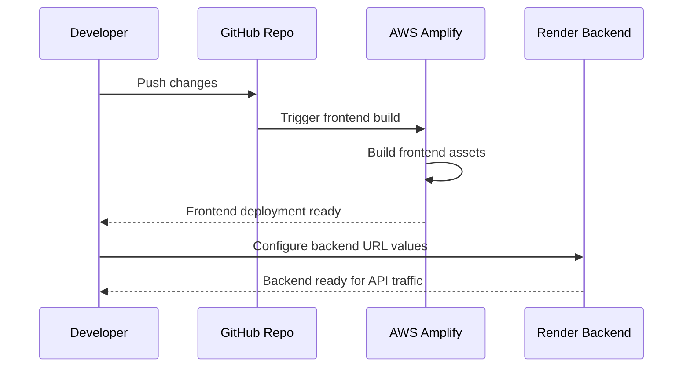

# Deployment

## Last Verified

Last Verified: 2026-07-15

Branch context: awsfullmig

## Related Documents

- [docs/deployment/ENVIRONMENT_VARIABLES.md](ENVIRONMENT_VARIABLES.md)
- [docs/operations/OPERATIONS_RUNBOOK.md](../operations/OPERATIONS_RUNBOOK.md)
- [README.md](../../README.md)

## Prerequisites

- Review the root deployment flow in [README.md](../../README.md)
- Review [amplify.yml](../../amplify.yml)
- Review [real-app-backend-main/render.yaml](../../real-app-backend-main/render.yaml)

## Derived Documents

- [docs/operations/OPERATIONS_RUNBOOK.md](../operations/OPERATIONS_RUNBOOK.md)
- [docs/reference/REPOSITORY_GUIDE.md](../reference/REPOSITORY_GUIDE.md)

## Deployment Flow

1. Deploy the frontend app from [real-app-frontend-main](../../real-app-frontend-main) through the Amplify build flow defined in [amplify.yml](../../amplify.yml).
2. Deploy or configure the backend from [real-app-backend-main](../../real-app-backend-main) using the Render configuration in [real-app-backend-main/render.yaml](../../real-app-backend-main/render.yaml).
3. Synchronize the frontend and backend URL values in the environment configuration so the frontend can reach the API and the backend can return to the frontend.

## Notes

- The root deployment guidance in [README.md](../../README.md) remains the entry point for the current deployment sequence.
- Any deployment detail not visible in the repository is marked as **Planned**.

